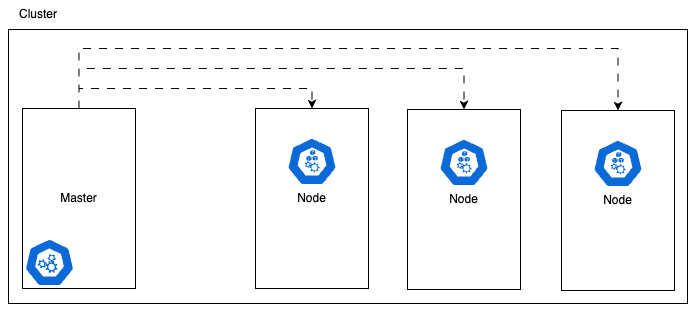
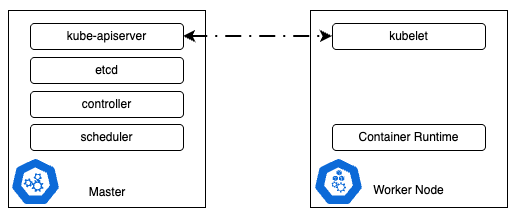
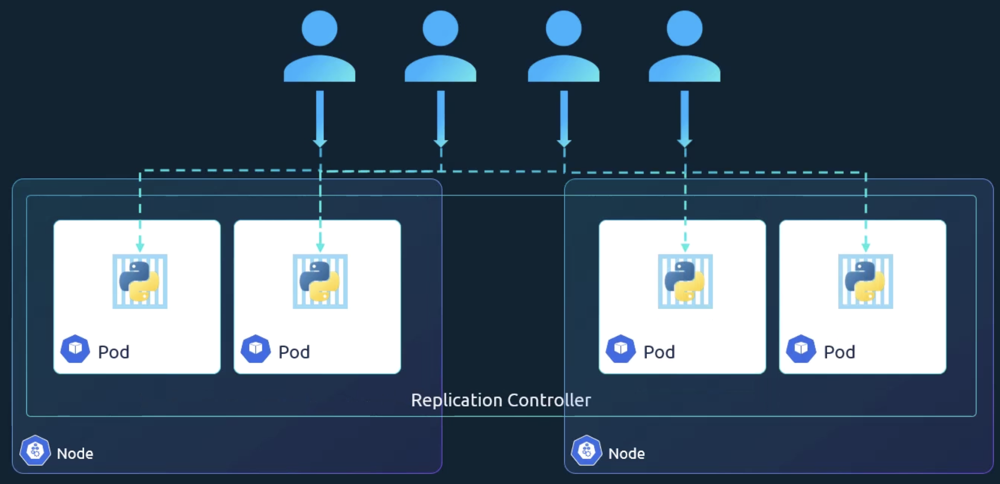
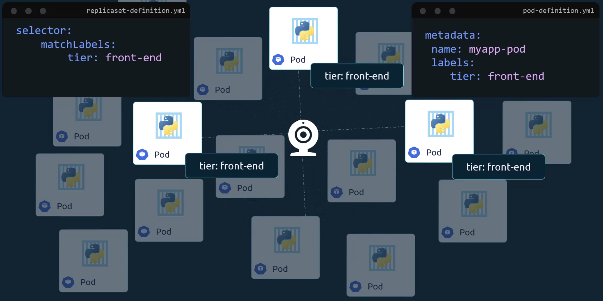
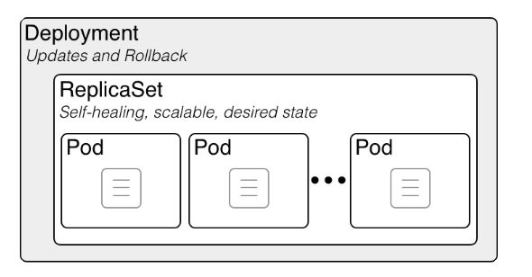
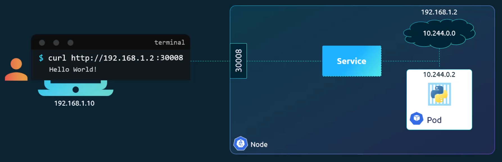
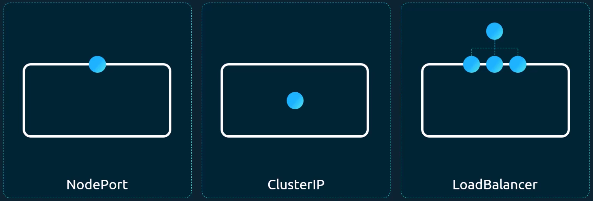
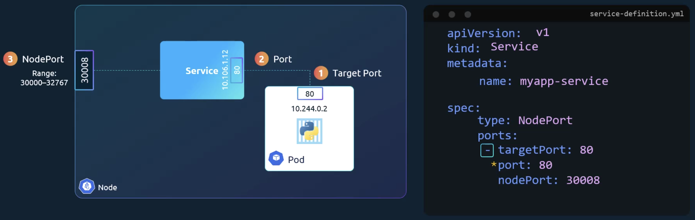
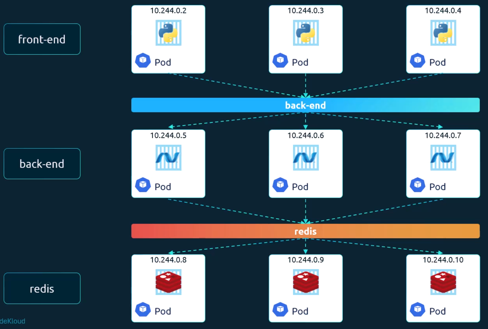
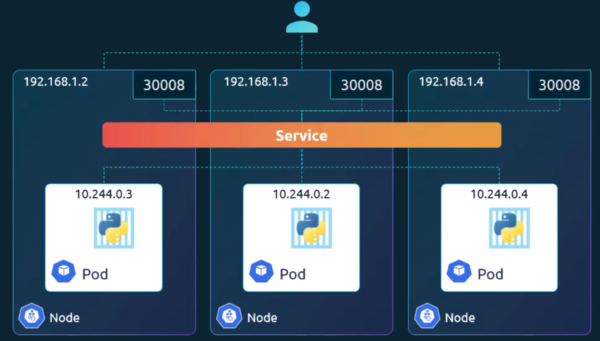

- [Core Infrastructure](#core-infrastructure)
  - [Nodes and Clusters](#nodes-and-clusters)
  - [The Master Node: The Control Plane](#the-master-node-the-control-plane)
  - [The Worker Node: The Execution Plane](#the-worker-node-the-execution-plane)
  - [Managing the Cluster with `kubectl`](#managing-the-cluster-with-kubectl)
  - [Analogy for Understanding](#analogy-for-understanding)
- [Docker vs CRI](#docker-vs-cri)
  - [The Evolution: From Docker to CRI](#the-evolution-from-docker-to-cri)
  - [Containerd: The Modern Runtime](#containerd-the-modern-runtime)
  - [Essential Command-Line Tools (CLI)](#essential-command-line-tools-cli)
  - [Analogy for Understanding](#analogy-for-understanding-1)
- [Pods](#pods)
  - [What is a Pod?](#what-is-a-pod)
  - [Scaling and Capacity](#scaling-and-capacity)
  - [Multi-Container Pods](#multi-container-pods)
  - [Creating Pods with YAML Configuration](#creating-pods-with-yaml-configuration)
  - [Analogy for Understanding](#analogy-for-understanding-2)
  - [What does the "Ready" column mean?](#what-does-the-ready-column-mean)
- [ReplicaSet](#replicaset)
  - [Kubernetes Controllers: The "Brain" of the Cluster](#kubernetes-controllers-the-brain-of-the-cluster)
  - [Why use Replication?](#why-use-replication)
  - [YAML Configuration File](#yaml-configuration-file)
  - [Labels and Selectors](#labels-and-selectors)
  - [Scaling the Application](#scaling-the-application)
  - [Analogy for Understanding](#analogy-for-understanding-3)
- [Deployment](#deployment)
  - [Key Capabilities of Deployments](#key-capabilities-of-deployments)
  - [Analogy for Understanding](#analogy-for-understanding-4)
- [Namespace](#namespace)
  - [Understanding Namespaces](#understanding-namespaces)
  - [Default Namespaces](#default-namespaces)
  - [Communication between namespaces](#communication-between-namespaces)
  - [Resource Management and Policies](#resource-management-and-policies)
  - [Analogy for Understanding](#analogy-for-understanding-5)
- [Services](#services)
  - [What is a Kubernetes Service?](#what-is-a-kubernetes-service)
  - [NodePort Service (External Access)](#nodeport-service-external-access)
  - [ClusterIP Service (Internal Access)](#clusterip-service-internal-access)
  - [How Services "Find" Pods (Labels \& Selectors)](#how-services-find-pods-labels--selectors)
  - [Load Balancing \& Multi-Node Support](#load-balancing--multi-node-support)
  - [Analogy for Understanding](#analogy-for-understanding-6)

# Core Infrastructure

## Nodes and Clusters

<p align="center">
    
</p>

- **Nodes**: A node is the basic unit of a Kubernetes cluster; it is a physical or virtual machine where Kubernetes is installed. These are the **worker machines** where your containers are actually launched and run.
- **Clusters**: A cluster is a **group of nodes** working together. By grouping nodes, Kubernetes ensures that if one machine fails, your application remain accessible because it can run on the other nodes.
- **Redundancy and Load**: Beyond fixing failures, having multiple nodes allows the system to share the workload across different machines.

## The Master Node: The Control Plane

<p align="center">
    
</p>

- **Role of the Master**: The master is a specific node that **watches over the worker nodes** and is responsible for the orchestration of containers.
- **API Server**: This acts as the **frontend** of the Kubernetes cluster. All users, management devices and command-line tools talk to the API server to interact with the system.
- **etcd Keystore**: This is a distributed, reliable **key-value store**. It stores all the data needed to manage the cluster and implements "locks" to ensure there are no conflicts between multiple masters.
- **Scheduler**: The scheduler is responsible for **distributing work**; it looks for newly created containers and decides which node they should be assigned to.

## The Worker Node: The Execution Plane

- **Kubelet**: This is an **agent that runs on every node** in the cluster. Its job is to ensure that containers are running as expected and to report the health of the worker node back to the master.
- **Container Runtime**: This is the underlying software required to actually **run the containers**. While **Docker** is a common choice, other alternatives include _Rocket_ or _Cri-o_.

## Managing the Cluster with `kubectl`

- `kubectl` Utility: Also known as "kube control", this is a **command-line tool** used to deploy and manage applications and inspect the cluster.
- Essential Commands:

```sh
kubectl run             # used to deploy an application on the cluster
kubectl cluster-info    # used to view the status and information of the cluster
kubectl get nodes       # used to list all the nodes that are part of the cluster
```

## Analogy for Understanding

Think of a Kubernetes cluster like a **large professional kitchen**. The **Master Node** is the **Head Chef** (or Manager) who stays in the office, looks at the orders (API Server), decides which cook should handle which dish (Scheduler), and monitors the kitchen to make sure no one has quit or burned a meal (Controller). The **Worker Nodes** are the **individual cooking stations**. Each station has a **Kubelet** (the station lead) who ensures the food is actually being cooked and reports back to the Head Chef. The **Container Runtime** is the actual **stove or oven** used to cook the food.

# Docker vs CRI

## The Evolution: From Docker to CRI

- **The Early Days**: Initially, Kubernetes and Docker were **tightly coupled**; Kubernetes was built specifically to orchestrate Docker and did not support other container tools.
- **Container Runtime Interface (CRI)**: As other tools emerged, Kubernetes introduced the **CRI**, a standard interface that allows any vendor's runtime to work with Kubernetes, provided they follow specific standards.
- **OCI Standards**: To ensure compatibility across the industry, the **Open Container Initiative (OCI)** established specifications for how images should be built (**Image Spec**) and how runtimes should be developed (**Runtime Spec**).
- The **"Docker Shim"**: Because Docker was created before the CRI, Kubernetes used a temporary "hack" called **Docker Shim** to keep it compatible. However, this was removed in **version 1.24**, meaning Docker is no longer a supported runtime.
- **Image Compatibility**: Even though Docker is no longer the runtime, **Docker Images still work** because they follow the OCI Image Spec.

## Containerd: The Modern Runtime

- **What is it?**: Containerd is the internal component of Docker that handles the container runtime.
- **Independence**: It is now a standalone project within the **Cloud Native Computing Foundation (CNCF)** and can be installed without the full Docker suite.
- **Kubernetes Integration**: Because containerd is **CRI compatible**, it can work directly with Kubernetes without the need for the old Docker shim.

## Essential Command-Line Tools (CLI)

When managing these environments, you will encounter 3 main tools, each with a different purpose:

- **ctr (Ctor)**
  - This comes with containerd but is **solely for debugging**.
  - It is not user-friendly, has limited features, and should not be used for managing containers in production.
- **nerdctl (Nerd Control)**
  - This is a **general-purpose CLI** that acts like a "Docker-like" tool for containerd.
  - It supports most Docker commands and adds advanced features like **image signing** and **lazy pulling**.
- **crictl (CRI Control)**
  - Maintained by the Kubernetes community, this tool works across **any CRI-compatible runtime** (not just containerd).
  - It is used for **inspecting and debugging** the runtime from a Kubernetes perspective.
  - **Pod Awareness**: Unlike Docker, `crictl` is "pod-aware", meaning it can list and manage Kubernetes pods directly.
  - **Warning**: You should not use `crictl` to create containers in production because the Kubelet may delete them if it doesn't recognize them.

## Analogy for Understanding

Think of the **CRI** as a **universal power socket**. In the beginning, Kubernetes only had a "Docker-shaped" plug. When other tools wanted to join, Kubernetes created a **universal adapter (the CRI)**. As long as every appliance follows the same safety standards (**OCI**), they can all plug in. **Containerd** is like a modern, efficient motor that fits that socket perfectly, while **nerdctl** and **crictl** are the different remote controls used to check on or operate that motor.

# Pods

## What is a Pod?

- **The Smallest Unit**: A pod is the **smallest object** you can create in Kubernetes.
- **Encapsulation**: Kubernetes does not run containers directly on nodes; instead, containers are wrapped into a pod. Think of a pods as a **single instance of your application**.
- **Relationship with Containers**: Usually, there is a **1-to-1 relationship** between a pod and a container.

## Scaling and Capacity

- **Scaling Up**: If your application needs to handle more users, you **do not** add more containers to an existing pod. Instead you **create new pods** to run additional instances of the same application.
- **Node Capacity**: If a single machine (node) runs out of space, you can add a new node to the cluster and deploy additional pods there.
- **Scaling Down**: To reduce capacity, you simple delete the extra pods.

## Multi-Container Pods

- **Helper Containers**: While rare, a single pod can hold multiple containers. This is typically used for **"helper" tasks**, such as a separate container that processes user-uploaded files or data for the main application.
- **Shared Resources**: Containers inside the same pod share the **same network space** (they can talk to each other using `localhost`) and the **same storage**.
- **Shared Fate**: Containers in a pod share the same "fate" - they are **created together and destroyed together**.

## Creating Pods with YAML Configuration

Kubernetes uses YAML files to define objects. Every pod definition file must include 4 top-level fields:

- `apiVersion`: The version of the Kubernetes API being used (for pods, this is usually `v1`). Specifies the API group and version used by the Kubernetes API server to understand and validate this resource.
- `kind`: The type of object you are creating (in this case, Pod).
- `metadata`: Information about the object, such as its **name** and **labels**. Labels are key-value pairs that help you group and filter pods later (e.g., making pods as "front-end" or "back-end").
- `spec` (Specification): This is where you describe the technical details, such as the **container name** and the **image** (like nginx) that Kubernetes should pull from a repository like Docker Hub.

## Analogy for Understanding

Think of a **Pod** as a **physical shipping crate**. Inside the crate is your **Container** (the goods). If you need to ship more goods (scale your app), you don't try to stuff more into the same crate; you get a **second crate** (a new pod). Occasionally, a crate might contain a "helper" item, like a specialized cooling unit for the goods—they stay together, travel together, and arrive together because they are in the same crate.

## What does the "Ready" column mean?

> Running containers in Pod / Total containers in Pod

```sh
kubectl get pods
# NAME    READY   STATUS              RESTARTS   AGE
# nginx   0/1     ContainerCreating   0          2s
```

# ReplicaSet

## Kubernetes Controllers: The "Brain" of the Cluster

<p align="center">
    
</p>

- **Definition**: Controllers are the **processes that monitor Kubernetes objects** and respond accordingly to ensure the system is running as desired.
- **Replication Controller vs Replica Set**: These are 2 technologies used for the same purpose. The **Replication Controller** is the older technology, while the **Replica Set** is the new recommended way to set up replication.

## Why use Replication?

- **High Availability**: It ensures that is a Pod fails or crashes, another one is automatically brought up so users **never lose access** to the application.
- **Reliability**: Even if you only need one pod, using a controller is beneficial because it **ensures that the specified number of pods are running at all times**, whether that number is 1 or 100.
- **Load Balancing**: When user demand increases, controllers allow you to deploy **multiple pods to share the load** across different nodes in the cluster. The scheduling of pods onto multiple nodes is determined by the Scheduler.

## YAML Configuration File

A ReplicaSet definition file has 4 main sections:

- `apiVersion`: For a ReplicaSet, this must be set to `apps/v1` (the older Replication Controller uses just v1).
- `template`: This is a **nested pod definition** inside the controller's file. It tells the controller exactly what kind of pod to create if one fails or if more are needed.
- `replicas`: This is a simple number that tells Kubernetes **how many instances** of the pod should be running at all times.
- `selector`: This is a major difference for ReplicaSet. It uses a `matchLabels` filter to identify which pods it should monitor. This allows the ReplicaSet to manage pods that were created even before the controller itself was deployed.

## Labels and Selectors

<p align="center">
    
</p>

- **Filtering**: Because a cluster might run hundreds of pods, **Labels** (key-value pairs) act as tags.
- **Monitoring**: The ReplicaSet uses the **Selector** to "look" for pods with specific labels. If it finds fewer pods with that label than the number of "replicas" specified, it will launch new ones using the template.

## Scaling the Application

There are 2 main ways to increase or decrease the number of pods:

1. **Update the File**: Change the `replicas` number in your YAML file and run the `kubectl apply` command.
2. **Command Line**: Use the `kubectl scale` command to quickly change the number without editing the file (e.g., scaling from 3 to 6 replicas).

## Analogy for Understanding

Think of a **Replica Set** like a **Thermostat**. You set the "desired temperature" (the number of **replicas**). The thermostat (the **controller**) constantly monitors the room. If the room gets too cold (a pod fails), it turns on the heater (the **template**) to bring the temperature back up. If you decide you want the room warmer (scaling up), you simply turn the dial, and the thermostat works to reach that new target.

# Deployment

<p align="center">
    
</p>

- **A Higher-Level Object**: A Deployment is a Kubernetes object that sits **higher in the hierarchy** than pods or replica sets. While pods run single instances and replica sets ensure multiple instances stay running, deployments manage the **entire lifecycle** of those instances.
- **The Hierarchy of Management**: When you create a Deployment, it **automatically creates a Replica Set**, which then creates the necessary Pods. You can see all these layers at once using `kubectl get all` command.

## Key Capabilities of Deployments

Deployments are designed to handle production needs that simple replica sets cannot manage alone:

- **Rolling Updates**: This allows you to upgrade your application to a newer version **seamlessly**. Instead of taking the whole app down, Kubernetes upgrades instances **one after the other**, ensuring users are never cut off during the process.
- **Rollbacks**: If a recent update causes an unexpected error, a Deployment allows you to **undo the change** and roll back to a previous, stable version of the application.
- **Pause and Resume**: You can pause the environment to make **multiple changes** - such as updating the server version, scaling the number of instances, and changing resource allocation - and then resume to apply all these changes **together** in a single rollout.

## Analogy for Understanding

Think of a **Deployment** as a **Professional Construction Manager**. The **Pods** are the **individual builders** doing the work, and the **Replica Set** is the **Site Foreman** making sure there are always enough builders on-site. The **Deployment (Manager)** is the one who plans how to replace old builders with new ones (Rolling Updates) without stopping the work, has a plan to revert to the old crew if the new ones fail (Rollbacks), and can pause the entire project to change the blueprints before allowing work to continue (Pause/Resume).

# Namespace

## Understanding Namespaces

- **The "House" Analogy**: Think of a Kubernetes cluster as a neighborhood and **namespaces as individual houses**. Within a house, family members refer to each other by their first names. However, if you want to talk to someone in a different house, you must use their **full name** to identify them correctly.
- **Isolation**: Namespaces provide a way to **isolate resources** within the same cluster. This is useful for separating different environments, such as **development (dev)** and **production (prod)**, so that work in one does not accidentally interfere with or modify the other.

## Default Namespaces

When a Kubernetes cluster is first set up, it automatically creates 3 primary namespaces:

- `default`: This is where your objects are placed if you do not specify a namespace. It is the environment you usually "play around" in when learning.
- `kube-system`: This contains internal pods and services required by Kubernetes itself, such as networking and DNS. They are kept here to **prevent accidental deletion or modification** by users.
- `kube-public`: This namespace contains resources that should be **available to all users** across the entire cluster.

## Communication between namespaces

- **Intra-namespace**: Resources in the same namespace can reach each other simple by using their name (e.g., a web-app reaching a database via db-service).
- **Inter-namespace**: To reach a service in a different namespace, you must use its **Full Qualified Domain Name (FQDN)**. The format is `service-name.namespace.svc.cluster.local`.
  - Example: To reach a database in the `dev` namespace from its `default` namespace, you would use `db-service.dev.svc.cluster.local`.
  - `cluster.local` refers to the domain. `svc` is the service name.

## Resource Management and Policies

- **Policies**: Each namespace can have its own **set of rules** defining who is allowed to perform specific actions.
- **Resource Quotas**: You can set limits on the amount of resources a namespace can consume. This ensures a specific environment is **guaranteed certain resources** and cannot exceed its limit (e.g., limiting a namespace to 10 pods, 10 CPUs, or 10 GB of memory).

## Analogy for Understanding

Think of **Namespaces** like **operating different departments** within the same office building. The **Sales** and **Accounting** departments (namespaces) share the same electricity and water (the cluster), but they have different filing cabinets and internal rules. If a Sales person wants to talk to a colleague in their own department, they just shout "Hey, Mark!". But if they need to send mail to a "Mark" in Accounting, they must address the envelope with his **full name and department code** to make sure it gets to the right place.

# Services

## What is a Kubernetes Service?

<p align="center">
    
</p>

- **The Connector**: Services enable communication between various components within and outside of your application. They help connect different groups of pods, such as front-end tier connecting to a back-end process.
- **Loose Coupling**: By using services, different microservices in your application remain "loosely coupled", meaning they can interact without being strictly tied to each other's specific locations.
- **Stable Networking**: Because pods are ephemeral (they can go down and be replaced with new IP addresses), you cannot rely on pod IPs for communication. A service provides a **single, stable interface** (IP and name) to access a group of pods.

<p align="center">
    
</p>

## NodePort Service (External Access)

<p align="center">
    
</p>

- **Purpose**: This service type makes an internal pod accessible to users outside the cluster by listening to a port on the physical or virtual **Node**.
- 3 Key Ports:
  - **Target Port**: The port on the **pod** where the application is actually running (e.g., port 80).
  - **Port**: The port on the **service itself**, which acts like a virtual server inside the cluster.
  - **NodePort**: The port on the **node** used for external access. These must be in the range of **30,000 - 32,767**.
- **How it works**: When a user accesses the Node's IP address at the designated NodePort, the service maps that request through the node to the pod.

## ClusterIP Service (Internal Access)

<p align="center">
    
</p>

- **Purpose**: This is the **default service type**. It creates a virtual IP inside the cluster to enable communication between different internal services, such as a front-end server talking to a back-end database.
- **Internal Identity**: Each ClusterIP service gets its own IP and name. Other pods use this name or IP to communicate, rather than trying to track individual pod IPs.
- **Efficiency**: It allows different layers of an application (like a web tier and a database tier) to scale or move independently without breaking communication.

## How Services "Find" Pods (Labels & Selectors)

- **Linking**: Services use **Labels and Selectors** to identify which pods they should manage.
- **Matching**: In the service definition file, you provide a **selector** that matches the **labels** assigned to the pods.
- **Automatic Updates**: If pods are added or removed, the service automatically updates itself to include or exclude them, making the system highly flexible.

```yaml
# service-definition.yaml
spec:
  selector:
    app: payment

# pod-definition.yaml
metadata:
  labels:
    app: payment
```

## Load Balancing & Multi-Node Support

<p align="center">
    
</p>

- **Random Distribution**: If a service manages multiple pods, it acts as a built-in load balancer. It typically uses a **random algorithm** to distribute incoming requests across all healthy pods.
- **Cluster-Wide Reach**: When pods are spread across multiple nodes, Kubernetes automatically creates the service across the entire cluster. This means you can access the application using the **IP of any node** in the cluster on the same port.

## Analogy for Understanding

Think of a **Kubernetes Service** like a **company’s main reception desk**. Customers (external users) don't need to know the specific desk number (Pod IP) of an employee; they just call the main office number (NodePort). For internal staff, the reception desk acts like a **switchboard** (ClusterIP), routing calls to the "Accounting Department" (a group of pods) regardless of which specific accountant picks up the phone. Even if accountants change offices or leave the company, the internal extension for "Accounting" stays exactly the same.
