# Docker Images

## Why create your Own Image?

- **Customization**: You create your own image when a service you need isn't available on Docker Hub or when you want to "Dockerise" your own application for easier shipping and deployment.
- **Manual to Automated**: To build an image, you first think about the manual steps (e.g., choosing an OS, installing dependencies, copying code) and then translate those into a **Dockerfile**.

## The Dockerfile Basics

- **Instruction Format**: A Dockerfile is a text file using an **INSTRUCTION argument** format (e.g., `FROM Ubuntu`).
- **Key Instruction**:
  - `FROM`: Every Dockerfile must start with this; it defines the **base operating system** or image.
  - `RUN`: Tells Docker to run specific commands (like installing packages) while the image is being built.
  - `COPY`: Moves files from your local system into the image.
  - `ENTRYPOINT`: Specifies the main command that will run when the container starts up.

## The Layered Architecture

- **Stacking Layers**: Docker builds images in layers; **each line of instruction creates a new layer** that only stores the changes from the previous one.
- **Caching for Speed**: Docker **caches** these layers. If a build fails or you change only the top layer (like source code), Docker reuses the existing bottom layers from the cache to make the process much faster.

## Container Lifecycle

- **Task-Oriented**: Unlike a Virtual Machine, a container is meant to run a **specific task** (like a web server or database) rather than an entire OS.
- **The "Stay Alive" Rule**: A container only stays alive as long as the **process inside it is running**. If the task finishes or the service crashes, the container exits immediately.

## Commands vs Entry Points

- `CMD` (Command): This defines the default program to run. However, if you add a command to your `docker run` instruction, it **completely replaces** the CMD defined in the image.
- `ENTRYPOINT`: This defines the permanent executable. Anything you type at the end of the `docker run` command will be **appended** to the entry point rather than replacing it.
- **Best Practice**: Use `ENTRYPOINT` for the main command (like `sleep`) and `CMD` for the default parameter (like 5 seconds). This allows users to easily change the parameter without re-typing the whole command.

# Docker Commands, Entrypoints and Arguments

## The Purpose of a Container

- **Process-Driven**: Unlike virtual machines, containers are not designed to host a full operating system; they are meant to run a **specific task or process**, such as a web server or database.
- **Lifecycle**: A container's life is tied directly to the process inside it. It **only lives as long as that process is alive**; if the process stops or crashes, the container exits immediately.
- **The Ubuntu Example**: If you run a plain Ubuntu container, it exits quickly because its default command is bash. Since Docker doesn't usually attach a terminal by default, bash finds no input and terminates, causing the container to exit.

## The `CMD` Instruction

- **Defining the Default**: The `CMD` (command) instruction in a Dockerfile sets the program that runs when the container starts.
- **Overriding at Runtime**: You can easily override the default `CMD` by **appending a new command** to the `docker run` instruction (e.g., `docker run ubuntu sleep 5`).
- **Replacement Rule**: If you provide parameters at the command line, they **entirely replace** the `CMD` instruction defined in the image.

## The `ENTRYPOINT` Instruction

- **Defining the Fixed Executable**: `ENTRYPOINT` is used to specify the main executable for the container.
- **Appending Rule**: Unlike `CMD`, any parameters you pass via the command line are **appended** to the `ENTRYPOINT` rather than replacing it.
- **Use Case**: This is ideal for "sleeper" images where you want the command to always be `sleep`, but you want to allow the user to easily provide the number of seconds as an argument.

```Dockerfile
ENTRYPOINT [ "sleep" ]
CMD [ "5" ]
```

## Combining `ENTRYPOINT` and `CMD`

- You can use both instructions together to create a **default value** that can still be overridden.
- **How it Works**: In this setup, `ENTRYPOINT` defines the program (e.g., sleep) and `CMD` provides the **default arguments** (e.g., 5). If the user provides no input, it runs `sleep 5`. If the user provides `10`, it runs `sleep 10`.
- **Override Flag**: If you need to change the actual executable at runtime (e.g., changing `sleep` to something else), you must use the `--entrypoint` flag in your command.

## Syntax requirements

- **JSON Format**: For `ENTRYPOINT` and `CMD` to work together correctly, they should be written in **JSON array format**.
- **Separation**: Each element (the executable and its parameters) must be a **separate string** within the array (e.g., `["sleep", "5"]`).

# Kubernetes Pod Commands and Arguments

## Translating Docker to Kubernetes

- **Property Mapping**: When moving from Docker to Kubernetes, the names of the instructions change. It is important to remember that:
  - The `command` field in Kubernetes overrides the `ENTRYPOINT` instruction in a Dockerfile.
  - The `args` field in Kubernetes overrides the `CMD` instruction in a Dockerfile.

## Using the `args` field

- **Purpose**: This field is used to pass additional arguments to the container's startup command.
- **Overriding Defaults**: If a Docker image has a default parameter (like a 5-second sleep timer), you can change it to 10 seconds by specifying "10" in the args section of the Pod definition.
- **Format**: Arguments must be provided in the form of an **array** within the Pod YAML file.

## Using the `command` field

- **Purpose**: Use this field if you need to change the **actual executable** being run by the container.
- **Example**: If your Docker image is set to run a standard `sleep` command as its entry point, but you want to use an alternative version like `sleep 2.0`, you would define this in the `command` field.
- **Comparison to Docker**: This is equivalent of using the `--entrypoint` flag when running a manual `docker run` command.

## Summary for CKAD Prep

| Docker file Instruction | Kubernetes Pod Field | Purpose                                       |
| ----------------------- | -------------------- | --------------------------------------------- |
| `ENTRYPOINT`            | `command`            | The main process/executable to run.           |
| `CMD`                   | `args`               | The default parameters passed to the process. |

# CheatSheet for Commands and Arguments

## Docker

| Dockerfile                              | `docker run ...`                            | What actually runs                                                              |
| --------------------------------------- | ------------------------------------------- | ------------------------------------------------------------------------------- |
| `CMD ["sleep"]`                         | `docker run <image>`                        | `sleep` _(no args → usually exits “missing operand”)_                           |
| `CMD ["sleep","5"]`                     | `docker run <image>`                        | `sleep 5`                                                                       |
| `CMD ["sleep","5"]`                     | `docker run <image> sleep 10`               | `sleep 10` _(replaces CMD entirely)_                                            |
| `CMD ["sleep","5"]`                     | `docker run <image> 10`                     | `10` _(tries to exec `10` → fails; because it replaces CMD, not “append args”)_ |
| `ENTRYPOINT ["sleep"]`                  | `docker run <image>`                        | `sleep` _(no args → usually exits “missing operand”)_                           |
| `ENTRYPOINT ["sleep"]` <br> `CMD ["5"]` | `docker run <image>`                        | `sleep 5`                                                                       |
| `ENTRYPOINT ["sleep"]` <br> `CMD ["5"]` | `docker run <image> 10`                     | `sleep 10` _(overrides CMD args)_                                               |
| `ENTRYPOINT ["sleep"]` <br> `CMD ["5"]` | `docker run --entrypoint sleep2 <image> 15` | `sleep2 15` _(overrides ENTRYPOINT, overrides CMD)_                             |
| `ENTRYPOINT ["sleep"]` <br> `CMD ["5"]` | `docker run --entrypoint sleep2 <image>`    | `sleep2 5` _(overrides ENTRYPOINT, keeps CMD as args)_                          |

## Kubernetes

- If `command` and/or `args` specified in Pod spec, replaces `ENTRYPOINT` and/or `CMD` in Dockerfile.

| Pod Spec                                | `kubectl run ...`                                        | What actually runs                                               |
| --------------------------------------- | -------------------------------------------------------- | ---------------------------------------------------------------- |
| _(none)_                                | `kubectl run app --image=<image>`                        | image `ENTRYPOINT` + image `CMD`                                 |
| `args: ["10"]`                          | `kubectl run app --image=<image> -- 10`                  | image `ENTRYPOINT` + `10` _(CMD replaced)_                       |
| `command: ["sleep2"]`                   | `kubectl run app --image=<image> --command -- sleep2`    | `sleep2` + image `CMD` _(ENTRYPOINT replaced, CMD kept as args)_ |
| `command: ["sleep2"]`<br>`args: ["15"]` | `kubectl run app --image=<image> --command -- sleep2 15` | `sleep2 15` _(ENTRYPOINT + CMD both replaced)_                   |

# ConfigMap

<p align="center">
    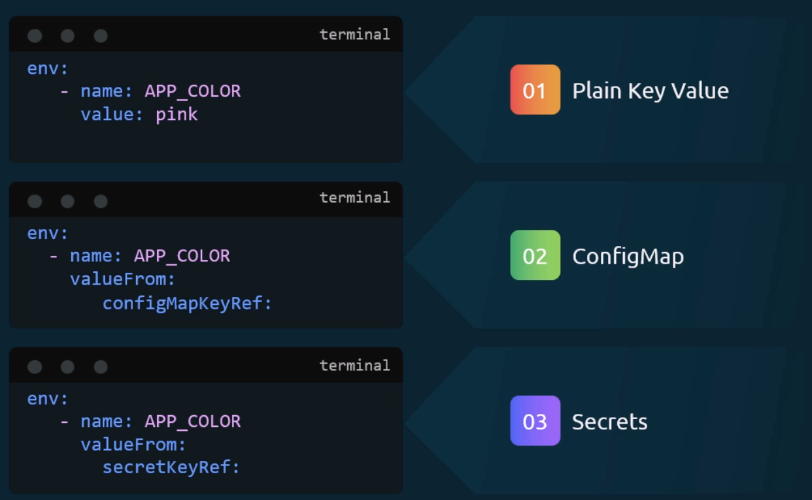
</p>

ConfigMaps are a vital tool in Kubernetes for **decoupling configuration data from application code**, making it much easier to manage settings across multiple environments.

## Core Concepts

- **What they are**: ConfigMaps are Kubernetes objects used to store **configuration data in the form of key-value pairs**.
- **Purpose**: Instead of hardcoding environment variables inside every individual Pod definition file--which becomes difficult to manage as your cluster grows--you can **manage this data centrally**.
- **Two-Phase Process**: Using ConfigMaps involves 2 distinct steps:
  - first, create the ConfigMap
  - second, inject it into the Pod

## Step 1: Creating ConfigMaps

2 primary ways to create a ConfigMap:

- **Imperative Approach (Command Line)**: You can create a ConfigMap directly using the `kubectl create configmap` command without needing a separate definition file.
  - **From Literal**: Use the `--from-literal` flag to specify key-value pairs directly in the terminal (e.g., app-color=blue).
  - **From File**: Use the `--from-file` flag to pull configuration data from an external file.
- **Declarative Approach (YAML File)**: You can create a **definition file** (similar to a Pod's YAML) with the following attributes:
  ```yaml
  apiVersion: v1
  kind: ConfigMap
  metadata: # includes name of the ConfigMap
  data: # list of configurations in key-value format
  ```

## Step 2: Injecting into Pods

Once created, you must "hand" the configuration to your container:

- `envFrom`: In your Pod definition file, you add an `envFrom` property under the container specification.
- **Linking**: You then provide the **name** of the specific ConfigMap you created. This makes all the key-value pairs available as **environment variables** inside the container.
- **Alternative Methods**: While environment variables are common, configuration data can also be injected as **single variables** or as **files mounted in a volume**.

## Analogy for Understanding

Think of a **ConfigMap** like a **universal remote control profile**. Instead of going to every television (Pod) in a building and manually setting the brightness and volume (environment variables), you save those settings onto a single profile (ConfigMap). When you turn a television on, you simply tell it to "use the Lobby Profile," and it automatically configures itself based on the central settings you saved earlier.

# Secret

While ConfigMap handle general settings, **Secrets** are designed specifically to protect **sensitive information** such as passwords, API keys, and certificates.

## Core Concepts

- **Purpose**: Secrets allow you to avoid hardcoding sensitive credentials directly into your application code or Pod definition.
- **Encoding vs Encryption**: Unlike ConfigMaps which store data in plain text, Secrets are **stored in an encoded format (Base64)**. It is important to note that **encoding is not the same as encryption**; anyone with the encoded string can easily decode it back to plain text.
- **Workflow**: Similar to other Kubernetes objects, you follow a 2 step process:
  - create the Secret
  - inject it into the Pod.

## Step 1: Creating Secrets

Create Secrets using 2 main methods:

- **Imperative (Command Line)**:
  - Use `kubectl create secret generic` followed by the secret name.
  - Use `--from-literal` flag to define key-value pairs directly in the command (e.g., `db-password=password123`).
  - Use `--from-file` flag to import data from a specific file path.
- **Declarative (YAML File)**:
  ```yaml
  apiVersion: v1
  kind: Secret
  metadata:
  data:
  ```
  - **Manual Encoding Required**: When writing the YAML file, you cannot use plain text. You must **manually convert your data to Base64** (using a tool like Linux `echo -n 'secret' | base64`) before pasting it into the `data` section.

## Step 2: Injecting Secrets into Pods

Once a Secret exists in the cluster, you can provide it to your application in multiple ways:

- **Environment Variables**: Use the `envFrom` property in the Pod definition to load all keys from a Secret as environment variables.
- **Volume Mounts**: You can mount a Secret as a **volume**. In this case, Kubernetes creates a directory where **each key in the Secret becomes a file**, and the content of that file is the secret value.

<p align="center">
    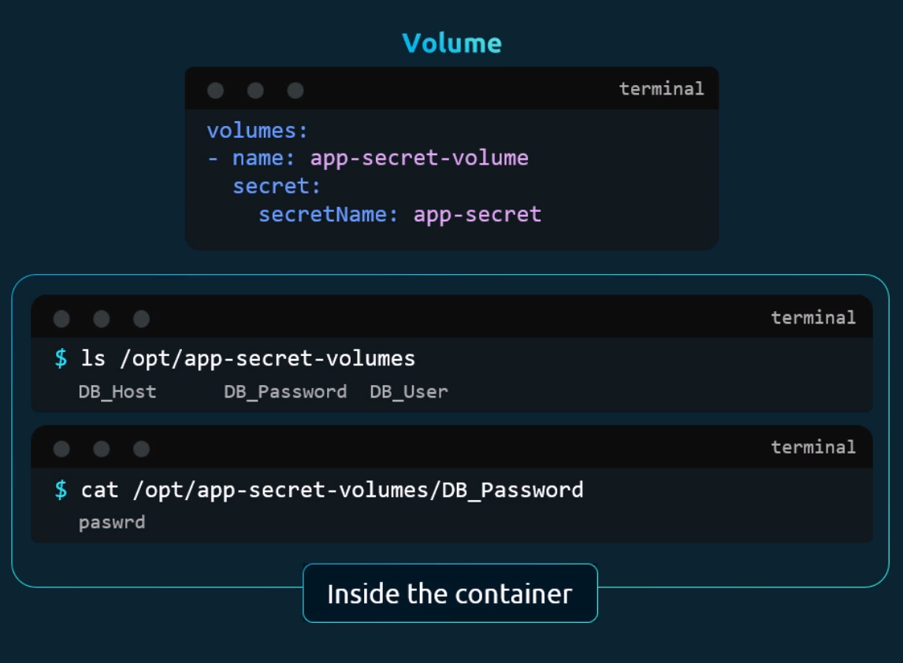
</p>

## Security Best Practices

Because Base64 encoding is easily broken, Kubernetes employs several internal mechanisms and best practices to keep secrets safe:

- **Node-Specific Delivery**: A Secret is only sent to a node if a Pod running on that node specifically requires it.
- **Memory-Only Storage**: Kubernetes stores Secrets in `tmpfs` (RAM) on the nodes, ensuring sensitive data is **never written to a physical disk storage**.
- **Automatic Detection**: Once a Pod depending on a Secret is deleted, the local copy of that Secret on the node is also wiped.
- Avoid checking Secret YAML files into source code repositories like GitHub and enable **Encryption at Rest** so that Secrets are encrypted while stored in ETCD. For even high security, consider external tools like **HashiCorp Vault**.

# Docker Security and Process Isolation

Understanding how Docker handles security and isolation on a single host.

## Process Isolation via Namespaces

<p align="center">
    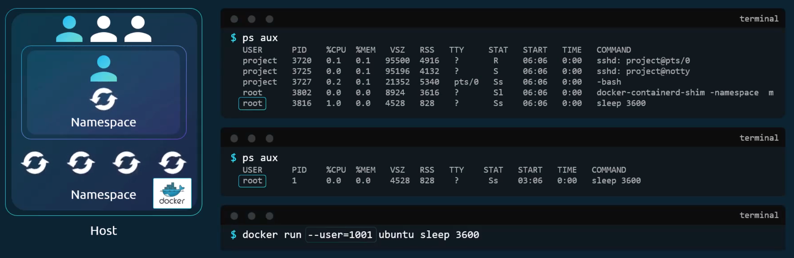
</p>

- **Shared Kernel**: Unlike virtual machines, containers are **not completely isolated** from their host; they share the same underlying operating system kernel.
- **Namespaces**: Docker uses a Linux feature called **namespaces** to create isolation. While the host has its own namespace, each container is tucked away in its own private namespace.
- **Process Visibility**: From inside a container, a process (like a "sleep" command) might appear to have a **Process ID (PID)** of 1. However, on the Docker host, that same process is visible but will have a **different PID**, as the host sees all processes across the entire system.

## User Security and Root Access

- **Default User**: By default, Docker runs all processes within a container as the **root user**.
- **Changing Users**: To improve security, you can force a process to run as a **non-root user** by specifying a user ID during the `docker run` command or by defining it in the **Docker Image** itself using the `USER` instruction.
- **The "Root" Myth**: The root user inside a container is **not the same** as the root user on the host. Docker restricts what this user can do to prevent it from being dangerous to the rest of the system.

## Linux Capabilities

<p align="center">
    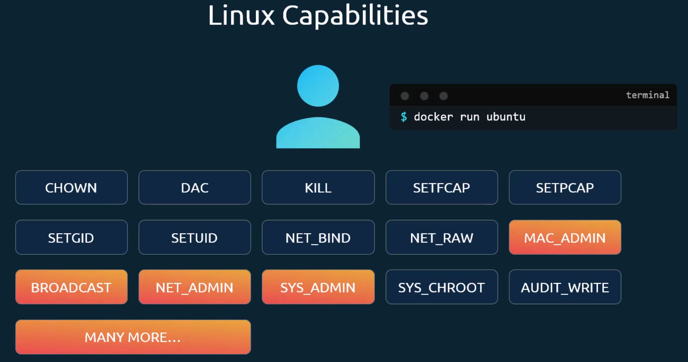
</p>

- **Fine-Grained Control**: Instead of giving the root user full power, Docker uses **Linux capabiliites** to limit their abilities.
- **Restricted Actions**: By default, a container cannot perform disruptive tasks like **rebooting the host** or manipulating the system clock, even if it is running as root.
- **Customizing Privileges**: You can manually add or remove these specific permissions using the `--cap-add` or `--cap-drop` flags. if a container needs total control, the `--privileged` flag can be used to enable all privileges.

## Analogy for Understanding

Think of the Docker host as an **apartment building** and containers as the **individual flats**. Every tenant (container) shares the same plumbing and foundation (the kernel), but they have their own front doors (namespaces) so they can't see into each other's rooms. Even though you are the "boss" (root) of your own flat, the building rules (capabilities) prevent you from doing things that would affect everyone else, like knocking down a load-bearing wall or shutting off the water for the whole building.

# Kubernetes Security Contexts: Managing Permissions

Security Contexts in Kubernetes allow you to define **security standards** for your workloads, such as specifying which user a process runs as or what system-level privileges it has.

## Core Concepts

- **Defining Standards**: Just as you can set security standards in Docker (like User IDs and Linux capabilities), Kubernetes allows you to configure these settings within your cluster.
- **2 Levels of Configuration**: You can choose to apply security settings at 2 different levels within your manifest file:
  - **Pod Level**: Settings defined here are **inherited by all containers** within the Pod.
  - **Container Level**: Settings defined here apply **only to that specific container**.
- **The Override Rule**: If you define a security setting at both levels, the **container-level configuration will override** the Pod-level setting.

## Key Security Settings

- **User IDs** (`runAsUser`): You can specify the exact **User ID** that the container's processes should use by running the `runAsUser` option. This is a critical security step to ensure processes do not run with unnecessary privileges.
- **Linux Capabilities**: Using th `capabilities` option, you can **add or remove specific system privileges**. As we previously discussed regarding Docker security, these allow for fine-grained control over what a container can do to the host kernel, such as modifying the system clock or network configuration.

## Analogy for Understanding

Think of the **Pod-level Security Context** as the **"House Rules"** for an apartment. If the house rule says "Everyone must take their shoes off," then every person in every room follows that rule. However, a **Container-level Security Context** is like a **"Room Rule"**. If one specific person decides that in their bedroom they will wear shoes, that specific "Room Rule" **overrides** the "House Rule" for that person only, while everyone else in the house continues to follow the original rule.

# Resource Requirements

## Resource Requests (Minimum Guarantee)

<p align="center">
    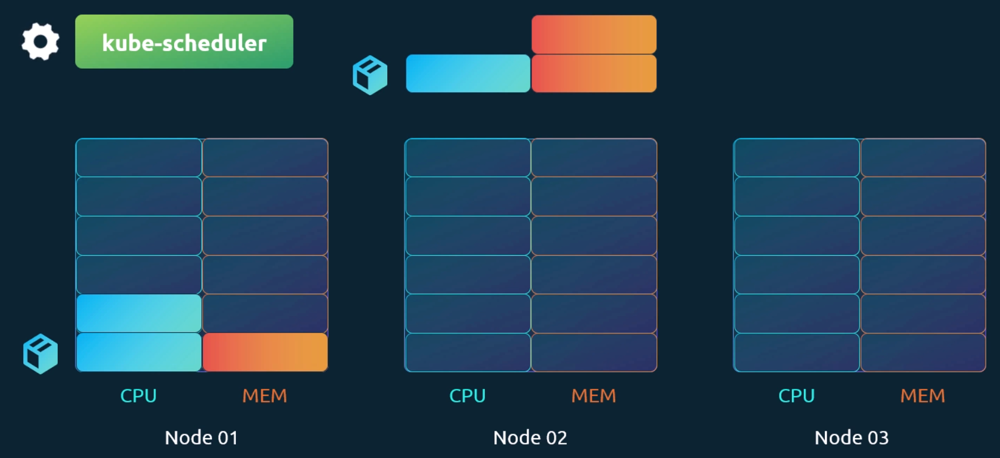
</p>
<p align="center">
    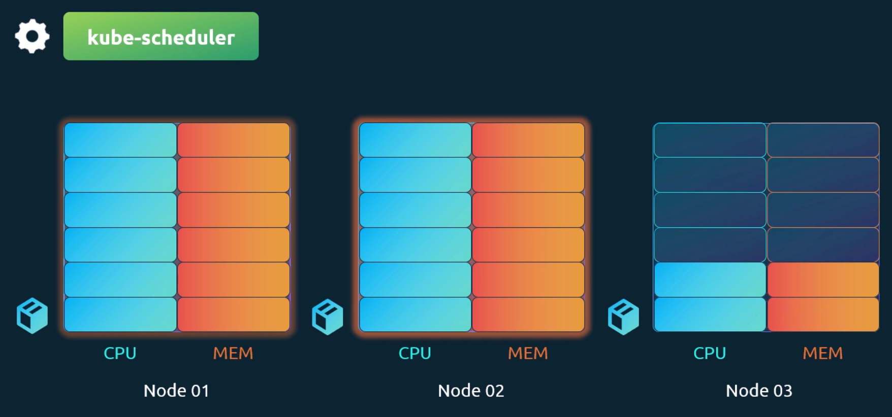
</p>

- A **request** is the minimum amount of CPU or memory a container is guaranteed to have.
- **The Scheduler's Role**: When you create a pod, the **Kubernetes Scheduler** looks for a node that has enough free space to meet the pod's requests.
- **Pending State**: If no node has enough available resources to meet the request, the pod will stay in a "pending" state until resources become available.
- **Measuring Units**:
  - **CPU**: Measures in vCPUs or "millicores". For example, 1.0 CPU is 1 full core, while 0.1 CPU can be written as 100m (100 milli).
  - **Memory**: Can be measured in decimal units like Megabytes (M) and Gigabytes (G), or binary units like Mebibytes (Mi) and Gigabytes (Gi). Note that 1Gi is 1024MB, while 1G is 1000MB.

## Resource Limits (Maximum Cap)

<p align="center">
    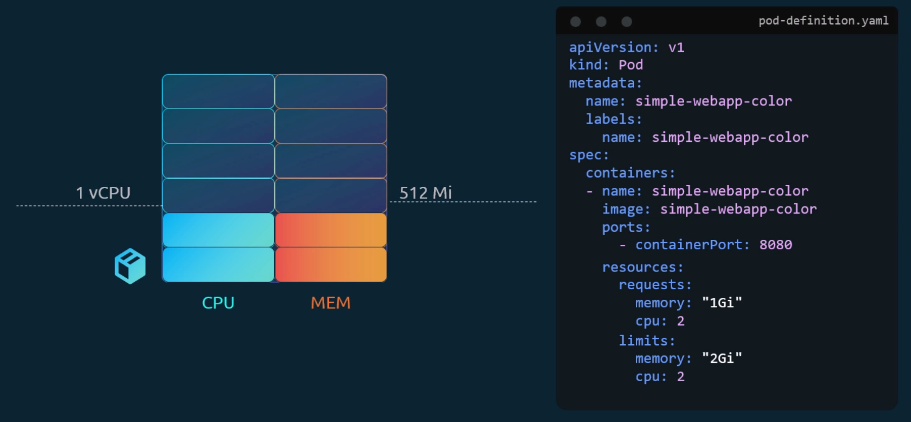
</p>
<p align="center">
    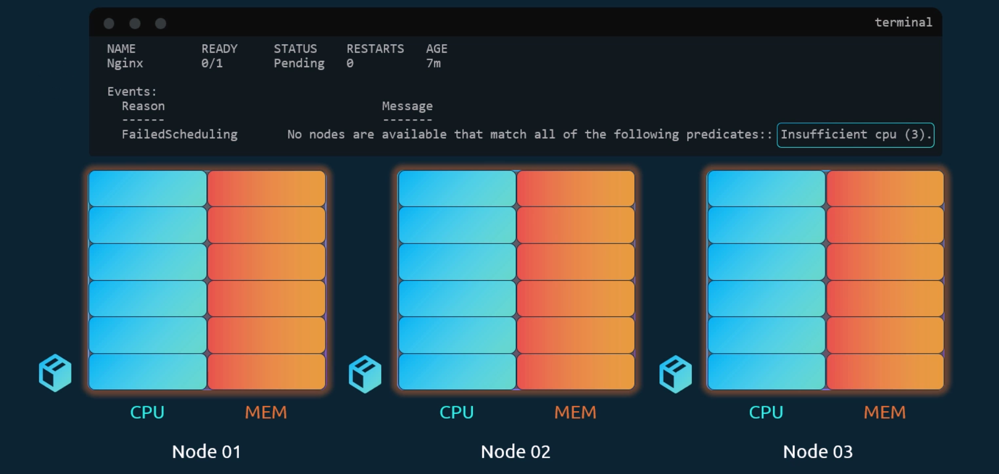
</p>

- A **limit** is the absolute maximum amount of resources a container can consume.
- **CPU Throttling**: If a container tries to use more CPU than its limit, Kubernetes throttles it. It doesn't kill the pod; it just restrict its processing speed.
- **Memory Termination (OOM)**: Memory works differently. If a pod constantly tries to exceed its memory limit, it will be terminated with an **Out of Memory Killed (OOMKilled) error**. This is because, unlike CPU, memory cannot be "slowed down"; if it's gone, the pod must be killed to free up space.

<p align="center">
    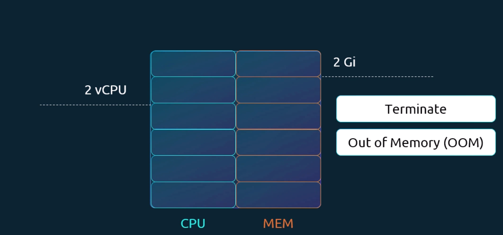
</p>

## Configuration Scenarios

<p align="center">
    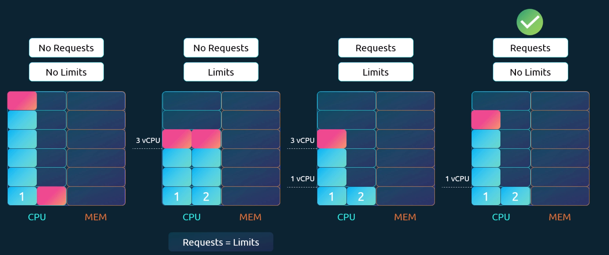
</p>
<p align="center">
    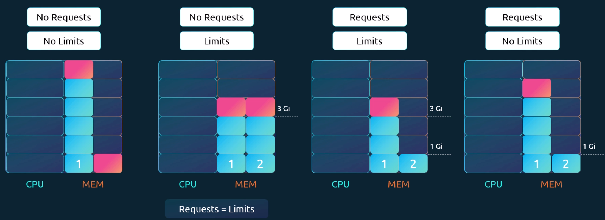
</p>

- **No Requests, No Limits**
  - Container can sue lots of resources
  - Risk: one Pod can **starve** others (bad multi-tenant behavior).
- **Limits set, Requests not set**
  - Kubernetes automatically sets **request = limit**.
  - Each Pod gets guaranteed that amount and cannot exceed it.
- **Requests and limits both set (different values)**
  - Pod is guaranteed the request.
  - Pod can burst up to the limit.
  - Still capped even if the node has free resources.
- **Requests set, no limits** ✅
  - **Often ideal for CPU**:
    - Guaranteed baseline via requests. Can burst above request if CPU is available.
  - **But be careful**:
    - All Pods should have requests, or a "no-request" Pod might get starved.
  - For **memory**, "requests without limits" can be risky:
    - If memory pressure happens, Kubernetes may have to kill Pods because memory can't be throttled.

## Administrative Controls (Namespace Level)

- `LimitRange`: You can set **default** requests and limits for a specific namespace. If a user creates a pod without defining resources, the `LimitRange` automatically applies these defaults. It also sets "min" and "max" boundaries for what a user is allowed to request.
- `ResourceQuota`: This acts as a **total budget** for a namespace. It limits the *sum* of all requests and limits across **all pods** in that **namespace** (e.g., "this department can only use 10 CPUs total").

<p align="center">
    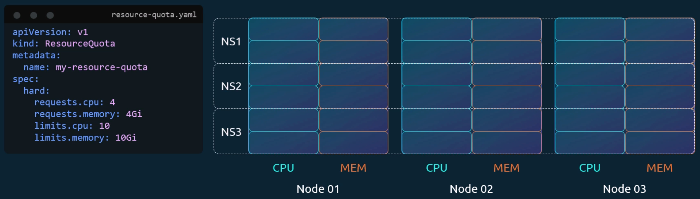
</p>

## Analogy for Understanding

Think of a **Resource Request** as a **hotel reservation**; the hotel (the node) ensures your room is ready before you arrive. A **Resource Limit** is like a **credit limit** on your spending; if it's CPU, the bank just slows down your transactions (throttling), but if it's Memory (cash), and you try to spend more than you have, they immediately close your account (OOMKill).

# Service Account

<p align="center">
    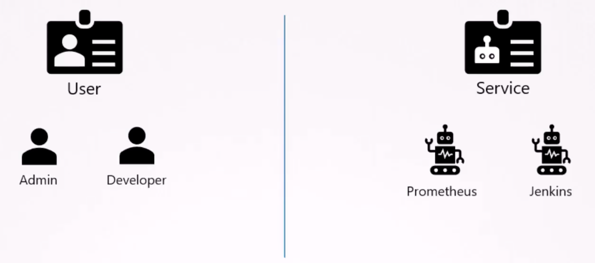
</p>

## What are Service Accounts?

- **Humans vs Machines**: Kubernetes distinguishes between **User Accounts** (for humans, like administrators or developers) and **Service Accounts** (for machines or applications).
- **Purpose**: A service account allows an application (like Prometheus for monitoring or Jenkins for deployments) to interact with the **Kubernetes API** to perform tasks such as listing pods or deploying apps.
- **Authentication**: For an application to query the API, it must be authenticated. This is done using a **token** associated with the service account.

## Working with Pods

- **The Default Account**: Every namespace has a **default service account** created automatically. If you do not specify a service account in your pod definition, Kubernetes assigns this default one.
- **Automatic Mounting**: Kubernetes automatically mounts the service account token into pods at a specific path: `/var/run/secrets/kubernetes.io/serviceaccount`. This filesystem is only shared between containers in the same Pod.

<p align="center">
    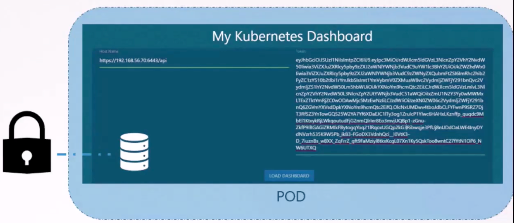
</p>

- **Specifying a Custom Account**: In your pod definition file, use the `serviceAccountName` field to assign a specific account.
- **Disabling Auto-Mount**: If your pod doesn't need to talk to the API, you can stop the token from mounting by setting `automountServiceAccountToken: false` in the pod spec.

```yaml
apiVersion: v1
kind: Pod
metadata:
  name: my-pod
spec:
  serviceAccountName: build-robot
  automountServiceAccountToken: false
```

- **Updating Service Accounts**: You **cannot edit** the service account of an existing pod; it must be deleted and recreated. However, **Deployments** handle this automatically by triggering a new rollout when the pod template is changed.

## Key Security Evolution (v1.22 & v1.24)

<p align="center">
    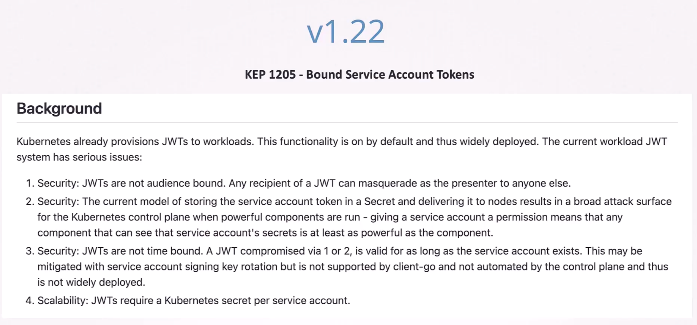
</p>

The way Kubernetes handles tokens has changed to become more secure:

- **Legacy Tokens (Old Way)**: Previously, tokens were stored as **Secret objects**, had **no expiry date**, and were valid as long as the service account existed.

<p align="center">
    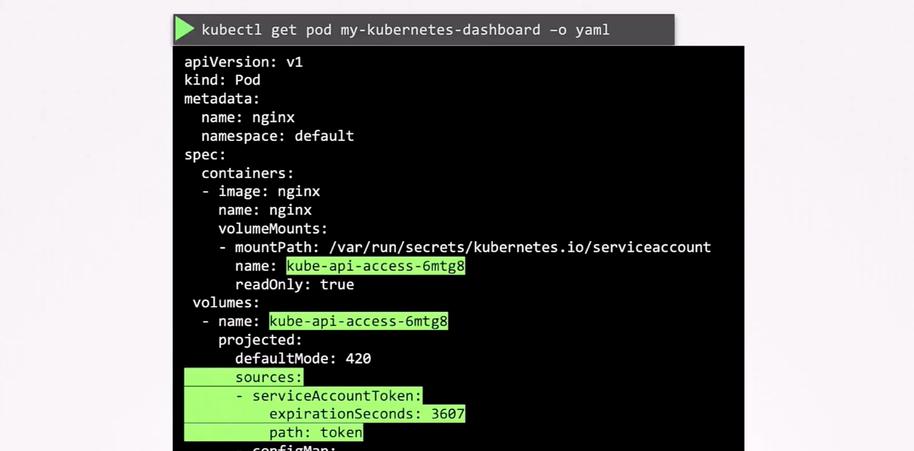
</p>

- **Modern Tokens (TokenRequestAPI)**: Since v1.22, Kubernetes uses the `TokenRequestAPI`. These tokens are:
  - **Time-bound**: They expire (usually after one hour if not specified otherwise).
  - **Audience-bound**: Targeted for specific uses.
  - **Project Volumes**: They are mounted into pods as "projected volumes" rather than secret-based volumes.
- **Recommendation**: You should only manually create permanent service account objects if your application cannot use the `TokenRequestAPI` and you accept the security risks of a non-expiring credential.

<p align="center">
    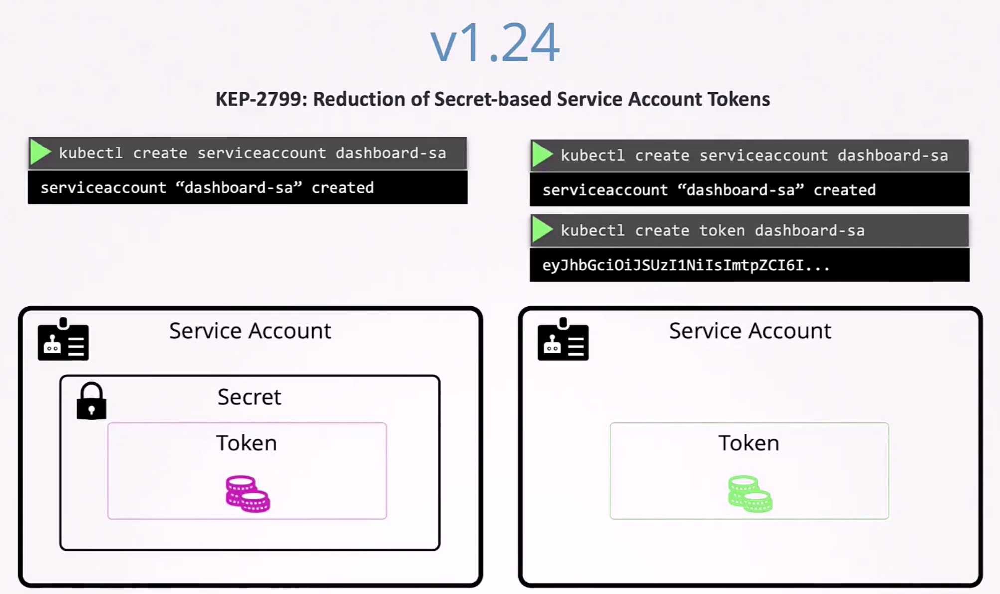
</p>
<p align="center">
    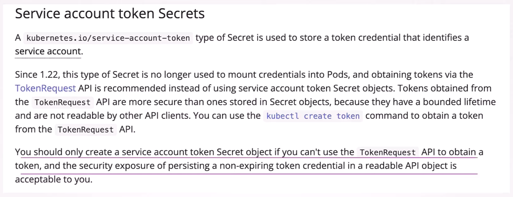
</p>
<p align="center">
    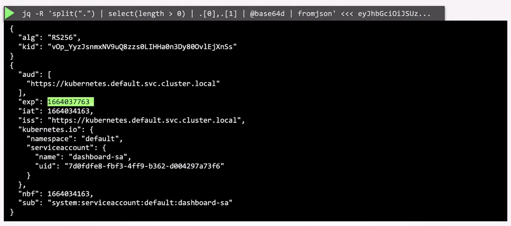
</p>
<p align="center">
    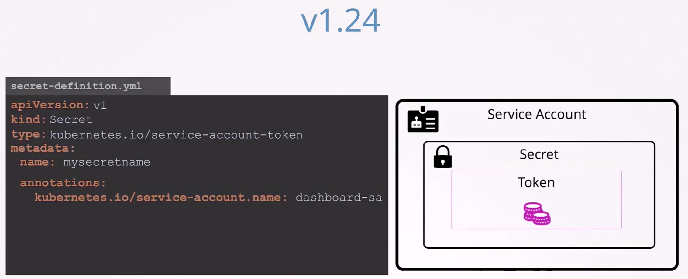
</p>
<p align="center">
    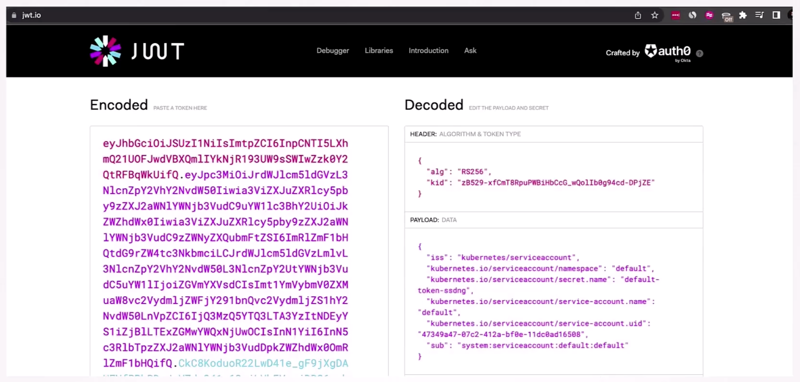
</p>

| Feature            | Pre v1.22/v1.24            | Post v1.24                        |
| ------------------ | -------------------------- | --------------------------------- |
| **Token Creation** | Automatic secret object    | Manual via `kubectl create token` |
| **Expiry**         | No expiry                  | Time-bound (typically 1 hour)     |
| **Mount Type**     | Secret Volume              | Projected Volume                  |
| **Storage**        | Stored in Etcd as a Secret | Generated via API on demand.      |

# Taints and Tolerations

- **Purpose**: These are used to set **restrictions** on which pods can be scheduled on specific nodes.
- **Taints** are set on **nodes**, while **tolerations** are set on **pods**.
- **The Goal**: They ensure that unwanted pods are not placed on specific nodes, allowing you to reserve nodes for particular use cases or applications.
- **Important Distinction**: Taints and tolerations are **not foe security** or preventing intrusions; they are strictly for scheduling logic.

## How It Works (Analogy)

- Imagine a person (a **node**) who sprays themselves with insect repellant (a **taint**).
- Most bugs (**pods**) are intolerant to the smell and are "thrown off", meaning they won't land on that person.
- However, if a specific bug is **tolerant** to that smell, it can land on the person despite the repellant.
- **Rule of Thumb**: If a node is tainted, only pods with a matching toleration can be scheduled there.

## Taint Effects

When you apply a taint, you must choose an `effect`, which defines what happens to pods that do not have a toleration. There are 3 main effects:

- `NoSchedule`: Kubernetes will **not schedule** any **new pods** onto the node if they don't have the matching toleration.
- `PreferNoSchedule`: The system will **try to avoid** placing a pod on the node, but it is not a hard guarantee.
- `NoExecute`: This is the strictest effect. Not only will new pods not be scheduled, but **existing pods** on the node will be **evicted (killed)** immediately if they do not tolerate the taint.

## Configuring Taints and Tolerations

- **To Taint a Node**: Use the command: `kubectl taint nodes <node-name> key=value:taint-effect`.
  - Example: `kubectl taint nodes node1 app=blue:NoSchedule`
- **To add a Toleration to a Pod**: Edit the pod definition file. Under the `spec` section, add a `tolerations` section.

## CKAD Tips

- **Master Nodes**: By default, Kubernetes master nodes are **automatically tainted** so that no application pods are scheduled on them. This is a best practice to keep management software separate from application workloads.
- **Taints do NOT "Attract" Pods**: A taint tells a node to **only accept** pods with certain tolerations. It does not force a pod to go to that specific node.
- **Co-existence**: A pod with a toleration for "blue" could still end up on an untainted "node2" or "node3" because those nodes have no restrictions.
- **Node Affinity**: If you need to **force** a pod to a specific node, you must use **Node Affinity** instead of (or in addition to) taints and tolerations.

<p align="center">
    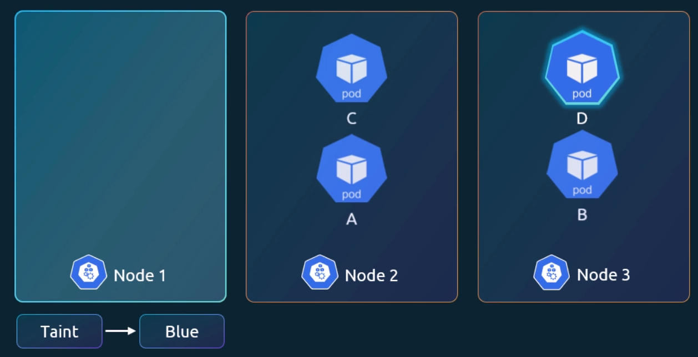
</p>

## Analogy for Understanding

Think of a **Taint** as a **"Special Access Only"** sign on a laboratory door. The **Toleration** is the **Security Badge** held by a scientist. The sign (Taint) keeps everyone out by default, and only the scientist with the right badge (Toleration) is allowed in. However, the sign doesn't force the scientist to stay in that lab; they are still free to go to the common breakroom (an untainted node) if they choose.

# Node Selectors

## Why use Node Selectors?

- **Problem**: By default, Kubernetes Scheduler assigns **any pod to any node**. In a cluster with mixed hardware (e.g., 2 small nodes and 1 large, high-resource node), you might have heavy data-processing workloads that require more "horsepower".
- **Risk**: Without restrictions, a resource-heavy pod might land on a small node and run out of resources, which is not desired.
- **Solution**: You can set a **limitation on pods** so they are restricted to running only on specific nodes. **Node Selectors** are the simplest and easiest method to achieve this.

## How to Implement Node Selectors?

Using Node Selectors is a 2-step process involving **labels** and pod **specification**.

- **Step 1: Label the Node**
  - Kubernetes needs a way to identify which node is which. You do this by assigning `labels` (key-value pairs) to your nodes.
  - CKAD Command: `kubectl label nodes <node-name> <key>=<value>`
    - *Example*: `kubectl label nodes node1 size=large`

- **Step 2: Update the Pod Definition**
  - In Pod's YAML file, you must add a property called `nodeSelector` inside the `spec` section.
  - You then provide the exact key-value pair that matches the label you gave the node.
  - *Example*: Setting `nodeSelector` to `size: large` ensures the pod is placed on a node with that specific label.

## Important Constraints and Limitations

<p align="center">
    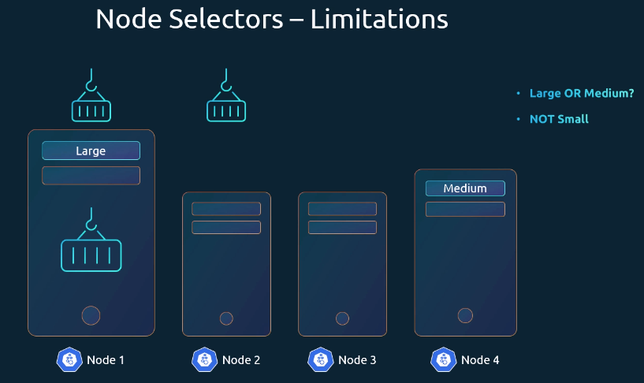
</p>

- **Simple Matching**: Node Selectors only work with a **single label and selector** for a basic match.
- **Lack of Complexity**: You **cannot** use Node Selectors for complex requirements, such as:
  - Placing a pod on a "large **OR** medium" node.
  - Placing a pod on "any node that is **NOT** small".
- **Advanced Alternative**: For more complex scheduling logic (like "OR" or "NOT" logic), you must use **Node Affinity and Anti-Affinity** features.
