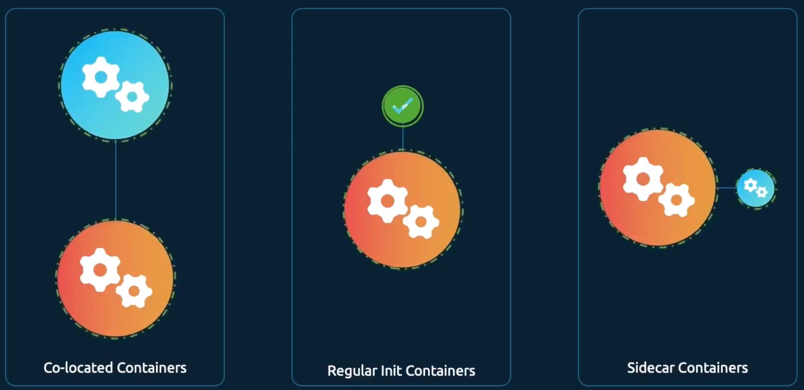
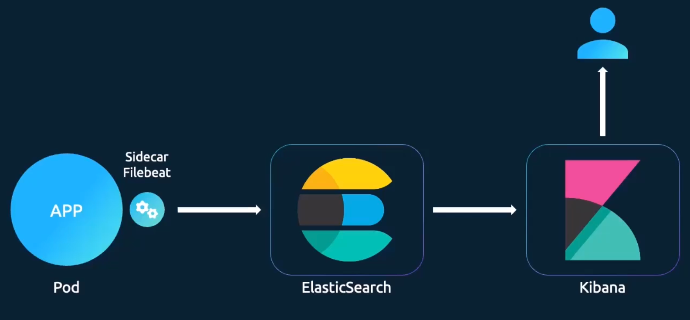

# Multi-Container Pods

- **Decoupling Applications**: Instead of 1 giant, bloadted application, you break it into small, independent and reusable microservices.
- **Working Together**: Sometimes 2 different services need to be paired togeter (e.g., a web server and a log agent) to function correctly.
- **Shared Resources**: Containers in the same pod share:
    - **Lifecycle**: They are created and destroyed at the same time.
    - **Network**: They share the same network space and can communicate with each other using `localhost`.
    - **Storage**: They can access the same storage volumes without needing extra configuratino to talk to each other.
- **Configuration**: In a pod definition file, the `containers` section is an **array**, which allows you to list multiple containers in a single Pod.

## Design Patterns

    

### Design Pattern 1: Co-located Containers

- **Definition**: This is the simplest form, where 2 or more containers run in a pod together throughout its entire lifecycle.
- **Startup Order**: There is **no ability to define which container starts first**; they all start together as elements in an array.
- **Use Case**: Use this when 2 services are highly dependent on each other but don't require a specific order to begin running.

### Design Pattern 2: Init Containers

- **Definition**: These are containers that run **initialisation steps** before the main application starts.
- **Behaviour**: An init container runs to completion and then terminates. The main applicaiton only starts **after** the init container has successfully finished its job.
- **Sequential Order**: You can have multiple init containers; they will run **one at a time in a specific order**.
- **Failure Handling**: If an init container fails, Kubernetes will **repeatedly restart the pod** until the init container succeeds.
- **Common Uses**: Waiting for a database to be ready, pulling code from a repository (e.g., `git clone`), or checking an external API.

### Design Pattern 3: Sidecar Containers

- **Definition**: A sidecar starts before the main app (like an init container) but **continues to run** for the entire life of the pod.
- **Implementation**: In modern Kubernetes, this can be achieved by using the init container approach with a restart polocy set to `Always`.
- **Advantage**: Unlike co-located containers, sidecars allow you to specify a **startup order**.
- **Common Use (Log Shipping)**: A "Filebeat" or logging agent starts before the app to capture startup logs and remains running to catch termination logs if the app crashes.

    

### Summary of Patterns

| Feature              | Co-located                    | Init Container              | Sidecar                       |
| -------------------- | ----------------------------- | --------------------------- | ----------------------------- |
| **Section in YAML**  | `spec.containers`             | `spec.initContainers`       | `spec.initContainers`         |
| **Order of startup** | No guaranteed order           | Strict sequential order     | Starts before the main app    |
| **Duration**         | Runs entire lifecycle         | Runs until task is complete | Runs entire lifecycle         |
| **Failure Effect**   | Restarts individual container | Restarts the entire Pod     | Restarts individual container |

### Analogy for Understanding

Think of a **Multi-container Pod** like a professional camera crew:
- Co-located Containers are like the Camera Operator and the Sound Engineer; they both need to be there for the whole shoot, and it doesn't matter who arrives first.
- Init Containers are like the Set Designer; they arrive first, build the set (run to completion), and then leave before the actors (the main app) arrive.
- Sidecar Containers are like the Safety Officer; they arrive before the actors to check the equipment but stay for the entire shoot to make sure everything remains safe until the very end.
