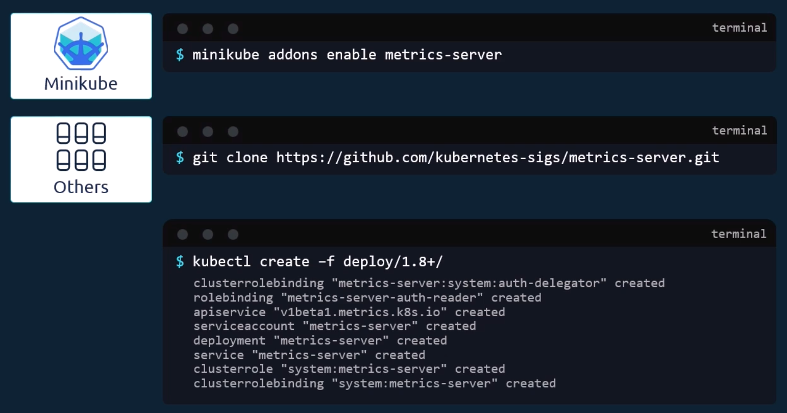
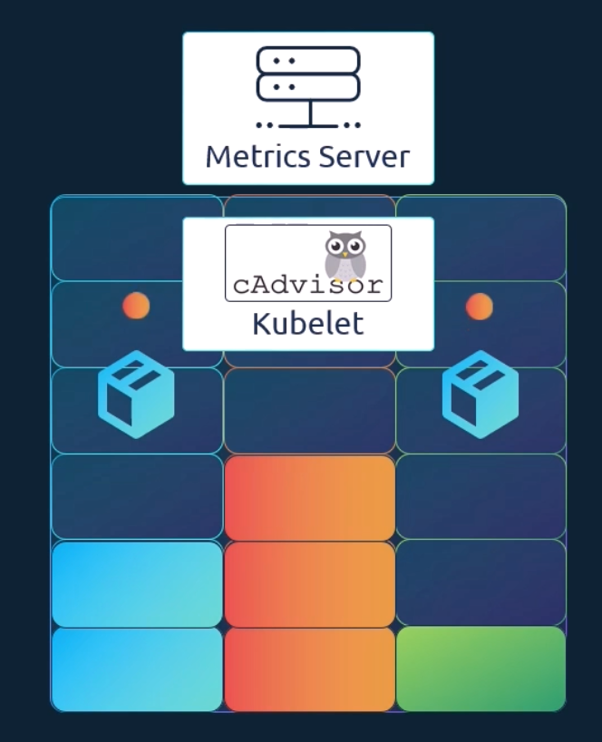

- [Readiness and Liveness Probes](#readiness-and-liveness-probes)
  - [Understanding Pod Lifecycle vs Conditions](#understanding-pod-lifecycle-vs-conditions)
  - [Readiness Probes: "Am I Ready for Traffic?"](#readiness-probes-am-i-ready-for-traffic)
  - [Liveness Probes: "Am I still Healthy?"](#liveness-probes-am-i-still-healthy)
  - [How to Configure Probes (CKAD Essentials)](#how-to-configure-probes-ckad-essentials)
  - [Key Tuning Options](#key-tuning-options)
  - [Summary Comparison](#summary-comparison)
  - [Analogy for Understanding](#analogy-for-understanding-1)
- [Logging and Monitoring](#logging-and-monitoring)
  - [Kubernetes Logging Basics](#kubernetes-logging-basics)
  - [Monitoring Resource Consumption](#monitoring-resource-consumption)
  - [How Data is Collected](#how-data-is-collected)

# Readiness and Liveness Probes

## Understanding Pod Lifecycle vs Conditions

Before configuring probes, you must understand how Kubernetes views a pod's 'health':

- **Pod Status**: This is a high-level summary of where the pod is in its life (e.g., `Pending`, `ContainerCreating` or `Running`).
  - **`Pending`**: Pod accepted by cluster, but at least 1 container not created yet or running (often waiting on scheduling or image downloads).
  - **`ContainerCreating`**: Pod scheduled to Node, and container runtime is actively pulling images, setting up network interfaces and building the containers.
  - **`Running`**: Pod bound to Node, and all of its contianers have been created, and at least one is currently running or starting.
- **Pod Condition**: These are an array of true/false values that provide more detail, such as whether the Pod is `Scheduled`, `Initialized` or `Ready`.
- **The "Ready" Gap**: By default, Kubernetes assumes a pod is `Ready` as soon as its containers are created. However, many applications (like Jenkins) take time to "warm up" or initialise before they can actually handle traffic.

## Readiness Probes: "Am I Ready for Traffic?"

- Question: *Should users be allowed to talk to me right now?*
- **Problem**: Kubernetes considers a container "Running" as soon as its main process starts. However, the app inside might still be loading configs or connecting to a database. Without a check, users get hit with network errors during deployments.
- **Purpose**: To decide if a Pod should be included in the Kubernetes Service endpoints to receive live user traffic.
- **Primary Use Cases**:
  - **App Warm-up**: Waiting for an app to load large caches, data or configuration files into memory upon boot.
  - **Graceful Overload Handling**: Temporarily stopping traffic if the app becomes flooded with requests or is running a heavy background task, allowing it to clear its queue.
- **Impact (With vs Without)**:
  - *Without*: When updating an app, new Pods instantly receive traffic before they are truly ready, causing immediate `500 Connection Refused` errors for users.
  - *With*: Traffic is completely held back during a rolling update until the probe passes. Result: **Zero-downtime deployments**.
- **Important to Know**:
  - **Failing does NOT kill the Pod**. It simply sets the Pod's `Ready` status to false and hides it from the Service network.
  - It runs continuously throughout the entire lifecycle of the Pod.

## Liveness Probes: "Am I still Healthy?"

- Question: *Am I completely broken or frozen inside?*
- **Problem**: An application can experience a code deadlock or infinite loop where the container process stays alive (so Kubernetes think its fine), but the applicaiton is entirely unresponsive and will never recover on its own.
- **Purpose**: To trigger automated self-healing by catching broken states and forcing a container restart.
- **Primary Use Cases**:
  - **Deadlocks**: Multi-threaded apps stuck waiting on each other indefinitely.
  - **Infinite Loops**: Code bugs causing 100% CPU lockups where the app can no longer process incoming requests.
  - **Severe Memory Leaks**: The app becomes sluggish or entirely frozen due to memory exhaustion but hasn't crashed yet.
- **Impact (With vs Without)**:
  - *Without*: You app freezes at 2:00 AM. The container stays "Running" indefinitely. Users hit endless loading screens. The app remains broken until an engineer wakes up to manually delete the Pod.
  - *With*: The app freezes, fails the probe 3 times, and Kubernetes automatically kills and replaces the container in seconds. **Self-heals while you sleep**.
- **Important to Know**:
  - **Failing triggers an immediate restart**.
  - **⚠️ Golden Rule**: Never include external dependencies (like checking a database or third-party API) in a liveness probe. If the database goes down, your liveness probe will fail, causing Kubernetes to endlessly kill and restart a perfectly fine web container -- making the problem worse (flapping).

## Startup Probe

- Question: *Am I done with my initial boot-up?*
- **The Problem**: If an application takes a long time to start (e.g., 2 minutes), an aggressive liveness probe will think the app is deadlocked and kill it *before it even finishes booting*, trapping the container in an infinite loop of restarts.
- **The Purpose**: To protect slow-starting applications by giving them a temporary grace period on boot-up.
- **Primary Use Cases**:
  - **Legacy / Heavy Applications**: Large enterprise frameworks (like heavy Java/Sprint Boot apps) that naturally take minutes to fully initialize.
  - **Cold-Start Data Sync**: Applications that must download massive configuration files or run database migrations before the app can even open its web ports.
- **Impact (With vs Without)**:
  - *Without*: To stop the container from getting killed on boot, you are forced to set a very high `initialDelaySeconds` (e.g., 2 minutes) on your Liveness probe. However, if the app deadlocks later in production, Kuberentes will now wait a dangerous 2 full minutes before restarting it.
  - *With*: You can set a lenient Startup probe to allow a slow 2-minute boot. The exact secnd the app boots successfully, the startup probe shuts off, and an aggressive, fast-acting Liveness probe takes over instantly.
- **Important to Know**:
  - **It disables all other probes**: Liveness and Readiness probes do not even start running until the Startup probe passes successfully.
  - It only runs at container startup. Once it passes once, it turns off for the rest of the container's life.

## How to Configure Probes (CKAD Essentials)

Both probes are configured in the pod definition file under the `spec.containers` section using 3 main methods:

- **HTTP GET**: Checks if a specific API path (e.g., `/ready`) returns a successful response.
- **TCP Socket**: Checks if a specific port (e.g., 3306 for a database) is open and listening.
- **Exec Command**: Runs a custom script inside the container; if the script exists with a code of 0, it is successful.

## Key Tuning Options

To avoid "flapping" or unnecessary restarts, you can fine-tune probes with these settings:

- `initialDelaySeconds`: How long to wait before performing the first probe (gives the app time to start).
- `periodSeconds`: How often to perform the probe (frequency).
- `failureThreshold`: How many times the probe can fail before Kubernetes takes action (defaults to 3).

## Summary Comparison

| Feature               | Readiness Probe                       | Liveness Probe                    |
| --------------------- | ------------------------------------- | --------------------------------- |
| **Primary Goal**      | Controls traffic flow via Services    | Controls container restarts       |
| **Action on Failure** | Pod is removed from Service endpoints | Container is killed and restarted |
| **Simple Question**   | "Can I start working yet?"            | "Am I still alive/functional?"    |

## Analogy for Understanding

Think of a **Readiness Probe** like a **"Closed/Open" sign** on a shop door; even if the lights are on (the container is running), customers (traffic) won't enter until the staff is ready. Think of a **Liveness Probe** like a **Health Monitor** on a machine; if the machine stops moving even though the power is on, the monitor triggers a **Hard Reset** to try and fix the jam.

# Logging and Monitoring

## Kubernetes Logging Basics

- **Standard Output**: Kubernetes captures logs from applications that stream their events to the **standard output (STDOUT)**.
- **The Main Command**: You can view these logs using `kubectl logs <pod-name>`.
- **Live Streaming**: Just like in Docker, you can use the `-f` (follow) flag to see a live trail of the logs as they happen.
- **Multi-Container Pods**: If a pod has more than one container, the basic command will fail because Kubernetes doesn't know which logs you want. You must **specify the container name** explicitly: `kubectl logs <pod-name> <container-name>`.

## Monitoring Resource Consumption

- **What to Monitor**: In a cluster, you should track **Node-level metrics** (health, CPU, memory, network and disk utilisation) and **Pod-level metrics** (CPU and memory consumption of individual pods).
- **The Metrics Server**: Kubernetes does not have a full-featured built-in monitoring tool. Instead, the **Metrics Server** is the standard, "slimmed-down" solution used to aggregated and provide this data.
- **In-Memory Storage**: The Metrics Server stores data **only in memory**. This means you cannot see historical performance data; for that, you would need advanced third-party solutions like Prometheus or the Elastic Stack.

    

## How Data is Collected

- **Kubelet and cAdvisor**: On every node, the **Kubelet** agent is running. It contains a subcomponent called **cAdvisor** (Container Advisor), which is responsible for retrieving performance metrics from the pods and exposing them.
- **Aggregation**: The Metrics Server retrieves this information from the Kubelet API across all nodes and stores it for you to query.

    

