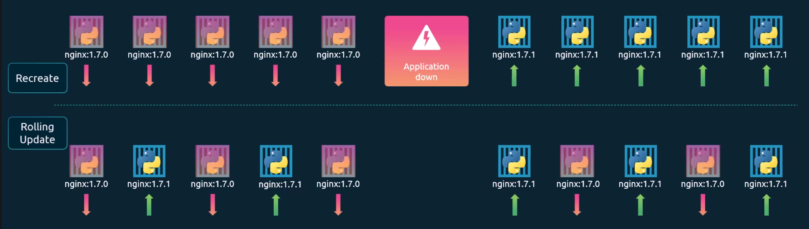
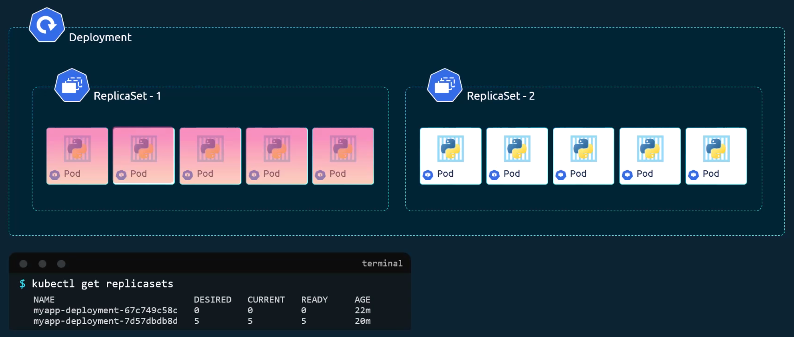
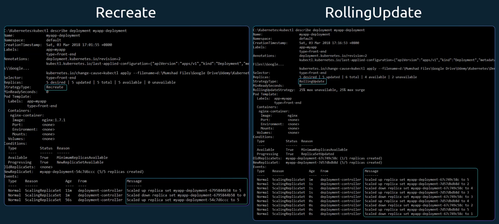
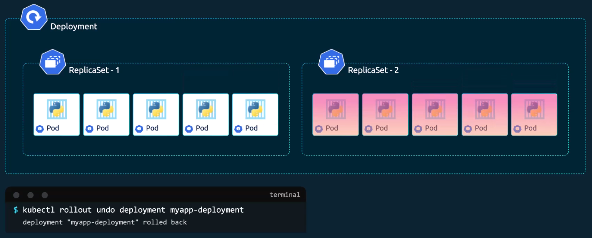
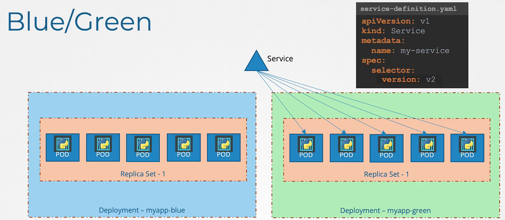
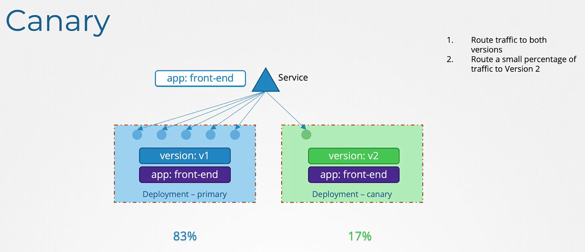

- [Labels, Selectors and Annotations](#labels-selectors-and-annotations)
  - [The Core Concept: Grouping and Filtering](#the-core-concept-grouping-and-filtering)
  - [Using Labels in Kubernetes](#using-labels-in-kubernetes)
  - [Connecting Objects Internally](#connecting-objects-internally)
  - [Annotations: For information, Not Selection](#annotations-for-information-not-selection)
  - [Summary](#summary)
- [Kubernetes Deployment Strategies](#kubernetes-deployment-strategies)
  - [1. RollingUpdate vs Recreate](#1-rollingupdate-vs-recreate)
    - [Rollouts and Revisions](#rollouts-and-revisions)
    - [Deployment Strategies](#deployment-strategies)
  - [Updating and Rolling back](#updating-and-rolling-back)
  - [Understanding Max Unavailable and Max Surge](#understanding-max-unavailable-and-max-surge)
  - [2. Blue-Green Deployment Strategy](#2-blue-green-deployment-strategy)
  - [3. Canary Deployment Strategy](#3-canary-deployment-strategy)
    - [Native Implementation Steps](#native-implementation-steps)
    - [Managing Traffic Split](#managing-traffic-split)
- [Jobs and Cron Jobs](#jobs-and-cron-jobs)
  - [Jobs](#jobs)
  - [CronJobs](#cronjobs)

# Labels, Selectors and Annotations

## The Core Concept: Grouping and Filtering

- **Problem**: As your cluster grows, you may end up with hundreds or thousands of objects like pods, services, and deployments. You need a way to filter and view these objects by categories such as application type or functionality.
- **Labels**: These are properties (key-value pairs) attached to each item to classify them. Think of them like tags on a YouTube video or keywords on a blog.
- **Selectors**: These are the **filters** used to find items based on their labels. For example, a selector can find all pods where the label "class" equals "mammal".

## Using Labels in Kubernetes

- **Defining Labels**: Labels are specified in the `metadata` section of a pod definition file under a dedicated `labels` section. You can add as many labels as you like in a key-value format.
- **Filtering via CLI**: To find specific pods using the command line, you use the `--selector` option with `kubectl get pods` command.
  - _Example_: `kubectl get pods --selector <key>=<value>`

## Connecting Objects Internally

Kubernetes uses labels and selectors to "glue" different objects together. This is a critical concept for the CKAD exam:

- `ReplicaSet`: To create a group of pods, a `ReplicaSet` uses a **selector** to discover and manage pods that have matching labels.
- **Placement in YAML**: In a `ReplicaSet` file, `labels` under the `template` section are for the pods, while labels at the very top are for the `ReplicaSet` itself.
- **Matching**: The `selector` field under the ReplicaSet specification **must match** the labels defined on the pod for the connection to work.
- **Services**: Similarly, a service uses a selector defined in its configuration file to find and route traffic to pods with matching labels.

```yaml
apiVersion: apps/v1
kind: ReplicaSet
metadata:
  name: my-rs
  labels:
    app: myapp
    type: front-end # replicaset labels
spec:
  selector:
    matchLabels:
      type: front-end # matches labels of the pod
  template: # pod template
    metadata:
      name: myapp-pod
      labels: # pod labels
        app: myapp
        type: front-end

---
apiVersion: v1
kind: Service
spec:
  type: ClusterIP
  selector:
    app: myapp # service matching labels on pod
    type: front-end
```

## Annotations: For information, Not Selection

- **Purpose**: While labels are for grouping and selecting, **annotations** are used to record informatory details.
- **Usage**: They store data that might be used for integration or documentation, such as:
  - **Tooling details**: Name, version, or build information.
  - **Contact details**: Phone numbers or email IDs of the team responsible for the object.
- **Key Difference**: Unlike labels, you do not use annotations to filter or group objects for Kubernetes to act upon.

## Summary

| Feature               | Labels & Selectors                            | Annotations                                       |
| --------------------- | --------------------------------------------- | ------------------------------------------------- |
| **Primary Use**       | Grouping, filtering and connecting objects    | Recording informatory/metadata details            |
| **Example Data**      | `app: frontend`, `env: production`            | `version: 1.2`, `contact: dev-team@org.com`       |
| **Kubernetes Action** | Used by ReplicaSets and Services to find pods | Not used by Kubernetes to group or select objects |

# Kubernetes Deployment Strategies

## 1. RollingUpdate vs Recreate

<p align="center">
    
</p>

### Rollouts and Revisions

- **Initial Rollout**: When you first create a deployment, it triggers a **rollout**, which automatically creates a `ReplicaSet`.
- **Tracking Revision**: Every time you update the deployment (such as changing the container image version), a new rollout is triggered and a new **deployment revision** is created.
- **History**: You can keep track of these changes by running `kubectl rollout history` to see the different versions your application has gone through.
- **Monitoring**: To see if an update is still in progress or has finished, use the command `kubectl rollout status`.

### Deployment Strategies

There are 2 primary ways Kubernetes handles updates, and knowing the difference is vital for the exam:

- **Recreate Strategy**:
  - All old pods are **destroyed first**, and then the new versions are created.
  - This results in **application downtime** because there is a period where no pods are running.
  - In the event logs, you will see the old ReplicaSet scale to zero before the new one scales up.
- **RollingUpdate Strategy (The Default)**:
  - This is the **standard behaviour** if you do not specify a strategy.
  - It takes down old pods and brings up new ones **one by one**.
  - This ensures the application stays online and provides a **seamless upgrade** for users.
  - Under the hood, it scales down the old ReplicaSet while simultaneously scaling up a new one.

<p align="center">
    
</p>
<p align="center">
    
</p>

## Updating and Rolling back

- **Applying Changes**: The preferred way to update is to modify your YAML configuration file and use `kubectl apply`.
- **Imperative Updates**: You can also use `kubectl set image` to quickly change a container version, though this can make your local YAML files outdated.
- **Undo/Rollback**: If a new version is buggy, you can use `kubectl rollout undo` to revert to the previous revision.
- **Recovery**: During a rollback, Kubernetes destroys the pods in the new ReplicaSet and brings the old ones back up gradually.

<p align="center">
    
</p>

## Understanding Max Unavailable and Max Surge

These 2 settings allow you to fine-tune the `RollingUpdate` strategy to balance speed and availability:

- **Max Unavailable (e.g., 25%)**: This defines the maximum number of pods that can be "down" during an update. If you have 4 replicas and set this to 25%, Kubernetes ensures that at least 3 pods are always running and available to serve traffic.
- **Max Surge (e.g., 25%)**: This defines how many extra pods Kubernetes can create above your desired number during the update. If you have 4 replicas and set this to 25%, Kubernetes can briefly run up to 5 pods (the 4 original plus 1 new version) while it transitions between versions.

## 2. Blue-Green Deployment Strategy

<p align="center">
    
</p>

- **The Concept**: You have 2 identical environments: **Blue** (the old version) and **Green** (the new version). Both versions are deployed simultaneously.
- **Traffic Management**: Initially, **100% of user traffic** is routed to the Blue version while you perform tests on the Green version. Once you are confident the new version is stable, you **switch all traffic to green** at once.
- **Implementation in Kubernetes**: While often managed by service meshes like Istio, you can implement this natively using **Deployments and Services**
  - **Step 1**: Create a deployment for the current version (Blue) with a specific label, such as `version: v1`.
  - **Step 2**: Create a **Service** with a `selector` that matches that label (`version: v1`) to route traffic to the Blue pods.
  - **Step 3**: Deploy the new version (Green) as a **separate deployment** with a new label, such as `version: v2`.
  - **Step 4**: After testing, update the **Service's label selector** to `version: v2`. The Service will immediately stop sending traffic to Blue and start sending it to Green.

## 3. Canary Deployment Strategy

<p align="center">
    
</p>

- **Definition**: A strategy where you deploy a new version of your application alongside the old one, but only route a **small percentage of traffic** to the new version.
- **The Goal**: This allows you to run tests in a production-live environment with real traffic. If new version performs well, you upgrade the rest of the environment; if it fails, you only impact a small subset of users.

### Native Implementation Steps

To implement this without advanced tools (like a service mesh), you use 2 **Deployments** and 1 **Service**:

1. **The Primary Deployment**: This is your current stable version (e.g., version V1). It typically runs multiple pods to handle the bulk of your traffic.
2. **The Canary Deployment**: You create a second, separate deployment using the **new container image** (e.g., version V2).
3. **The Common Label**: To ensure a single Service can send traffic to both deployments at once, you must give the pods in **both deployments a common label** (for example, `app: front-end`).
4. **The Service Selector**: You configure your Service's `selector` to match that **common label**. The Service will now automatically discover and route traffic to all pods that carry that label, regardless of which deployment they belong to.

### Managing Traffic Split

- **Equal Distribution**: By default, a Kubernetes Service distributes traffic **equally across all available pods**.
- **Manual Weighting**: Because traffic is split per pod, you control the percentage of traffic by adjusting the **replica count**. For example, if your Primary deployment has 5 pods and your Canary deployment has 1 pod, the Canary pod will receive approximately 1/6 = 17% of the total traffic (1 out of 6 pods).
- **Native Limitation**: Native Kubernetes has limited control over exact traffic percentages. You cannot easily route exactly 1% of traffic unless you have at least 100 pods in total. For granular control (e.g., 1% vs 99% split with only 2 pods), you would need a service mesh like **Istio**.

# Jobs and Cron Jobs

Kubernetes handles 2 main types of workloads:

- **long-running services** (like web servers).
- **batch processing tasks** (like generating reports or processing images).

## Jobs

- **Purpose**: Unlike standard Pods that are meant to run forever, a `Job` is designed to run a specific task to completion and then stop.
- **The Restart Policy**: By default, Kubernetes Pods have a `restartPolicy: Always`, meaning they will keep restarting even after finishing a task. For Jobs, you **must override this** by setting the `restartPolicy` to either `Never` or `OnFailure`.
- **Key Job Configurations**:
  - `completions`: Use this to specify how many times the Pod must finish successfully before the Job is considered done.
  - `parallelism`: This determines how many Pods can run at the same time. If set to 3, the Job will attempt to run 3 Pods simultaneously.
  - **Management**: If a Pod fails, the Job controller is "intelligent enough" to create new Pods until the required number of successful completions is reached.
  - `backoffLimit`: maximum number of times Kubernetes will **retry failed Pods** before considering the Job as failed. The default number value is `backoffLimit: 6` (if not specified).

```yaml
spec:
  completions: 3 # 3 successful pod completions are required
  parallelism: 3 # up to 3 pods can run at the same time
  backoffLimit: 20 # at most 20 pod failures are allowed before the Job fails
```

## CronJobs

- **Purpose**: A `CronJob` is simply a `Job` that runs on a **periodic schedule**, similar to a Linux Crontab.
- **Structure**: A `CronJob` definition is more complex because it contains **3 nested "spec" sections**:
  1. A spec for the `CronJob` itself (the schedule).
  2. A template spec for the `Job` it creates.
  3. A template spec for the `Pod` that performs the work.

```yaml
apiVersion: batch/v1beta1
kind: CronJob
metadata:
  name: reporting-cron-job
spec: # cron job spec
  schedule: "*/1 * * * *"
  jobTemplate:
    spec: # job spec
      completions: 3
      parallelism: 3
      template:
        spec: # pod spec
          containers:
            - name: reporting-tool
              image: reporting-tool
          restartPolicy: Never
```

- **Schedule Format**: Use a standard cron-like string (e.g., `* * * * *`) to tell Kubernetes exactly when the task should run.

