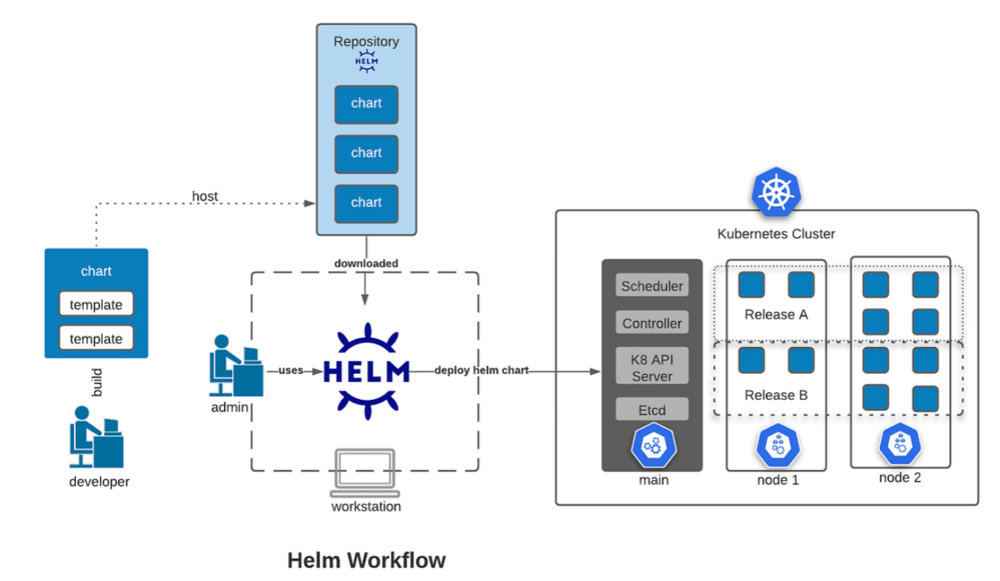

# 9. Helm

# 9.1 Helm Core Concepts

- **Package Manager for Kubernetes**: Helm bundles multiple interconnected Kubernetes objects (Deployments, Services, Secrets, PV/PVCs) into a single logical application package called a **Chart**.
- **App-Centric Management**: Helm allows you to manage an entire application stack (e.g., WordPress) as a single entity, rather than managing individual resource manifests separately.

# 9.2 Key Helm Architecture & Mechanics

- **Centralized Configuration (`values.yaml`)**:
  - Acts as a single source of truth for custom settings across all application components.
  - Eliminates the need to search through or edit dozens of individual component YAML files.
  - Allows configuration adjustments (like passwords, replica counts, or storage sizes) in one place.
- **Release Management**:
  - Tracks deployments as specific **Revisions** (releases).
  - Enables single-command **upgrades** and **rollbacks** capabilities if a deployment fails.
- **Clean Life Cycle**:
  - **Single-command installation**: Deploys large applications requiring hundreds of manifest objects automatically.
  - **Single-command uninstallation**: Tracks every objects tied to a package release, allowing clean deletion with **no orphaned resources** left behind in the cluster.

# 9.3 Main Benefits

- Replaces manual, error-prone workflows (like running `kubectl apply -f`) on dozens of separate files or managing huge, monolithic YAML files.
- Standardizes, simplifies and speeds up application deployment in Kubernetes clusters.

# 9.4 Helm Templating & Structure

- **Templating & Variable Syntax**:
  - Kubernetes manifests inside a chart act as dynamic templates.
  - Variables are defined using double curly braces (e.g., `{{ .Values.replicaCount }}`).
  - Values are injected into these templates from the `values.yaml` file at render time.
- **Helm Chart Structure**:
  - `Chart.yaml`: Contains metadata (chart name, version, description, `appVersion`).
  - `values.yaml`: Contains default configuration values for templates.
  - `templates/`: Directory holding Kubernetes manifest template files.

```yaml
# Chart.yaml (Metadata)
apiVersion: v2
name: my-app
version: 1.0.0      # Helm Chart version
appVersion: 2.1.0   # The actual application software version

# values.yaml (Variables Default Values)
replicaCount: 3
image: nginx:latest

# templates/deployment.yaml (Template Manifest)
apiVersion: apps/v1
kind: Deployment
metadata:
  name: my-app-deployment
spec:
  replicas: {{ .Values.replicaCount }}   # Injects '3' from values.yaml
  template:
    spec:
      containers:
      - name: nginx
        image: {{ .Values.image }}       # Injects 'nginx:latest' from values.yaml
```



- **How it works**: When you run `helm install my-release ./my-app`, Helm replaces `{{ .Values.replicaCount }}` with `3` and outputs a standard Kubernetes YAML file before sending it to the cluster.

# 9.5 Repositories & Discovery

- **Artifact Hub (`artifacthub.io`)**: Central public registry to discover community charts.
- **Repository Management Commands**:
  - Add a repository: `helm repo add <repo_name> <url>`
  - List configured repos: `helm repo list`
  - Update local repo indexes: `helm repo update`
- **Searching for Charts**:
  - Searching community hub: `helm search hub <keyword>`
  - Search added local repos: `helm search repo <keyword>`

# 9.6 Releases & Local Workflow

- **Releases**: An active instance of a Chart deployed to a cluster.
  - Installing the same chart twice creates 2 distinct, independent releases with unique release names.
- **Tracking Releases**:
  - List installed releases in current namespace: `helm list` (or `helm ls`).
- **Local Editing (`helm pull`)**:
  - Download and extract chart source files locally: `helm pull --untar <repo_name>/<chart_name>`
  - Allows manual editing of local `values.yaml` or template files before installing.

| Feature            | `helm pull` (Download)                                              | `helm install` (Deploy)                                     |
| ------------------ | ------------------------------------------------------------------- | ----------------------------------------------------------- |
| **Primary Goal**   | Fetch raw chart files to your **local machine**.                    | Deploy application resources to the **Kubernetes cluster**. |
| **Cluster Impact** | **Zero** (kubernetes knows nothing about this)                      | **Active** (create Pods, Services, Deployments, etc.)       |
| **Result**         | A `.tgz` archive or a directory of YAML files on your laptop.       | A live, running **Release** in the cluster                  |
| **Use Case**       | Inspecting code, customizing `values.yaml`, air-gapped environments | Actually running the application                            |

# 9.7 Key Command Equivalents and Overrides

- **Overriding values without editing files (`--set`)**:
  - CKAD often ask you to install/upgrade a chart while overriding a specific setting (e.g., setting replica count or port).
  - `helm install <release_name> <chart> --set replicaCount=3`
- **Inspecting values before deployment**:
  - To see default chart parameters without extracting files: `helm show values <chart_name>`
  - _Tip_: Pipe to `grep` to quickly find the exact key name: `helm show values bitnami/nginx | grep replica`
- **Using Custom Values File**:
  - Pass a custom values file during install or upgrade: `helm install <release_name> <chart> -f custom-values.yaml`

# 9.8 Upgrades, Rollbacks and Uninstall

- **Upgrade a release**: `helm upgrade <release_name> <chart> --set image-tag=v2.0`
- **Rollback to a previous revision**: `helm rollback <release_name> <revision_number>`
- **Uninstall a release**: `helm uninstall <release_name>`

# 9.9 Namespace Handling and Multi-Tenancy

- Helm commands respect Kubernetes namespaces, but you **must explicitly specify them** using the `-n` or `--namespace` flag.
- _List releases across ALL namespaces_: `helm list -A` or `helm list --all-namespaces`
- _Install into a specific namespace_: `helm install <release_name> <chart> -n <target_namespace>`

# 9.10 Dry Run and Template Rendering (Debugging)

- **Preview manifests without installing**:
  - `helm install <release_name> <chart> --dry-run --debug`
- **Render templates locally to standard output**:
  - `helm template <release_name> <chart_directory>` (Generates raw Kubernetes YAML files, useful if asked to convert a Helm chart to plain k8s manifests).
