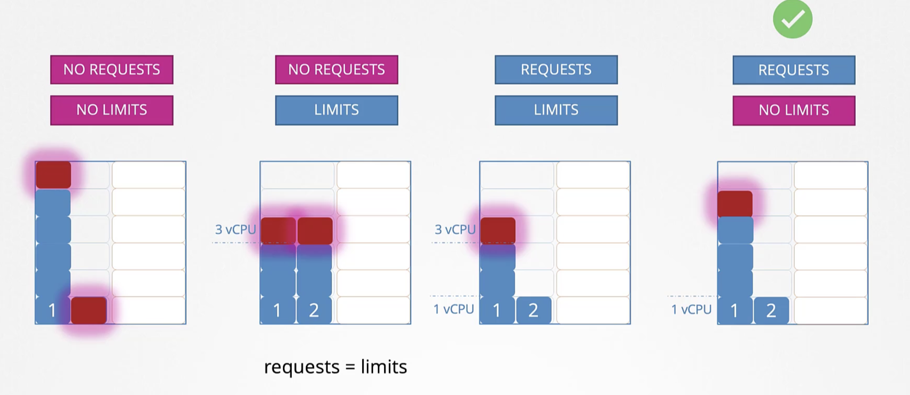
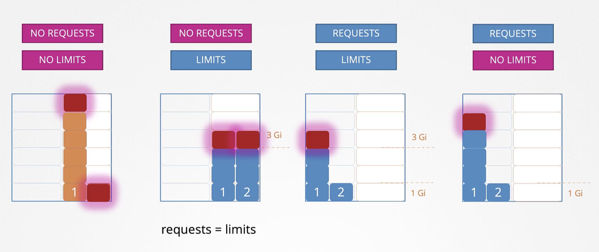

# k8s Configuration

## Creating own image

- Each layer in the dockerfile has a `SIZE`, run `docker history <image_name>` to see the SIZE
- `docker build Dockerfile -t leonlow/my-custom-app`
- `docker push leonlow/my-custom-app`: push to Docker registry

```dockerfile
## start from a base OS or another image
FROM ubuntu

## install dependencies using apt
RUN apt-get update
RUN apt-get install python

## install python dependencies using pip
RUN pip install flask
RUN pip install flask-mysql

## copy source code to /opt folder
COPY . /opt/source-code

## run the web server using `flask` command
ENTRYPOINT FLASK_APP=/opt/source-code/app.py flask run
```

## Commands and Arguments in Docker

- Using `CMD`

```yaml
## override the default CMD of ubuntu image CMD["bash"] which causes the container to exit
FROM ubuntu

CMD sleep 5

## using docker command
docker run ubuntu-sleeper sleep 10
```

- Using `ENTRYPOINT`, command line parameters get appended

```yaml
FROM ubuntu

ENTRYPOINT ["sleep"]

## using docker command ("sleep 10")
docker run ubuntu-sleeper 10
```

- Using both `ENTRYPOINT` and `CMD`
  - If command line argument not provided, it uses the default parameter in CMD
  - `docker run ubuntu-sleeper`: sleep for 5 seconds
  - `docker run ubuntu-sleeper 10` sleep for 10 seconds
  - `docker run --entrypoint sleep2.0 ubuntu-sleeper 10` using a new entry point "sleep2.0 10"

```yaml
FROM ubuntu

ENTRYPOINT ["sleep"]

CMD ["5"]
```

## Commands and Arguments in Kubernetes

- Creating a Pod with the Commands
- Example: `docker run --name ubuntu-sleeper ubuntu-sleeper`

```yaml
apiVersion: v1
kind: Pod
metadata:
  name: ubuntu-sleeper-pod
spec:
  containers:
    - name: ubuntu-sleeper
      image: ubuntu-sleeper
      command: ['sleep2.0'] ## override the ENTRYPOINT in docker image --> ENTRYPOINT ["sleep"]
      args: ['10'] ## override the CMD in docker image --> CMD ["5"]
```

- Can also do this

```yaml
command:
  - 'sleep'
  - '1200'
```

## Kubernetes Environment Variables

- **Plain Key Value**: Adding environment variables in Pod definition file

```yaml
spec:
  containers:
    - name: simple-webapp-color
      image: simple-webapp-color
      ports:
        - containerPort: 8080
      env:
        - name: APP_COLOR
          value: pink
```

- **ConfigMap**

```yaml
env:
  - name: APP_COLOR
    valueFrom:
      configMapKeyRef:
```

- **Secrets**

```yaml
env:
  - name: APP_COLOR
    valueFrom:
      secretKeyRef:
```

## Kubernetes ConfigMaps

- Instead of putting the environment variables key-value in the pod definition file (makes the file too large), we can put it in ConfigMap definition file.
- When the Pod is created, ConfigMap will inject key-value pairs into the environment variables of the Pod for the application hosted as a container in the Pod.

---

### Create `ConfigMap`

- Imperative

```sh
kubectl create configmap
  <config_name> --from-literal=<key>=<value>

kubectl create configmap \
  app_config --from-literal=APP_ENV=Prod \
             --from-literal=APP_NAME=my-app

## by file
kubectl create configmap
  <config_name> --from-file=<path_to_file>

kubectl create configmap \
  app_config --from-file=app_config.properties
```

- Declarative
  - `kubectl create -f config-map.yaml`

```yaml
apiVersion: v1
kind: ConfigMap
metadata:
  name: app_config
data:
  APP_ENV: Prod
  APP_NAME=my-app
```

- ConfigMap in Pods

```yaml
apiVersion: v1
kind: Pod
metadata:
  name: my-app
  labels:
    name: my-app
spec:
  containers:
    - name: my-app
      image: my-app
      ports:
        - containerPort: 8080
      envFrom:
        - configMapRef:
          name: app_config
```

- Single Env

```yaml
env:
  - name: APP_ENV
    valueFrom:
      configMapKeyRef:
        name: app_config
        key: APP_ENV
```

- Volumes

```yaml
volumes:
  - name: app-config-volume
    configMap:
      name: app_config
```

- Other Commands

```sh
## View ConfigMap
kubectl get configmaps

## Describe ConfigMap
kubectl describe configmaps
```

---

## Kubernetes Secrets

- Create the secret then inject it into the Pod.

---

### Create Secret

- Imperative Method

```sh
kubectl create secret generic
  <secret_name> --from-literal=<key>=<value>

kubectl create secret generic \
  app-secret --from-literal=DB_HOST=mysql \
             --from-literal=DB_USER=root \
             --from-literal=DB_PASSWORD=password

## reading secrets from file
kubectl create secret generic
  <secret_name> --from-file=<path_to_file>

kubectl create secret generic \
  app-secret --from-file=app_secret.properties
```

- Declarative Approach
  - `kubectl create -f secret-data.yaml`
- Encode Secrets because we don't want to show them in plain text in YAML file
  ```
  echo -n 'mysql' | base64
  bXlzcWw=
  echo -n 'root' | base64
  cm9vdA==
  echo -n 'password' | base64
  cGFzc3dvcmQ=
  ```
- Decode Secrets
  ```
  echo -n 'bXlzcWw=' | base64 --decode
  mysql
  ```

```yaml
apiVersion: v1
kind: Secret
metadata:
  name: app-secret
data:
  DB_Host: bXlzcWw=
  DB_User: cm9vdA==
  DB_Password: cGFzc3dvcmQ=
```

```sh
kubectl get secrets
kubectl describe secrets

kubectl get secret app-secret -o yaml
```

### Injecting K8s secrets into Pods

```yaml
# env
envFrom:
  - secretRef
      name: app-config

# Single env
env:
  - name: DB_Password
    valueFrom:
      secretKeyRef:
        name: app-secret
        key: DB_Password

# Volume
volumes:
- name: app-secret-volume
  secret:
    secretName: app-secret
```

### Note on Secrets

- Secrets are not Encrypted. Only encoded.
  - Do not check-in Secret objects to SCM along with code.
- Secrets are not encrypted in ETCD.
  - Enable encryption at rest
  - `EncryptionConfiguration` k8s object to encrypt secrets.
- Anyone able to create pods/deployments in the same namespace can access the secrets.
  - Configure least-privilege access to Secrets - RBAC (role-based access control)
- Consider third-party secrets store providers
  - AWS Provider, Azure Provider, GCP Provider, Vault Provider

### How Kubernetes Handles Secrets

- A secret is only sent to a node if a pod on that node requires it.
- Kubelet stores the secret into a tmpfs so that the secret is not written to disk storage
- Once the Pod the depends on the secret is deleted, kubelet will delete its local copy of the secret data as well.

---

## Encrypting Secret Data at Rest

- [Encrypting Secret Data at Rest](https://kubernetes.io/docs/tasks/administer-cluster/encrypt-data/)

1. Create a Secret Object

```sh
kubectl create secret generic my-secret --from-literal=key1=supersecret

kubectl get secret my-secret -o yaml
kubectl describe secret my-secret

echo "<secret>" | base64 --decode
```

2. Install etcdctl

- `apt-get install etcd-client`

3. Check if `etcd-controlplane` is in system pods namespace

- **System Components**: The output will include various Kubernetes system components such as etcd, kube-apiserver, kube-scheduler, kube-controller-manager, coredns, and others.
- `kubectl get pods -n kube-system`

4. Reading the secret out of etcd

```sh
ETCDCTL_API=3 etcdctl \
   --cacert=/etc/kubernetes/pki/etcd/ca.crt   \
   --cert=/etc/kubernetes/pki/etcd/server.crt \
   --key=/etc/kubernetes/pki/etcd/server.key  \
   get /registry/secrets/default/my-secret | hexdump -C   ## secret name here
```

- Data is stored in etcd in an unencrypted format currently. Thus, we need encryption in etcd.

5. Check if `kube-api` server has the `--encryption-provider-config`

```sh
# 2 ways to check
    # 1.
ps -aux | grep kube-api | grep "encryption-provider-config"

    # 2.
ls /etc/kubernetes/manifests/
cat /etc/kubernetes/manifests/kube-apiserver.yaml
```

6. If no `--encryption-provider-config` option, encryption at rest has not been enabled

- Encryption happens at `identity` in the YAML file. If none provided, then no encryption.
- We need a secret key to encrypt the k8s secret
  - `head -c 32 /dev/urandom | base64`: generates a 32-byte random key and base64 encode it. (MacOS and Linux)
    ```
    ~ head -c 32 /dev/urandom | base64
    mEg+nxrHi/bO4Be6zfNT3HBccNRyndPQinnraJVozVY=
    ```
- The YAML file created below will be named as `enc.yaml`

```yaml
apiVersion: apiserver.config.k8s.io/v1
kind: EncryptionConfiguration
resources:
  - resources:
      - secrets ## specifying that we want to encrypt k8s secrets
    providers:
      - aesbc:
          keys:
            - name: key1
              secret: mEg+nxrHi/bO4Be6zfNT3HBccNRyndPQinnraJVozVY=
      - identity: {}
```

7. Mount the new encryption config file to the `kube-apiserver` static pod

- Save the new encryption config file to `/etc/kubernetes/enc/enc.yaml` on the control-plane node.
  - `mkdir /etc/kubernetes/enc`
  - `mv enc.yaml`

8. Edit the manifest for the kube-apiserver static pod: `/etc/kubernetes/manifests/kube-apiserver.yaml` so that it is similar to:

- `vi /etc/kubernetes/manifests/kube-apiserver.yaml`

```yaml
apiVersion: v1
kind: Pod
metadata:
  annotations:
    kubeadm.kubernetes.io/kube-apiserver.advertise-address.endpoint: 10.20.30.40:443
  creationTimestamp: null
  labels:
    app.kubernetes.io/component: kube-apiserver
    tier: control-plane
  name: kube-apiserver
  namespace: kube-system
spec:
  containers:
  - command:
    - kube-apiserver
    ...
    - --encryption-provider-config=/etc/kubernetes/enc/enc.yaml  # add this line
    # directory in the Pod
    volumeMounts:
    ...
    - name: enc                           # add this line
      mountPath: /etc/kubernetes/enc      # add this line
      readOnly: true                      # add this line
    ...
  # location of file in local directory
  volumes:
  ...
  - name: enc                             # add this line
    hostPath:                             # add this line
      path: /etc/kubernetes/enc           # add this line
      type: DirectoryOrCreate             # add this line
  ...
```

9. Restart the api server

- Run `crictl pods` to check the state of `kube-apiserver-controlplane`
- Run `ps -aux | grep kube-api | grep "encryption-provider-config"` to check if the encryption option was added
- Test creating a new secret `kubectl create secret generic my-secret-2 --from-literal=key2=topsecret`
- Run and should see encrypted secret (not plaintext)

  ```
  ETCDCTL_API=3 etcdctl \
   --cacert=/etc/kubernetes/pki/etcd/ca.crt   \
   --cert=/etc/kubernetes/pki/etcd/server.crt \
   --key=/etc/kubernetes/pki/etcd/server.key  \
   get /registry/secrets/default/my-secret-2 | hexdump -C
  ```

- Previously created secrets will not be encrypted. To ensure that all secrets are encrypted, run `kubectl get secrets --all-namespaces -o json | kubectl replace -f -`

## Docker Security

- [Docker Security CheatSheet](https://cheatsheetseries.owasp.org/cheatsheets/Docker_Security_Cheat_Sheet.html)
- Docker containers share the same underlying operating system as the Host but they have their own namespaces.
- Thus, these containers can only see its own processes, libraries and dependencies. It cannot view anything outside of its own namespace.
- Docker host has a set of users
  - root
  - non-root users
- By default, Docker host runs containers as the root user.
- If we don't want to run Docker containers as the root user, specify the user ID

  - `docker run --user=1000 ubuntu sleep 3600`
  - OR we can set the user ID in the docker image in Dockerfile

    ```dockerfile
    FROM ubuntu

    USER 1000
    ```

    `docker build -t my-ubuntu-image .`
    `docker run my-ubuntu-image sleep 3600`

- What happens if you run container as the root user? Is the root user within the container the same as the root user on the Host?
  - Can the process inside the container do anything that the root user can do on the system?
  - Docker implements a set of security feature that limit the rights of the root user within the container.
  - The root user within the Docker container is not like the root user on the Host.
  - Docker uses Linux capabilities to implement this.
- Adding capabilities to Docker container
  - Grant additional capabilities to the container beyond the default set provided by Docker
  - `docker run --cap-add NET_ADMIN -d --name my-container my-image`

## Kubernetes SecurityContext

- Can configure security at Pod level or Container level.
- If configured at Pod level, the security settings will flow to all the containers in the Pod.
- If configured at container level, the security settings on the container will override the settings on the Pod.

```yaml
## Adding Security Context to Pod
apiVersion: v1
kind: Pod
metadata:
  name: web-pod
spec:
  securityContext:
    runAsUser: 1000 ## user id to limit permissions in Pod
containers:
  - name: ubuntu
    image: ubuntu
    command: ['sleep', '3600']
```

```yaml
## Adding Security Context to Container
apiVersion: v1
kind: Pod
metadata:
  name: web-pod
spec:
  containers:
    - name: ubuntu
      image: ubuntu
      command: ['sleep', '3600']
      securityContext:
        runAsUser: 1000
        capabilities:
          add: ['MAC_ADMIN'] ## capabilities are only supported at the container level and not at the POD level
```

- Check the user that is running the container

```sh
controlplane ~ ➜  kubectl exec ubuntu-sleeper -- whoami
root
```

## Kubernetes ServiceAccounts

- 2 Types of accounts in Kubernetes: User and Service
  - User account is used by humans, e.g., administrator, developer accessing the k8s cluster
  - Service account is used by machines, e.g., application interacting with k8s cluster like a monitoring application Prometheus to poll k8s api to get performance metrics
    - Query the kubernetes api to get information about the cluster

```sh
kubectl create serviceaccount dashboard-sa
kubectl create serviceaccount <service_account_name> --namespace <namespace>

kubectl get serviceaccount
kubectl get sa

## creates a ServiceAccount object then generates a token for the ServiceAccount
## then it creates a Secret object and stores the token in the Secret object
kubectl describe serviceaccount dashboard-sa

## to view the secret token
## this token is used as an authentication bearer token while making a REST call to the k8s api
kubectl describe secret dashboard-sa-token-kbbdm

## making REST call to k8s api
curl https://192.168.56.70:6443/api -insecure --header "Authorization: Bearer <secret_token>"
```

- What if third-party application (Prometheus) is hosted within the k8s cluster itself?

  - Mount the service token secret as a volume inside the Pod hosting the third-party application
  - Thus, the token secret is already mounted in the Pod and can be easily read by the application

- Every k8s cluster has a `default` ServiceAccount.
  - When a Pod is created, by default, the `default` ServiceAccount and its token are automatically mounted to the Pod as a volume mount.

```sh
## viewing default token secret
kubectl describe pod <pod_name>

Mounts:
  /var/run/secrets/kubernetes.io/serviceaccount from default-token-j4hkv (ro)
Conditions:
  Type: Status
Volumes:
  default-token-j4hkv:
    Type: Secret (a volume populated by a Secret)
    SecretName: default-token-j4hkv
    Optional: false
```

```sh
## view the secret token mounts
--> kubectl exec -it my-kubernetes-dashboard -- ls /var/run/secrets/kubernetes.io/serviceaccount
ca.crt namespace token

## view toke to access kubernetes api
--> kubectl exec -it my-kubernetes-dashboard -- ls /var/run/secrets/kubernetes.io/serviceaccount/token
```

- Use a different ServiceAccount in the Pod definition file

```yaml
apiVersion: v1
kind: Pod
metadata:
  name: my-kubernetes-dashboard
spec:
  containers:
    - name: my-kubernetes-dashboard
      image: my-kubernetes-dashboard
  serviceAccountName: dashboard-sa
```

- **NOTE**: Cannot edit the ServiceAccount of an existing Pod. Must delete and recreate the Pod.

- Prevent mounting the default ServiceAccount onto the Pod if none is specified.

```yaml
apiVersion: v1
kind: Pod
metadata:
  name: my-kubernetes-dashboard
spec:
  containers:
    - name: my-kubernetes-dashboard
      image: my-kubernetes-dashboard
  automountServiceAccountToken: false # no ServiceAccount was specified, and also prevent mounting the `default` ServiceAccount
```

- The token is a JWT Token and it has no expiry.

  - Decode JWT Token: `jq -R 'split(".") | select(length > 0) | .[0],.[1] | @base64d | fromjson' <<< "$JWT"`

- Creating a non-expiring token ServiceAccount

```yaml
apiVersion: v1
kind: Secret
type: kubernetes.io/service-account-token
metadata:
  name: mysecretname
  annotations:
    kubernetes.io/service-account.name: dashboard-sa
```

- Create token for service account
  - `kubectl create token <service_account_name>`

## Kubernetes Resource Requirements

- In a k8s cluster, each node has limited CPU and memory available.
- Every Pod requires a set of resources to run, consuming resources on the Node.
- kube-scheduler decides which Pod the Node goes to, scheduler takes into account resources required on the Pod and the availability of resources on each Node, then identifies the best Node for allocating the Pod.
- If there are no available Nodes to place a Pod, the Pod will be in `Pending` status.
  - The error message will be: `FailedScheduling No nodes are available that match all of the following predicates:: Insufficient cpu (3).`

---

### Resource Requests

- Resources
  - CPU: 1
  - Memory: 1Gi (1 GB)

```yaml
## Pod Definition YAML
apiVersion: v1
kind: Pod
---
spec:
  containers:
    - name: simple-app
      image: simple-app
      ports:
        - containerPort: 8080
      resources:
        ## Pod resources. kube-scheduler will look for an available Node that has available resources for these requests.
        requests:
          memory: '4Gi'
          cpu: 2
```

### Resource - CPU

- CPU Values
  - 1 CPU, 100m CPU, 1m CPU (m stands for milli)
- 1 CPU is equivalent to:
  - 1 AWS vCPU
  - 1 GCP Core
  - 1 Azure Core
  - 1 Hyperthread

### Resource - Memory

- Memory Values
  - 256 Mi
  - 268 M
  - 1 G

|     Memory     |   Number of Bytes   |
| :------------: | :-----------------: |
| 1G (Gigabyte)  | 1,000,000,000 bytes |
| 1M (Megabyte)  |   1,000,000 bytes   |
| 1K (Kilobyte)  |     1,000 bytes     |
| 1Gi (Gibibyte) | 1,073,741,824 bytes |
| 1Mi (Mebibyte) |   1,048,576 bytes   |
| 1Ki (Kikibyte) |     1,024 bytes     |

### Resource Limits

- Limit the container from taking up all the CPU or memory from the Node
  - E.g., 1 vCPU or 512 Mi

```yaml
## Pod Definition YAML
apiVersion: v1
kind: Pod
---
spec:
  containers:
    - name: simple-app
      image: simple-app
      ports:
        - containerPort: 8080
      resources:
        ## Pod resources. kube-scheduler will look for an available Node that has available resources for these requests.
        ## The container requests 1Gi of memory and 1 CPUs but is limited to 2Gi of memory and 2 CPUs.
        ## This setup ensures that while the container is allocated resources, it cannot exceed the specified limits.
        requests:
          memory: '1Gi'
          cpu: 1
        limits:
          memory: '2Gi'
          cpu: 2
```

### Exceed Limits

- When a Pod tries to exceed its limits, the system throttles the CPU so that it does not go beyond its limits.
- However, a Pod can exceed its memory limits. But if it exceeds constantly, the Pod will be terminated and will be **OOM (Out of Memory)**.

### Behavior - CPU and Memory

- 
- 

---

## Kubernetes Limit Ranges

- LimitRange ensures that every Pod created has default values set to CPU and Memory.
- This can happen without CPU and memory values specified in Pod definition files.
- These are enforced when the Pod is created. **It does not affect existing Pods, it only affects newly created Pods**.
- **Pod Specification Overrides**: If the Pod specification file explicitly specifies memory and CPU limits, those values will override any default values defined in the LimitRange.
- Kubernetes validates the Pod against the LimitRange rules. If the specified limits in the Pod definition file fall within the allowed range defined in the LimitRange, the Pod is created successfully.
- If the specified limits in the Pod definition file fall outside the allowed range defined in the LimitRange, Kubernetes will reject the creation of the Pod, and an error will be returned.

```yaml
## LimitRange for CPU
apiVersion: v1
kind: LimitRange
metadata:
  name: cpu-resource-constraint
spec:
  limits:
    - default:
        cpu: 500m
      defaultRequest:
        cpu: 500m
      max:
        cpu: '1'
      min:
        cpu: 100m
      type: Container
```

```yaml
## LimitRange for Memory
apiVersion: v1
kind: LimitRange
metadata:
  name: memory-resource-constraint
spec:
  limits:
    - default:
        memory: 1Gi
      defaultRequest:
        memory: 1Gi
      max:
        memory: 1Gi
      min:
        memory: 500Mi
      type: Container
```

## Kubernetes Resource Quota

- ResourceQuota is a namespace level object, it allows you to specify constraints on resource consumption within a particular namespace.
- ResourceQuota not only applies to Pods, but also to other resources within the namespace, such as PVCs, Services, ConfigMaps, and Secrets.

```yaml
## resource-quota.yaml
apiVersion: v1
kind: ResourceQuota
metadata:
  name: my-resource-quota
spec:
  hard:
    requests.cpu: 4
    requests.memory: 4Gi
    limits.cpu: 10
    limits.memory: 10Gi
```

## Kubernetes Taints and Tolerations

- Restrict Nodes from accepting certain Pods.
- Taints:
  - Applied to Nodes
  - Indicate node limitations or issues (e.g., hardware problems, outdated software)
  - Prevent Pods from being scheduled on a Node unless they tolerate the Taint
  - 3 Taint Effects:
    1. `NoSchedule`: Pods will not be scheduled onto the Node
    2. `PreferNoSchedule`: system tries to avoid placing the Pod onto the Node.
    3. `NoExecute`: new Pods will not be scheduled onto the Node and existing Pods onto the Node, will be evicted if they do not tolerate the taint.
- Tolerations:
  - Applied to Pods
  - Allow Pods to be scheduled on Nodes with matching Taints
  - Specify the tolerable Taint values (key, value, effect)
- Taints and Tolerations help the Kubernetes scheduler make informed decisions
- Ensure Pods are deployed on suitable Nodes, respecting node limitations
- Enhance cluster management and resource utilization.
- However, it does not mean that the tainted Pod will enter the Node with the same tolerance. The tainted Pod can also be scheduled into other Nodes with no tolerance.
  - It does not tell the Pod to go to a certain Node. Instead, it only tells the Node to accept certain Pods.

```sh
## taint node
kubectl taint nodes node-name key=value:taint-effect  ## key-value pair

kubectl taint nodes node1 app=blue:NoSchedule  ## example command

## check taints on node
kubectl describe node node-name | grep Taint

##### remove taint from node
## Step 1: Get the Taint from the node
kubectl describe node node-name | grep Taint
## Step 2: Add a minus at the end
kubectl taint node node-name Taint-   ## add a '-' at the end

## check what nodes are Pods scheduled to
kubectl get pods -o wide
```

```yaml
## adding Tolerations to Pods
apiVersion: v1
kind: Pod
metadata:
  name: myapp-pod
spec:
  containers:
    - name: nginx-container
      image: nginx
  ## NOTE: Values MUST be in DOUBLE QUOTES
  tolerations:
    - key: 'app'
      operator: 'Equal'
      value: 'blue'
      effect: 'NoSchedule' ## Pod is allowed to be scheduled on a Node that has a Taint with NoSchedule
```

- When Kubernetes Cluster first sets up, a taint is already applied on the Master Node automatically that prevents any Pods from being scheduled on the Master Node.
  - To see this taint, `kubectl describe node kubemaster | grep Taint`, you will see `Taints: node-role.kubernetes.io/master:NoSchedule`

## Kubernetes Node Selectors

- Set limitation on Pods so they only run on particular Nodes
- Set Node Selectors
- Kubernetes-scheduler uses the `nodeSelector` on pod and nodes to find out which pod to place into which node

```yaml
apiVersion: v1
kind: Pod
metadata:
  name: myapp-pod
spec:
  containers:
    - name: data-processor
      image: data-processor
  nodeSelector:
    size: Large
```

```sh
# labelling Nodes
kubectl label nodes <node-name> <label-key>=<label-value>

kubectl label nodes node01 size=Large

## find labels on existing nodes (go to `Labels` section)
kubectl describe node node-name
```

- What if we want to add conditions?
  - E.g., Place the Pod into Nodes that are "Large OR Medium"
  - E.g., Place the Pod into Nodes that are "NOT small"
  - Need to use Node Affinity or Anti Affinity

## Kubernetes Node Affinity

```yaml
## Place Pods into Nodes that are Large or Medium
apiVersion: v1
kind: Pod
metadata:
  name: myapp-pod
spec:
  containers:
    - name: data-processor
      image: data-processor
  affinity:
    nodeAffinity:
      requiredDuringSchedulingIgnoredDuringExecution:
        nodeSelectorTerms:
        - matchExpressions:
          - key: size
            operator: In
            values:
            - Large
            - Medium

## NOT small
  affinity:
    nodeAffinity:
      requiredDuringSchedulingIgnoredDuringExecution:
        nodeSelectorTerms:
        - matchExpressions:
          - key: size
            operator: NotIn
            values:
            - Small

## Operator "Exists" means that the Pod will be schedule on a Node that has a label named "size", regardless of its value
  affinity:
    nodeAffinity:
      requiredDuringSchedulingIgnoredDuringExecution:
        nodeSelectorTerms:
        - matchExpressions:
          - key: size
            operator: Exists
```

- What if there are no Nodes that have the label "size"? What if someone changes the label on the Node? Will the Pod continue to stay on the Node?
  - Focus on Node Affinity Types
  - `DuringScheduling`: Pod does not exist and is created for the first time.
  - `DuringExecution`: Pod already exists and is running, then a change is made that affects Node Affinity.

---

### Node Affinity Types

- Available:

1. `requiredDuringSchedulingIgnoredDuringExecution`:

- `requiredDuringScheduling`: if a matching Node does not exist, the Pod will not be scheduled.
- `IgnoredDuringExecution`: pods continue to run after they have been scheduled even though Node Affinity has changed.

2. `preferredDuringSchedulingIgnoredDuringExecution`:

- `preferredDuringScheduling`: if a matching Node does not exist, the kube-scheduler will ignore Node affinity rules and place the Pod on any available Nodes.
- `IgnoredDuringExecution`: pods continue to run after they have been scheduled even though Node Affinity has changed.

- Planned (Future k8s Update)

1. `requiredDuringSchedulingRequiredDuringExecution`:

- `RequiredDuringExecution`: any existing Pods that are running on Nodes and do not meet the change in Node Affinity Rules will be evicted.

---

## Taints and Tolerations vs Node Affinity

- By setting taints on Nodes and tolerations on Pods, it does not guarantee that the Pod will be scheduled on the Node with acceptable taint. The Pod can be scheduled to another Node with no taint at all.
- By setting Node Selector and Affinity on Nodes and Pods, the Pods will now be placed onto the respective Nodes. However, other Pods that do not have any selectors (affinity rules) can be placed onto Nodes with labels.
- To solve this, use a combination of taints and tolerations, as well as node affinity. This allow us to:
  - Restrict Pod placement on specific Nodes using Taints and Tolerations
  - Specify preferred Nodes for scheduling using Node Affinity.
