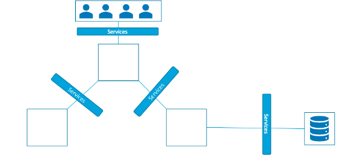
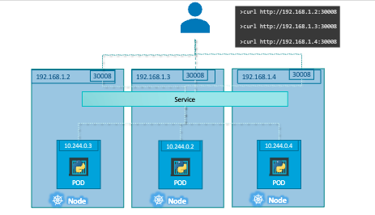
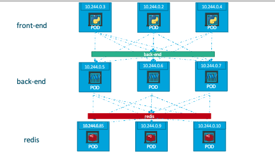
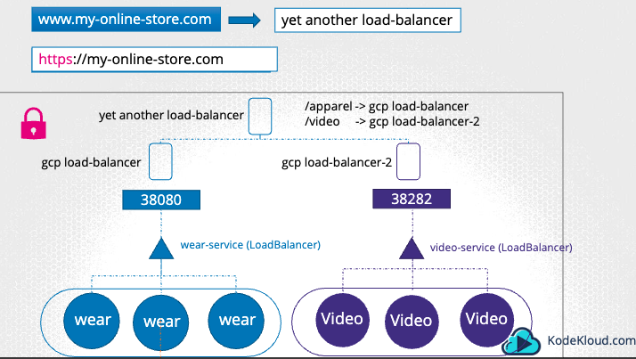
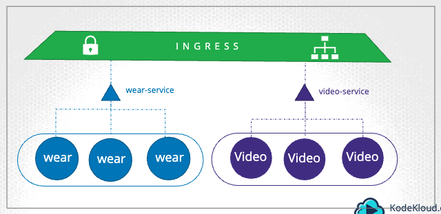

# Services and Networking

## Kubernetes Services



- A Kubernetes Service is an abstraction that defines a logical set of Pods and a policy for accessing them, often through a stable IP address and DNS name, ensuring reliable communication between components within a cluster. It decouples work definitions from the underlying Pod infrastructure, facilitating load balancing, service discovery, and scaling.
- Enable communication within and outside of the application.
- Enable loose coupling in our application as they allow microservices to communicate as well as exposing our frontend service to the outside world.

## NodePort

- NodePort is a type of Kubernetes Service that exposes a specific port on each Node in the cluster, allowing external traffic to access the Service via `NodeIP:NodePort`.
- This facilitates direct access to the service from outside the cluster, making it possible to route traffic to the correct Pods through any Node's IP and the designated port.
- `targetPort`: port on Pod
- `port`: port on Service
- `nodePort`: port on Node

```yaml
# service-definition.yaml
apiVersion: v1
kind: Service
metadata:
	name: myapp-service
spec:
	type: NodePort
  ports:
  - targetPort: 80
    port: 80
    nodePort: 30008
  # using selectors to match to labels in the pod (links Service to Pod)
  selector:
    app: myapp
    type: frontend
```

```yaml
# pod-definition.yaml
apiVersion: v1
kind: Pod
metadata:
  name: myapp-pod
  labels:
    app: myapp
    type: frontend
spec:
  containers:
    - name: nginx-container
      image: nginx
```

```sh
kubectl create -f service-definition.yaml

## to retrieve IP address and Port of the Node
kubectl get services
```



- Multiple Nodes
  - In a Kubernetes Cluster with multiple nodes running the same group of Pods, you can use a Kubernetes NodePort Service to expose these Pods on a specific port, such as 30008, on each node.
  - This allows external traffic to reach the Pods by accessing any Node's IP and the designated NodePort.
  - For instance, if you have Nodes with IPs `192.168.1.2`, `192.168.1.3`, `192.168.1.4` and you configured a NodePort Service on port 30008, you can access the Pods by using the following commands: `curl http://192.168.1.2:30008`, `curl http://192.168.1.3:30008`, `curl http://192.168.1.4:30008`
  - Each of these commands will route traffic through the NodePort, which will then forward the requests to one of the available Pods running the service.

## ClusterIP



- ClusterIP is a default type of Kubernetes Service that provides a **stable internal IP address**, making the service accessible only within the cluster.
- This allows the components within the cluster to communicate with each other reliably without exposing the service externally.

```yaml
# service-definition.yaml
apiVersion: v1
kind: Service
metadata:
  name: backend
spec:
  type: ClusterIP ## default service type, if not specified, it will automatically be ClusterIP for Service
  ports:
    - targetPort: 80 ## port on Pods that traffic should be forwarded to
      port: 80 ## port on Service itself that receives incoming traffic and maps to the `targetPort` on the Pods
  ## linking selectors in Service to labels in Pods
  selector:
    app: myapp
    type: backend
```

```sh
kubectl create -f service-definition.yaml
kubectl get services
```

- If service is connected to Pod correctly, the `endpoints` section in `kubectl describe svc` will show the correct IP address of the associated Pods.

## Ingress

- When using NodePort, users initially enter on URL `http://<node_ip>:NodePort` to access the Node.

  - However, we do not want users to remember node_ip so we configure a DNS entry in DNS server such that it becomes `http://my-online-store.com:NodePort`
  - The NodePort is more than 30000 and we also don't want users to remember it, default port for HTTP is 80.
  - We include a `proxy-server` between the user and the Node. This proxy-server will route traffic from port 80 to port 30080 (Node's port).
  - Thus, the URL then simplifies to `http://my-online-store`

- When using LoadBalancer, support cloud platforms like Google Cloud Platform (GCP) will set up a `gcp-load-balancer` between the users and the cluster Nodes
  - The load balancer listens on port 80 and proxies requests to the NodePort (e.g., 30080) of the appropriate Pods or Nodes in the Kubernetes Cluster.
  - The load balancer has an external IP to point users to the load balancer.
  - We set the load balancer external IP as a DNS entry in the DNS server.



- As our application grows, we have another endpoint `/video` to display another page for videos. And we now have 2 endpoints: `/apparel` and `/video`
  - We need 2 load balancers (gcp-load-balancer and gcp-load-balancer-2) with 2 NodePort 38080 and 38282 to route traffic to the different services - apparel-service and video-service.
  - On top of the 2 load balancers, we need another load balancer to route traffic to the respective load balancers
    - `/apparel` to `gcp-load-balancer`
    - `/video` to `gcp-load-balancer-2`
  - Deploying multiple load balancers on the cloud incurs a significant cost.
  - Can also impact performance as each additional layer of load balancing introduces latency, thereby affecting response times.



- That is where Ingress comes in

  - Ingress exposes your application to the outside world and defines rules for routing incoming HTTP or HTTPS requests, providing a single entry for incoming traffic.
  - It also enables load balancing, SSL termination and routing to multiple backend services, making it a powerful tool for managing external access to your application.
  - Even with Ingress, still need to export port via NodePort or LoadBalancer to the outside world

- Implementation of Ingress
  - First, deploy a reverse proxy or load balancing solution (like NGINX, HAProxy, GCE, Traefik, Istio) that acts as the Ingress Controller, handling incoming traffic and routing it to backend services.
  - Then, we specify a set of rules to configure Ingress.
  - The solution we deploy is called an **Ingress Controller** and the set of rules configured is called **Ingress Resources**.
  - Ingress Controller: Configure this solution as an Ingress Controller to manage traffic based on rules defined in Ingress Resources.
  - Ingress Resources are created using definition files, specifying routing rules, TLS settings and backend services.
  - A Kubernetes Cluster does NOT come with an Ingress Controller by default, need to deploy and configure an Ingress Controller separately to utilize Ingress resources.

```yaml
# Ingress Controller (Deployment Object)
apiVersion: networking.k8s.io/v1
kind: Deployment
metadata:
  name: nginx-ingress-controller
spec:
  replicas: 1
  selector:
    matchLabels:
      name: nginx-ingress
  template:
    metadata:
      labels:
        name: nginx-ingress
    spec:
      containers:
        - name: nginx-ingress-controller
          image: quay.io/kubernetes-ingress-controller/nginx-ingress-controller:0.21.0
      args:
        - /nginx-ingress-controller ## within the image, the nginx program is stored at this location
        - --configmap=$(POD_NAMESPACE)/nginx-configuration
      ## nginx service requires these env variables to read configuration data from within the Pod
      env:
        - name: POD_NAME
          valueFrom:
            fieldRef:
              fieldPath: metadata.name
        - name: POD_NAMESPACE
          valueFrom:
            fieldRef:
              fieldPath: metadata.namespace
      # ports used by NGINX controller
      ports:
        - name: http
          containerPort: 80
        - name: https
          containerPort: 443

---
## need a ConfigMap to store a set of configuration options for NGINX such as the
## path to store the logs, keep-alive threshold, ssl settings, session timeout etc.
## Using a ConfigMap makes it easy to modify a configuration setting later.
apiVersion: v1
kind: ConfigMap
metadata:
  name: nginx-configuration

---
## need a Service to expose the Ingress Controller to the external world
## we create a service of type NodePort with the nginx-ingress label selector to link
## the service to the deployment
apiVersion: v1
kind: Service
metadata:
  name: nginx-ingress
spec:
  type: NodePort
  ports:
    - port: 80
      targetPort: 80
      protocol: TCP
      name: http
    - port: 443
      targetPort: 443
      protocol: TCP
      name: https
  selector:
    name: nginx-ingress

---
## creating a ServiceAccount to allow the IngressController to monitor the
## data in the Kubernetes Cluster with the correct Roles, ClusterRoles and RoleBindings
apiVersion: v1
kind: ServiceAccount
metadata:
  name: nginx-ingress-serviceaccount
```

- Ingress Controller

  - **Deployment** manages the deployment and scaling of the nginx-ingress-controller Pod. It ensures that there is always one instance (`replicas: 1`) of the nginx-ingress-controller Pod running, which runs the NGINX Ingress Controller to manage incoming traffic based on configured rules and settings
  - **ConfigMap** stores configuration data for the NGINX Ingress Controller. It holds settings such as path to store logs, keep-alive thresholds, SSL settings, and session timeouts. Using a ConfigMap makes it easier to manage and update configuration settings without modifying the Deployment object.
  - **Service** exposes the NGINX Ingress Controller to external traffic. It creates a NodePort type Service that exposes ports 80 (HTTP) and 443 (HTTPS) on each Node in the cluster. Requests to these ports are forwarded to the NGINX Ingress Controller Pod(s) based on the label selector (`name: nginx-ingress`).
  - **ServiceAccount** defines an identity with permissions to access Kubernetes resources. It allows the NGINX Ingress Controller to interact securely with the Kubernetes API server, enabling it to monitor and manage ingress resources and other necessary cluster information.

- Ingress Resource
  - Defines routing rules
  - E.g., when user specifies `www.my-online-store.com/wear`, `www.my-online-store.com/watch`, `wear.my-online-store.com`, `watch.my-online-store.com`
  - Rules:
    - Rule 1: www.my-online-store.com
      - Within each rule, can handle different pods, for example:
        - `http://www.my-online-store.com/wear` to `/wear`
        - `http://www.my-online-store.com/watch` to `/watch`
    - Rule 2: www.wear.my-online-store.com
    - Rule 3: www.watch.my-online-store.com
    - Rule 4: everything else

```yaml
## ingress resource
apiVersion: networking.k8s.io/v1
kind: Ingress
metadata:
  name: ingress-wear
spec:
  ## traffic is routes to Service object
  backend:
    service:
      name: wear-service ## routes all traffic to wear-service
      port:
        number: 80

---
## specifying rules and paths
## e.g., `http://www.my-online-store.com/wear` and `http://www.my-online-store.com/watch`
## 1 rule 2 paths
apiVersion: networking.k8s.io/v1
kind: Ingress
metadata:
  name: ingress-wear-watch
spec:
  rules:
    - http:
      paths:
        - path: /wear
          backend:
            service:
              name: wear-service ## routes all traffic to wear-service
              port:
                number: 80
        - path: /watch
          backend:
            service:
              name: watch-service ## routes all traffic to wear-service
              port:
                number: 80

---
## using domain names
## e.g., `wear.my-online-store.com` and `watch.my-online-store.com`
## Since we have 2 domain names, we create 2 rules and 1 path each
apiVersion: networking.k8s.io/v1
kind: Ingress
metadata:
  name: ingress-wear-watch
spec:
  rules:
    - host: wear.my-online-store.com
      http:
        paths:
          - backend:
            service:
              name: wear-service ## routes all traffic to wear-service
              port:
                number: 80
    - host: watch.my-online-store.com
      http:
        paths:
          - backend:
              service:
                name: watch-service ## routes all traffic to wear-service
                port:
                  number: 80
```

```sh
kubectl create -f ingress-wear.yaml

## to get Ingress Resource
kubectl get ingress
kubectl get ingress -A

kubectl describe ingress <ingress_name>

## Imperative approach to create Ingress Resource
kubectl create ingress <ingress_name> --rule="host/path=service:port"
kubectl create ingress <ingress_test> --rule="wear.my-online-store.com/wear*=wear-service:80"

## find all ingress resources in all namespaces
kubectl get ingress --all-namespaces
kubectl get ingress -A

## using kubectl --help
kubectl create ingress --help
kubectl create ingress <ingress_name> -n <namespace> --rule="/pay=pay-service:8282"

kubectl get roles -n <ingress_namespace>
kubectl get rolebindings -n <ingress_namespace>
kubectl describe roles <role_name> -n <ingress_namespace>
```

- If the requirements does not match any of the configured paths in `Ingress`, do

```sh
## examine the Default backend field
kubectl describe ingress --namespace app-space
# Default backend:  <default>

## If it displays <default>, proceed to inspect the ingress controller's manifest by executing
## In the manifest, search for the argument --default-backend-service
kubectl get deploy ingress-nginx-controller -n ingress-nginx -o yaml
```

- Useful Documentation
  - [Ingress](https://kubernetes.io/docs/concepts/services-networking/ingress/)
  - [Ingress Path Types](https://kubernetes.io/docs/concepts/services-networking/ingress/#path-types)

## `rewrite-target` option in Ingress

- Different ingress controllers have different options that can be used to customise the way it works. NGINX Ingress controller has many options that can be seen [here](https://kubernetes.github.io/ingress-nginx/examples/)
- [rewrite-target option](https://kubernetes.github.io/ingress-nginx/examples/rewrite/)

```yaml
apiVersion: networking.k8s.io/v1
kind: Ingress
metadata:
  name: ingress-pay
  namespace: critical-space
  ## adding rewrite options with annotation
  annotations:
    nginx.ingress.kubernetes.io/rewrite-target: /
```

- Our watch app displays the video streaming webpage at `http://<watch-service>:<port>/`
- Our wear app displays the apparel webpage at `http://<wear-service>:<port>/`

We must configure Ingress to achieve the below. When user visits the URL on the left, his request should be forwarded internally to the URL on the right. Note that the /watch and /wear URL path are what we configure on the ingress controller so we can forwarded users to the appropriate application in the backend. The applications don't have this URL/Path configured on them:

- `http://<ingress-service>:<ingress-port>/watch` --> `http://<watch-service>:<port>/`
- `http://<ingress-service>:<ingress-port>/wear` --> `http://<wear-service>:<port>/`

Without the `rewrite-target` option, this is what would happen:

- `http://<ingress-service>:<ingress-port>/watch` --> `http://<watch-service>:<port>/watch`
- `http://<ingress-service>:<ingress-port>/wear` --> `http://<wear-service>:<port>/wear`

Notice watch and wear at the end of the target URLs. The target applications are not configured with `/watch` or `/wear` paths. They are different applications built specifically for their purpose, so they don't expect `/watch` or `/wear` in the URLs. And as such the requests would fail and throw a 404 not found error.

Basically the 2 services are served on `http://<watch-service>:<port>/` and `http://<wear-service>:<port>/`

To fix that we want to "ReWrite" the URL when the request is passed on to the watch or wear applications. We don't want to pass in the same path that user typed in. So we specify the `rewrite-target` option. This rewrites the URL by replacing whatever is under `rules->http->paths->path` which happens to be /pay in this case with the value in `rewrite-target`. This works just like a search and replace function.

For example: `replace(path, rewrite-target)`
In our case: `replace("/path","/")`

```yaml
apiVersion: extensions/v1beta1
kind: Ingress
metadata:
  name: test-ingress
  namespace: critical-space
  annotations:
    nginx.ingress.kubernetes.io/rewrite-target: /
spec:
  rules:
  - http:
      paths:
      - path: /pay
        backend:
          serviceName: pay-service
          servicePort: 8282
```

This could also be: `replace("/something(/|$)(.*)", "/$2")`

```yaml
apiVersion: extensions/v1beta1
kind: Ingress
metadata:
  annotations:
    nginx.ingress.kubernetes.io/rewrite-target: /$2
  name: rewrite
  namespace: default
spec:
  rules:
  - host: rewrite.bar.com
    http:
      paths:
      - backend:
          serviceName: http-svc
          servicePort: 80
        path: /something(/|$)(.*)
```