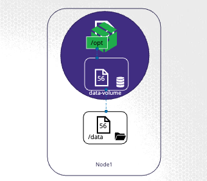

# State Persistence

## Volumes

- To persist data processed by container, create a volume and place the data in the Volume.
- In Kubernetes, we can also attach volumes to Pod. Data generated by Pod is stored in Volumes.
- The volume needs a storage location, configure it to a path on the host.



```yaml
apiVersion: v1
kind: Pod
metadata:
	name: random-number-generator
spec:
	containers:
	- image: alpine
    name: alpine
    command: ["/bin/sh", "-c"]
    args: ["shuf -i 0-100 -n 1 >> /p[t/number.out;"]
    ## once the volume is created, we mount the volume so the container can access the data in the volume
    volumeMounts:
    - mountPath: /opt
      name: data-volume
  volumes:
  ## The following volume works on a single node for storing data, but does not work across multiple nodes
  - name: data-volume
    hostPath:
      path: /data # Directory on the node where data is stored
      type: Directory

## Alternatively, you can store volumes in AWS Elastic Block Store
  volumes:
  - name: data-volume
    awsElasticBlockStore:
      volumeID: <volume-id>
      fsType: ext4
```

## Persistent Volumes

- In the previous section, the volumes were created in the Pod definition file.
- However, it is better to maintain the volumes in a more central location, i.e., Persistent Volume Claims (PVC), so that an administrator can configure a large pool of storage and users can request persistent volumes from it.
- PVC is consists of Persistent Volumes (PV)

```yaml
## pv-definition.yaml
apiVersion: v1
kind: PersistentVolume
metadata:
  name: pv-vol1
spec:
  accessModes:
    - ReadWriteOnce
    # - ReadOnlyMany
    # - ReadWriteMany
  capacity:
    storage: 1Gi ## amount of storage reserved for this PV, set to 1GB in this case

  ## volume location, stored in Node's local directory (NOT USED IN PRODUCTION)
  # hostPath:
  #   path: /tmp/data

  ## replace hostPath with one of the PV storage solutions, like AWS Elastic Block Store
  awsElasticBlockStore:
    volumeID: <volume_id>
    fsType: ext4
```

```sh
kubectl create -f pv-definition.yaml

kubectl get persistentvolume
kubectl get pv
```

## Persistent Volume Claims

- Make the storage available to a Node.
- PVC and PV are 2 separate objects in Kubernetes namespace.
- Administrator creates a set of PV, user creates PVC to use the storage.
- Once PVC is created, Kubernetes binds the PV to the PVC based on the requests and properties set on the volume.
- Every PVC is bound to the PV.
- During the binding process, Kubernetes looks for PV that has sufficient capacity as requested by the claim.
- Binding: (if don't match, PVC will not be bounded to PV)
  - Sufficient Capacity
  - Access Modes
  - Volume Modes
  - Storage Class
  - Selector
    - If there are multiple PV that can bind to the PVC, can use selectors in PVC to bind to labels in a PV.
- If there are no PVs available, PVC remains in a "Pending" state. Once PV is available, PVC will be bounded to the PV.
- When PVC is created, Kubernetes looks at the accessModes match, capacity requested sufficient.

```yaml
## pvc-definition.yaml
apiVersion: v1
kind: PersistentVolumeClaim
metadata:
  name: myclaim
spec:
  accessModes:
    - ReadWriteOnce
  resources:
    requests:
      storage: 500Mi
```

```sh
kubectl create -f pvc-definition.yaml

kubectl get persistentvolumeclaim
kubectl get pvc

kubectl delete persistentvolumeclaim myclaim
kubectl delete pvc myclaim
```

- What happens to PV when a PVC bounded to it is deleted?

  - By default, PV has `persistentVolumeReclaimPolicy: Retain` When a PVC bound to it is deleted, the PV will remain until it is manually deleted by the administrator and is not available for reuse by other claims.
  - `persistentVolumeReclaimPolicy: Delete`: When a PVC bound to it is deleted, the PV will be deleted as well to free up storage space.
  - `persistentVolumeReclaimPolicy: Recycle`: When a PVC bound to it is deleted, the PV will be scrubbed (data cleared) and made available for a new claim.

- Using PVCs in Pods
  - Once you create a PVC, use it in a Pod definition file by specifying the PVC Claim name under `persistentVolumeClaim` section in the volumes section.
  - The same is true for ReplicaSets or Deployments. Add this to the pod template section of a Deployment on ReplicaSet.

```yaml
apiVersion: v1
kind: Pod
metadata:
  name: mypod
spec:
  containers:
    - name: myfrontend
      image: nginx
      volumeMounts:
        - mountPath: '/var/www/html'
          name: mypd
  volumes:
    - name: mypd
      persistentVolumeClaim:
        claimName: myclaim
```

- Volume Types:
  - `azureDisk` is used to mount a Microsoft Azure Data Disk into a Pod
  - `hostPath` is used to mount a directory from the Node on which the Pod is running.
  - `emptyDir` is used to store data in a Pod only as long as that Pod is running on that node and when the Pod is deleted, the files are to be deleted as well.
  - `fc` is used to mount an existing Fibre channel volume into a Pod.

## Storage Classes

- Before PV is created, you must create disk on Google Cloud or other supported cloud platforms.
- **Static Provisioning**: In Kubernetes, static provisioning involves the administrator manually creating PersistentVolumes (PVs) which are then matched to PersistentVolumeClaims (PVCs) made by users.
- **Dynamic Provisioning**: In Kubernetes, dynamic provisioning allows the system to automatically create PersistentVolumes (PVs) based on user-defined PersistentVolumeClaims (PVCs) and StorageClasses.

```sh
gcloud beta compute disks create \
  --size 1GB
  --region us-ease1
  pd-disk
```

```yaml
apiVersion: v1
kind: PersistentVolume
metadata:
  name: pv-vol1
spec:
  accessModes:
    - ReadWriteOnce
  capacity:
    storage: 500Mi
  gcePersistentDisk:
    pdName: pd-disk
    fsType: ext4
```

- Storage Classes: resource that defines the specifications and parameters for dynamically provisioning PersistentVolumes (PVs)
- Example below is using GCP storage class

```yaml
# sc-definition.yaml
apiVersion: storage.k8s.io/v1
kind: StorageClass
metadata:
  name: google-storage
provisioner: kubernetes.io/gce-pd
parameters:
  type: pd-standard
  replication-type: none

# pvc-definition.yaml
apiVersion: v1
kind: PersistentVolumeClaim
metadata:
  name: myclaim
spec:
  accessModes:
  - ReadWriteOnce
  storageClassName: google-storage ## specify the storage class in pvc definition file.
  resources:
    requests:
      storage: 500Mi
```

```sh
kubectl get storageclass
kubectl get sc
```

## Kubernetes StatefulSets

- IP addresses of Pods are dynamically assigned. If Pod is recreated, the Pod name changes and Pod IP changes.
- A StatefulSet in Kubernetes is a workload API object used to manage stateful applications, ensuring the stable, unique network identities and persistent storage for each of its pods.
- Pods are created in an ordered, graceful deployment.
- Unlike Deployments, StatefulSets maintain a **sticky identity for each pod**, allowing for ordered deployment, scaling, and updates.

  - 3 Pods: `<stateful_set_name>-0`, `<stateful_set_name>-1`, `<stateful_set_name>-2`
  - The first Pod created will always have the name `<stateful_set_name>-0`

- Good for Master-Slave Replication
  - E.g., 1 Master and 2 Slaves
  - Slave reads data from Master_Host with consistent name `mysql-0`
  - Procedure:
    1. Setup master first and then slaves
    2. Clone data from the master to slave-1
    3. Enable continuous replication from master to slave-1
    4. Wait for slave-1 to be ready
    5. Clone data from slave-1 to slave-2
    6. Enable continuous replication from master to slave-2
    7. Configure Master Address on Slave (i.e., `mysql-0`)

```yaml
# statefulset-definition.yaml
# same as Deployment, just need to change `kind` and specify `serviceName` (headless service)
apiVersion: apps/v1
kind: StatefulSet
metadata:
  name: mysql
  labels:
    app: mysql
spec:
  template:
    metadata:
      labels:
        app: mysql
    spec:
      containers:
        - name: mysql
          image: mysql
  replicas: 3
  selector:
    matchLabels:
      app: mysql
  serviceName: mysql-h ## headless service
  podManagementPolicy: Parallel ## by default is OrderedReady. Parallel means creating Pods in parallel instead of orderly manner
```

```sh
kubectl create -f statefulset-definition.yaml

## scaling gracefully with stateful sets
kubectl scale statefulset mysql --replicas=5
kubectl scale statefulset mysql --replicas=3 ## scaling down

kubectl delete statefulset mysql
```

## Headless Services

- A Headless Service in Kubernetes is a type of Service that does not assign a cluster IP address.
- Instead, it enables **direct DNS resolution to the individual pod IP addresses**, allowing clients to connect directly to the pods, **often used with StatefulSets** to provide stable network identities for stateful applications.
- Each Pod gets `<pod_name.headless_service>`
  - E.g., `mysql-0.mysql-h.default.svc.cluster.local`, `mysql-1.mysql-h.default.svc.cluster.local`, `mysql-2.mysql-h.default.svc.cluster.local`
- Purpose of this is because we want write operations to only be directed to `mysql-0.mysql-h.default.svc.cluster.local` (which is the Master Node).

```yaml
## headless-service.yaml
apiVersion: v1
kind: Service
metadata:
  name: mysql-h
spec:
  ports:
    - port: 3306
  selector:
    app: mysql
  clusterIP: None ## Setting clusterIP to None makes this a headless service, enabling direct DNS resolution to the pods

---
## deployment-definition.yaml
apiVersion: apps/v1
kind: StatefulSet
metadata:
  name: mysql-deployment
  labels:
    app: mysql
spec:
  serviceName: mysql-h ## must specify the headless service
  replicas: 3
  matchLabels:
    app: mysql
  template:
    metadata:
      name: myapp-pod
      labels: app: mysql
    spec:
      containers:
        - name: mysql
          image: mysql
      ## Usually this section is not specified. If specified, it needs a headless service with the same name
      ## to create DNS records like `mysql-pod.mysql-h.default.svc.cluster.local`
      subdomain: mysql-h ## Specify the headless service name to set up DNS subdomain for the pod
      hostname: mysql-pod ## Configure the DNS entry name of the pod
```

## `VolumeClaimTemplate`

- `volumeClaimTemplate`: Defines a PVC template within a StatefulSet. Ensures each pod gets its own PV for persistent storage, critical for stateful applications. In the example, each pod will have its own data-volume that is bound to a PV provisioned by the google-storage StorageClass.
- Pods are created in an ordered manner.
  - When the first Pod is created with a PVC, the StorageClass dynamically provisions a PV to bind to the PVC.
  - When the next Pod is created with a PVC, the StorageClass dynamically provisions another PV to bind to this new PVC, ensuring each PVC gets a separate PV.
- If a Pod is destroyed and recreated, the Pod is recreated with the same PVC as before. Thus, this ensures that data is persistent and stateful, maintaining data integrity.

```yaml
## deployment-definition.yaml
apiVersion: apps/v1
kind: StatefulSet
metadata:
  name: mysql-deployment
  labels:
    app: mysql
spec:
  replicas: 3
  selector:
    matchLabels:
      app: mysql
  template:
    metadata:
      labels:
        app: mysql
    spec:
      containers:
        - name: mysql
          image: mysql
          volumeMounts:
            - mountPath: /var/lib/mysql
              name: data-volume
  # ensure that each pod in the StatefulSet gets its own persistent storage, which is crucial for stateful applications.
  volumeClaimTemplates:
    - metadata:
        name: data-volume
      spec:
        accessModes:
          - ReadWriteOnce
        storageClassName: google-storage
        resources:
          requests:
            storage: 500Mi

---
# sc-definition.yaml
apiVersion: storage.k8s.io/v1
kind: StorageClass
metadata:
  name: google-storage
provisioner: kubernetes.io/gce-pd
```
