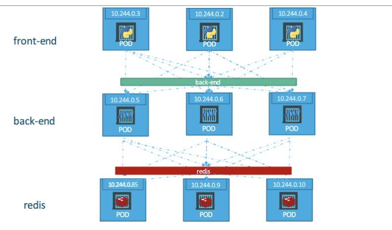

# Kubernetes

## 4 Sections in Kubernetes YAML file

1. apiVersion: specific to what we are creating (e.g., v1)
2. kind: a k8s object (e.g., Pod, Node, ReplicationController)
3. metadata: data about the k8s object (e.g., name, labels)
4. spec: specification of what's used in the k8s object

## Replication Controller

- To create multiple PODs and share the load across them. For instance, when the traffic increases, we deploy additional PODs to balance the load across multiple pods.
- High availability:
  - If there is only 1 POD in the Node, and the POD fails, replication controller automatically brings up a new POD when the existing POD fails.
- `replicas`: number of replicas needed.
- `apiVersion: v1`

## Replica Set

- Replaces Replication Controllers. Both have the same purpose but are not the same.
- `apiVersion: apps/v1`
- Requires a `selector` section that helps the replicaset identify what pods fall under it.
  - Besides managing the PODs specified in the template, replicaset can also manage existing PODs that were created before the replicaset.
  - Use `matchLabels` to match the labels specified on PODs
- Replicaset monitors the pods and if any of them were to fail, deploy new ones.

```yml
## Replica Set
selector:
  matchLabels:
    tier: front-end

## Pods
metadata:
  name: myapp-pod
  labels:
    tier: front-end
```

## Deployment

- For Production environment.
- Deployment object manages the rollout of updates to applications using a strategy called `Rolling Updates`, which ensures that updates are **applied incrementally with minimal downtime by replacing old pods with new ones in a controlled manner**.
  - `RollingUpdate` is the default Deployment strategy where we take down the older version and bring up a newer version 1 by 1.
  - `Recreate` (BAD) strategy destroys all running instances and then deploy the new instances. During this period, the application will be down and inaccessible to users.
- This approach enhances application availability and reliability by allowing for **smooth updates and easy rollback** if any issues arise during the deployment process.
- The contents of Deployment YAML file, similar to replicaset definition file.
- `apiVersion: apps/v1`
- Deployment automatically creates a replicaset. The replicasets ultimately create pods.

---

### Rollout and Versioning

- Rollout: process of gradually deploying or upgrading your application containers.
- When you first create a Deployment, it triggers a rollout.
- A new rollout creates a new Deployment revision. Let's call it "revision 1"
- In future, when the application is upgraded and the container version is updated to a new one, a new rollout is triggered and a new Deployment revision is created called "revision 2".
- This helps us to **track the changes made to the Deployment** and **enables to to rollback to a previous version of Deployment** (if necessary).

---

# Kubernetes Networking

## Internal Networking

- Node has an IP Address (e.g, 192.168.1.2), this is the IP address to access the Node or SSH into it.
- Each POD in k8s has its own internal IP Address in the range of 10.244 series (e.g., 10.244.0.2). When you deploy multiple PODs, they all get a separate IP assigned and its internal IP address is subjected to change when PODs are recreated.

## Cluster Networking


- Two nodes with IP address 192.168.1.2 and 192.168.1.3.
- Each node has a single POD deployed and attached to an internal network. They have their own IP addresses assigned. The 2 networks have an address 10.244.0.0 and the PODs deployed have the same address.
- This will not work well when the Nodes are part of the same k8s cluster. The PODs have the same IP addresses assigned to them which leads to IP conflicts in the network.


- With Calico networking setup, it manages the networks and IPs in Nodes and assigns a different network address for each network in the Nodes.
- This creates a virtual network of all PODs and Nodes where they are all assigned a unique IP address..
- Thus, all PODs can now communicate with each other using the assigned IP addresses.

# Kubernetes Services

- k8s Services enable communication between various components within and outside of the application.
- Helps to connect applications with other application or users.
- Services enable connectivity between groups of pods like a group of front-end pods, a group of back-end pods and a group of database pods like in a 3-tier architecture.
- Services enable **loose coupling** between microservices in our application.

## NodePort (Kubernetes Service)


- NodePort service listens to a port on the Node and forwards requests to PODs.
- NodePort makes an internal POD accessible on a port on the Node.
- There are 3 ports involved in NodePort Service
  - `targetPort`: The port on the POD where the actual web server is running is port 80. It is where the service forwards the requests to.
  - `port`: port on the service itself.
  - `NodePort`: port on the Node itself which we use to access the web server externally. NodePorts can only be in a valid range from 30000 to 32767. Users will connect to the POD via the Node's IP address and the NodePort. `http://<NodeIP>:<NodePort>`
- The `selector` for NodePort must be the same as `label` for POD because there could be many POD with the same port and the service does not know which POD to forward requests to. Need a selector and label to identify the correct POD.
- When we have multiple similar PODs running the application, the NodePort service also acts as a built-in load balancer to distribute load across different PODs and it identifies the correct port by selector and label. The NodePort Server spans scross all nodes in the cluster and maps the targetPort to the same NodePort on all the ndoes in the cluster.
- The primary purpose of a Service object in Kubernetes, including a NodePort, is to provide a stable IP address and DNS name for accessing a set of Pods, regardless of where they are running within the cluster. - This abstraction decouples the client from the actual Pod IPs.

## ClusterIP (Kubernetes Service)



- The purpose of a ClusterIP Service in Kubernetes is to provide an internal IP address within the cluster that allows communication between different services and Pods. (Front-end pods --> Back-end pods --> database pods).
- This type of service is not accessible from outside the cluster and is used to **facilitate internal-only traffic**.
- ClusterIP creates a virtual IP inside the cluster to enable communication between different services such as a set of front-end servers to a set of back-end servers.
- For instance, we have a group of pods that would like to communicate with another group of pods. The ClusterIP Service (front-end, back-end or database) will forward that request to one of the Pods.
- Use `selector` in ClusterIP Service to connect to `labels` in Pods.
- The ClusterIP service can be accessed by other PODs using the internal ClusterIP address or the service name.

## LoadBalancer (Kubernetes Service)


- In the diagram above, there are 3 Node clusters to access the pods with the same port but different IP Addresses. What IP should we give our end users to access the application (Pod)? We cannot give them all 3 IP Address and let them choose on their own.
- Thus, we need to setup a separate Load Balancer VM in our environment OR use Kubernetes built-in integration with supported cloud platforms.
- Kubernetes Load Balancer is only available on supported cloud platforms like AWS, Google Cloud, Azure.
