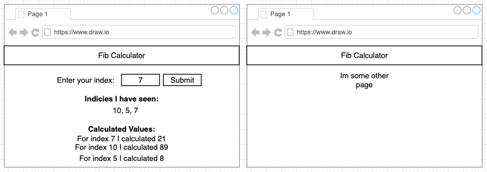
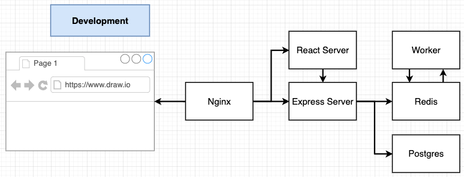
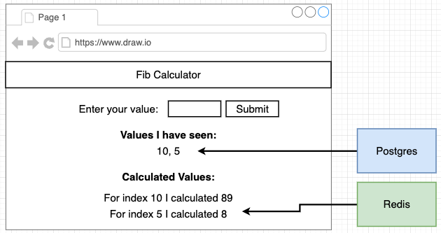
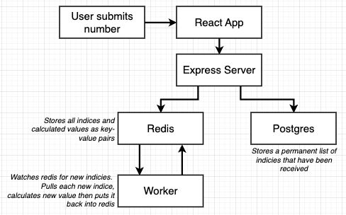
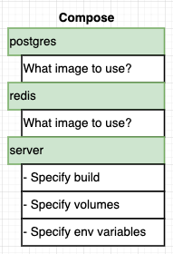
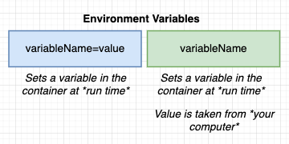
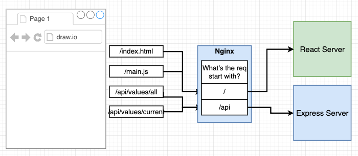
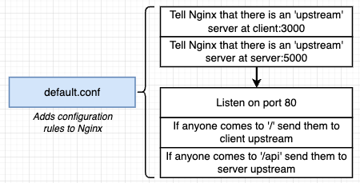
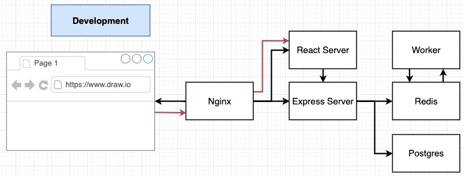

## Project Outline

- Goal: Building Multiple Container Application
- Project: Fibonacci Sequence

### Application Architecture






### Development Versions of Docker Containers

- Need to make **dev** Dockerfiles for React App, Express Server and Worker.
- This is to ensure we don't have to rebuild the entire Docker Image whenever we make a change to the source code.

1. Copy over package.json
2. Run `npm install`
3. Copy over everything else
4. Docker compose should set up a volume to 'share' files.

- Run `docker build -f Dockerfile.dev .` to build image and retrieve image_id
- `docker run <image_id>`

### Docker Compose



### Environment Variables in Docker Compose




### Nginx Path Routing




- Production Web Server
- Nginx routes incoming requests and it knows which request goes to the React Server and which request goes to the Express server.
- On Client Side, we are making requests to `/api/values` but on the server side, we are receiving requests on `/values`.
  - NGINX looks at the incoming request path. If it starts with `/`, redirect request to express server.
  - If it starts with `/api`, redirect request to the express API, nginx removes `/api` and when it reaches express api, it will become `/values`

### Routing with NGINX




- Use `default.conf` to add configuration rules to NGINX for the path routing.
    - **Upstream Server**: servers that NGINX redirect incoming requests to.
    - NGINX redirects to `client:3000` and `server:5000` as named in services in docker-compose.yml

### Switching of WebSocket between NGINX and React



- In Client Service, add this in docker-compose.yml

```yaml
environment:
    - WDS_SOCKET_PORT=0
```

- In `default.conf`, add this (for development environment only):

```conf
# for allowing WebSocket to React Server (FOR DEVELOPMENT!!)
location /ws {
    proxy_pass http://client;
    proxy_http_version 1.1;
    proxy_set_header Upgrade $http_upgrade;
    proxy_set_header Connection "Upgrade";
}
```

## Production Multi-Container Deployments

- Single Container Deployment
    1. Push code to github
    2. Travis automatically pulls repo
    3. Travis builds an image, tests code
    4. Travis pushes code to AWS EB
    5. EB builds image, deploys it
        - Not good because EB should be serving the web application, not building image
- Multi-Container Deployment
    1. Push code to github
    2. Travis automatically pulls repo
    3. Travis builds a **test** image, tests code
    4. Travis build **prod** images
    5. Travis pushes built **prod** images to Docker Hub.
    6. Travis pushes project to AWS EB
    7. EB pulls built images from Docker Hub, deploys
        - No longer dependent on EB to build our images

### Production Dockerfile

- `Dockerfile`