## Introduction

### Why use Docker?


- Docker makes it really easy to install and run software without worrying about setup or dependencies.

### What is Docker?

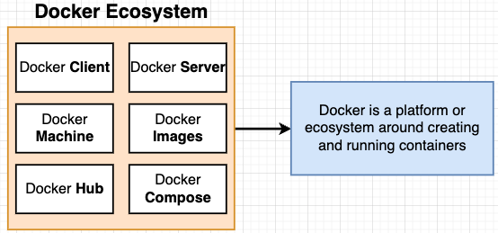
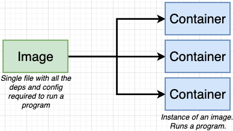

- Docker is a platform or ecosystem around creating and running containers.
- Docker image is stored in the Hard Drive. Container has its own space of hard drive, technology, memory, hardware resources, etc.

### Docker for Windows/Mac (Installing Docker)

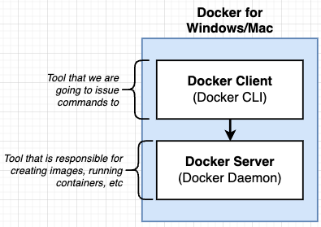

### Using the Docker Client

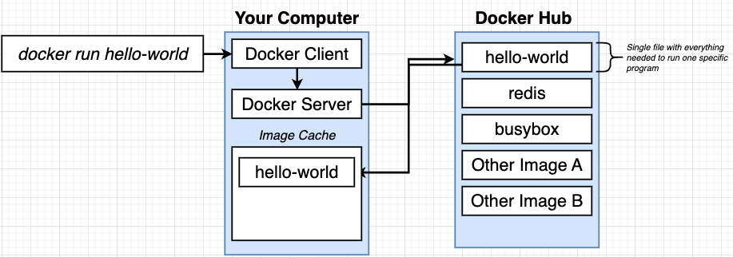

- Run `docker run hello-world`
  - Docker Server checks if our image cache (local) contains the `hello-world` image.
  - If image cache does not contain that image, Docker Server reaches out to Docker Hub and downloads the `hello-world` image from Docker Hub into the image cache.
  - Docker Server creates a container which is an instance of the image hello-world.

```
## Explanation from Docker

To generate this message, Docker took the following steps:
 1. The Docker client contacted the Docker daemon.
 2. The Docker daemon pulled the "hello-world" image from the Docker Hub.
    (arm64v8)
 3. The Docker daemon created a new container from that image which runs the
    executable that produces the output you are currently reading.
 4. The Docker daemon streamed that output to the Docker client, which sent it
    to your terminal.
```

### What is a Container?

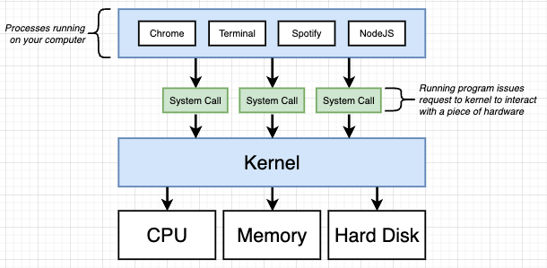
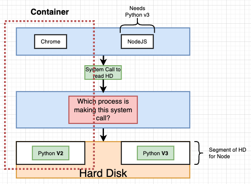
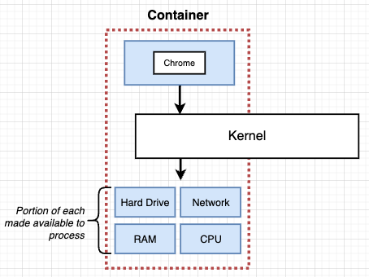
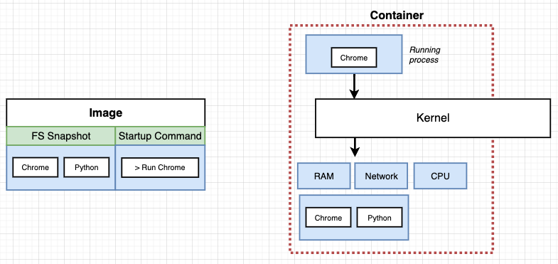

- Kernel is the intermediary between the processes and the hard drive.
- System calls are function invocations (kernel exposes these endpoints to the processes).
- Docker is a set of processes that have a grouping of resources specifically assigned to it.
  - **Image** is like a **File System snapshot with a startup command**
  - File System snapshot of the image is created inside the hard drive of the container.
  - The running process is then isolated within the container.

### NameSpacing and Control Groups (cGroups)

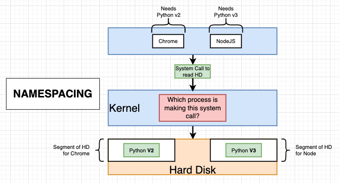
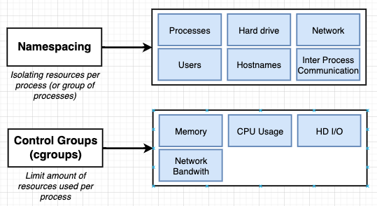

### How is Docker running on your computer?

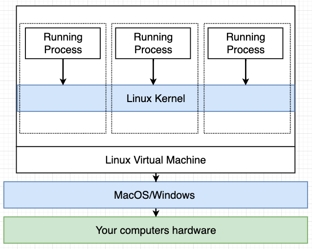

- NameSpacing and Control Groups (cGroups) are only available on Linux and not MacOS or Windows OS.
- When we installed Docker For Mac / Docker For Windows, we are installing a _Linux Virtual Machine_.
  - Inside the Linux Virtual Machine, there is a Linux Kernel that will manage the running containers / processes.
- Running `docker version`

```
Server: Docker Desktop 4.17.0 (99724)
    ...
  OS/Arch:          linux/arm64
```

## Manipulating Containers with Docker Client

### Creating and Running a Container from an Image

- Syntax: `docker run <image_name>`

  - `docker`: reference the Docker Client
  - `run`: try to create and run a container
  - `<image_name>`: name of image to use for this container

- Syntax (with override command): `docker run <image_name> <override_command>`
  - E.g., `docker run busybox ls`, `docker run busybox echo hi there`
  - `ls` command exists (an executable) inside the FS Snapshot of busybox image and not inside hello-world image. Thus, running `docker run hello-world ls` will not work.

### Listing Running Containers

- `docker ps`
  - lists all current running containers on your machine and can also retrieve the id or name of the container.
  - `ps`: list all running containers
- `docker ps --all` or `docker ps -a`
  - lists all containers that we have ever created including containers that were exited/shutdown naturally.

### Container Lifecycle

- `docker run` = `docker create` + `docker start`
  - `docker create`: creates a container out of an image, just setting out the file system snapshot of the container
  - `docker start`: starting a container, executing the startup command
    - `-a`: returns the output from the container when you start the container.

```
➜  docker-and-kubernetes-bootcamp git:(main) ✗ docker create hello-world
cbe8d7e65920d4ca66e93d2aca617b076978d4720d0c5bcc4fc932ff838a079b

➜  docker-and-kubernetes-bootcamp git:(main) ✗ docker start -a cbe8d7e65920d4ca66e93d2aca617b076978d4720d0c5bcc4fc932ff838a079b

Hello from Docker!
This message shows that your installation appears to be working correctly.

## docker start without `-a` option flag
➜  docker-and-kubernetes-bootcamp git:(main) ✗ docker start cbe8d7e65920d4ca66e93d2aca617b076978d4720d0c5bcc4fc932ff838a079b
cbe8d7e65920d4ca66e93d2aca617b076978d4720d0c5bcc4fc932ff838a079b
```

### Restarting Stopped Containers

- Can start a container back up again even after it has exited but the container will run the startup command used initially when creating the container

```
➜  docker-and-kubernetes-bootcamp git:(main) ✗ docker ps -a
CONTAINER ID   IMAGE     COMMAND           CREATED              STATUS                      PORTS     NAMES
ff458fdb6339   busybox   "echo hi there"   About a minute ago   Exited (0) 52 seconds ago             vigorous_mclaren

➜  docker-and-kubernetes-bootcamp git:(main) ✗ docker start -a ff458fdb6339
hi there
```

### Removing Stopped Containers

- `docker system prune`
  - delete stopped containers
  - delete build cache
  - delete dangling images
  - delete networks not used by at least one container

### Retrieving Log Outputs

- `docker logs <container_id>`
  - get all logs that have been emitted from the container in the entire history

### Stopping Containers

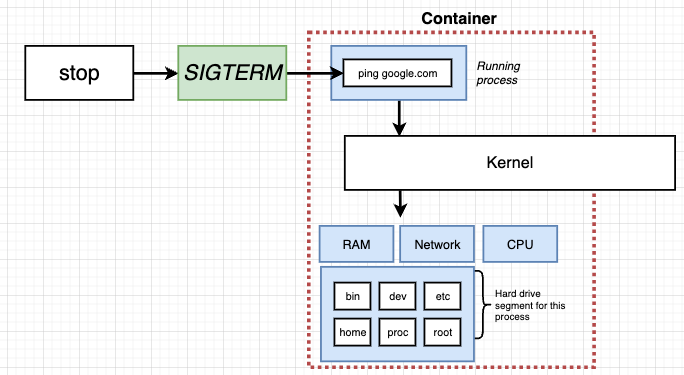

- `docker stop <container_id>`, `docker kill <container_id>`
  - Stopping the running container
  - `stop`: SIGTERM (terminate signal), shutdown gracefully with cleanup operations. Docker container only has **10 seconds** to shutdown gracefully, by then if haven't shutdown, it will run the `kill` signal.
  - `kill`: SIGKILL (kill signal), shutdown now without cleanup operations

### Multi-Command Containers

- `docker run redis`
  - started up redis inside the container. if u run `redis-cli` outside the container locally, it won't work.
  - need to run `redis-cli` inside the running container.
- `docker exec -it <container_id> <command>`
  - execute an additional command in a container
  - `exec`: run another command
  - `-it`: provide input to the container
  - `<command>`: command to execute

```
➜  docker-and-kubernetes-bootcamp git:(main) ✗ docker ps
CONTAINER ID   IMAGE     COMMAND                  CREATED         STATUS         PORTS      NAMES
e188c80b27cc   redis     "docker-entrypoint.s…"   3 minutes ago   Up 2 minutes   6379/tcp   tender_mendeleev

➜  docker-and-kubernetes-bootcamp git:(main) ✗ docker exec -it e188c80b27cc redis-cli
127.0.0.1:6379>
```

---

#### Purpose of the `-it` flag

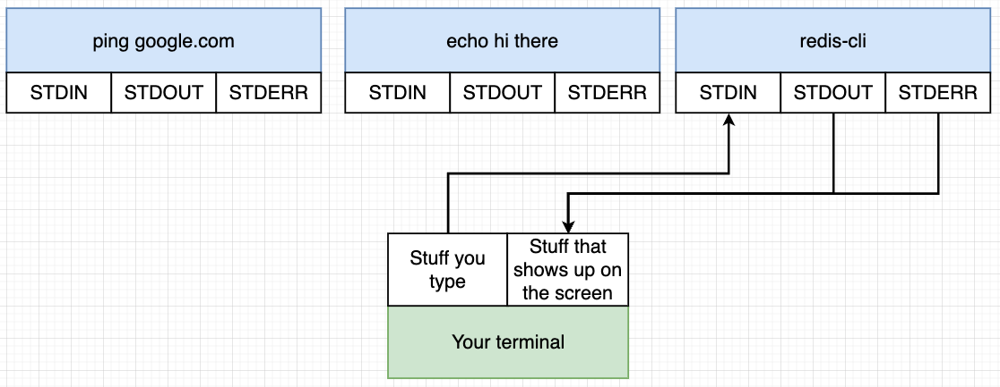

- In Linux environment, we have the STDIN, STDOUT and STDERR
- If `-it` not included, then the command will execute but you cannot provide any input to the container.
  - `-i` direct input to STDIN
  - `-t` presents a nicely formatted text/indentation/auto-complete functionality

---

#### Getting a Command Prompt in a Container

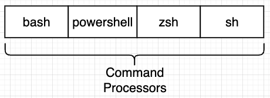

- `docker exec -it <container_id> sh`
  - getting full terminal access inside the context of a container.
  - `sh` is a shell / command processor.

```
➜  docker-and-kubernetes-bootcamp git:(main) ✗ docker exec -it e188c80b27cc sh
# cd /
# ls
bin   data  etc   lib    mnt  proc  run   srv  tmp  var
boot  dev   home  media  opt  root  sbin  sys  usr
# echo hi there
hi there
# redis-cli
127.0.0.1:6379>
```

---

### Starting with a Shell with `docker run`

- Starting interactive shell with `docker run -it <image_name> sh`

```
➜  docker-and-kubernetes-bootcamp git:(main) ✗ docker run -it busybox sh
/ # ls
bin    dev    etc    home   lib    lib64  proc   root   sys    tmp    usr    var
/ # ping 127.0.0.1
PING 127.0.0.1 (127.0.0.1): 56 data bytes
64 bytes from 127.0.0.1: seq=0 ttl=64 time=2.442 ms
64 bytes from 127.0.0.1: seq=1 ttl=64 time=1.781 ms
```

### Container Isolation

- Between containers, they do not share their file system and no sharing of data between both containers.
- Containers are completely isolated from each other.

## Building Custom Images through Docker Server

- Dockerfile --> Docker Client --> Docker Server --> Usable Image
  - Dockerfile is a configuration to define how our container should behave.
- Creating a Dockerfile
  1. Specify a base image
  2. Run some commands to install additional programs
  3. Specify a command to run on container startup
- To run the container
  - Run `docker build .` and get the image_id
    - passing dockerfile to Docker CLI
    - `build` uses dockerfile to generate an image out of it.
    - `.` is the build context which specifies the directory of files/folders to use for the build.
  - Run `docker run <image_id>`
- Dockerfile Terms:
  - `FROM`: Instruction telling Docker server what to do, what image to use as a base image.
  - `RUN`: used to execute some command
  - `CMD`: what command is used when image is used to startup a new container.

```dockerfile
# Task: Create an image that runs redis-server
# Use an existing docker image as a base image
FROM alpine

# Download and install a dependency (apk is a package manager)
RUN apk add --update redis

# Tell the image what to do when it starts as a container
CMD ["redis-server"]
```

### What is a Base Image?


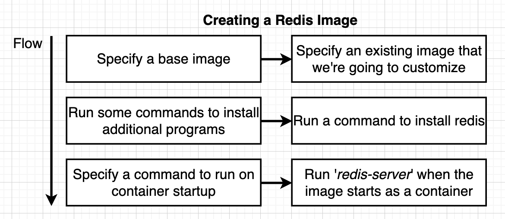

- Writing a dockerfile == Being given a computer with no OS and being told to install chrome.
- Why use `alpine` as a base image?
  - `alpine` comes with a preinstalled set of programs that are useful to us.
  - `alpine` has a minimalistic and lightweight nature, which results in smaller image sizes and reduced attack surface, making it ideal for efficient and secure container deployments.
- A base image refers to a fundamental, unaltered image that serves as the starting point for creating custom application containers. It typically contains a minimal operating system and necessary dependencies, allowing developers to layer their specific application code and configurations on top of it to create a containerized application.

### Build Process in Detail

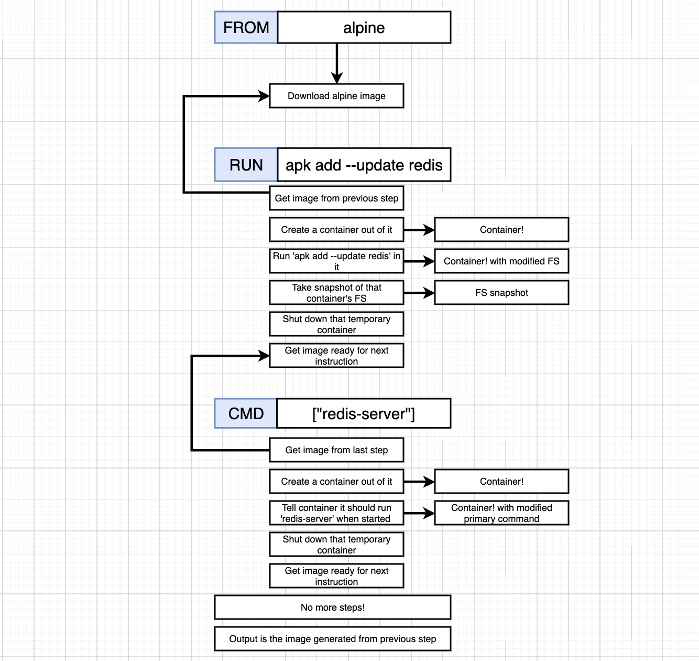

- `FROM alpine`
  - downloads the image from Docker Hub
- `RUN apk add --update redis`
  - docker server looks at the alpine image that was generated at the previous step and created an intermediate container out of it
  - executed `apk add --update redis` process inside the intermediate container and downloaded redis and some dependencies.
  - then redis was installed onto the hard drive of the intermediate container
  - once download completes, we remove the intermediate container and save the file system snapshot as a temporary image.
- `CMD ["redis-server"]`
    - to tell the final Docker container to use this command as the primary command for executing the process in the Docker container when it starts up.
    - end result is an image id, i.e., `a3bc35b05f0d`

```
Step 1/3 : FROM alpine
 ---> 3cc203321400

Step 2/3 : RUN apk add --update redis
 ---> Running in 26101910f7f5
 fetch https://dl-cdn.alpinelinux.org/alpine/v3.18/main/aarch64/APKINDEX.tar.gz
fetch https://dl-cdn.alpinelinux.org/alpine/v3.18/community/aarch64/APKINDEX.tar.gz
(1/1) Installing redis (7.0.14-r0)
Executing redis-7.0.14-r0.pre-install
Executing redis-7.0.14-r0.post-install
Removing intermediate container 26101910f7f5
 ---> bf48dd1e5941  # this is the id for a temporary image with copy of redis

Step 3/3 : CMD ["redis-server"]  # to create a container with a primary command
 ---> Running in e0c6014f46f6
Removing intermediate container e0c6014f46f6
 ---> a3bc35b05f0d
Successfully built a3bc35b05f0d # final image that was created
```

### Rebuilds with Cache

```dockerfile
Step 1/3 : FROM alpine
 ---> 3cc203321400
Step 2/3 : RUN apk add --update redis
 ---> Using cache
 ---> bf48dd1e5941
Step 3/3 : CMD ["redis-server"]
 ---> Using cache
 ---> a3bc35b05f0d
Successfully built a3bc35b05f0d
```

- Docker Server is able to read from dockerfile that the instruction has not changed and the same alpine image will be downloaded from Docker Hub. 
- Docker Server knows these images have already been generated and stored on the local machine.
- Thus, Docker uses the cache of the image.
- When will Docker Server not use cache image?
    - order of instructions has changed
    - new instruction added to the dockerfile
- Instructions that frequently change should always be at the bottom of the dockerfile so the top instructions will be ran using image cache (fast performance).

### Tagging an Image

- `docker build -t leonlow/redis:latest .`
    - `.` specifies the directory of files/folders to use for the build
    - `docker run leonlow/redis` to run a container
- Tagging Convention
    - `leonlow`: docker ID
    - `redis`: repo/project name
    - `latest`: version (optional, if not specified, defaults to `latest`)

### Manual Image Generation with Docker Commit

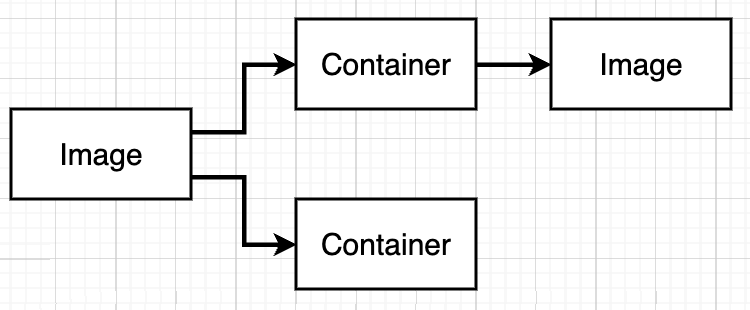 

- Not used for projects, just for learning purposes
- It is possible to generate an image out of a container. In the build process, an intermediate container was used to download dependencies and changed the FS Snapshot of the container then generate an image out of the container.

```
docker run -it alpine sh
/ # apk add --update redis

### On another terminal
docker ps  # get the container_id
docker commit -c 'CMD ["redis-server"]' <container_id>  # this generates the image_id
docker run <image_id>
```