## Kubernetes Production

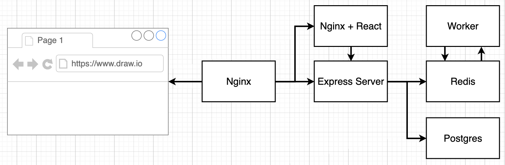
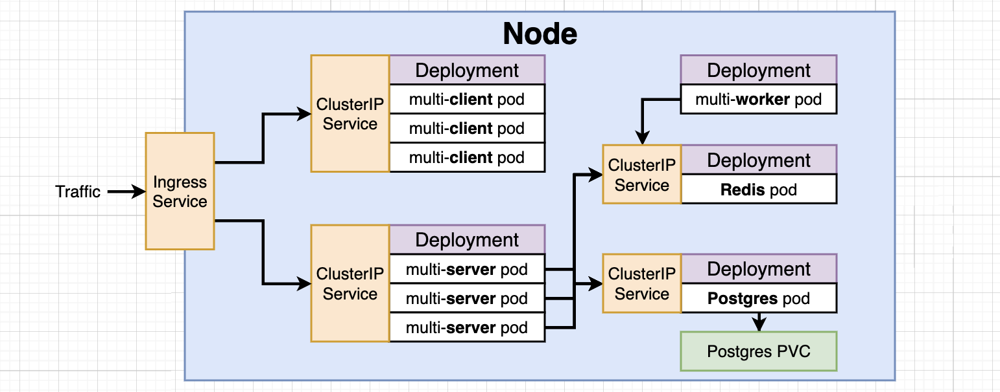

- On local, we will set up our application on one single Node.
  - "ChatGPT": You generally don't need to use Docker Compose in a production Kubernetes environment. Kubernetes itself provides a way to define and manage containerized applications in a more scalable, resilient, and production-ready manner. However, Docker Compose can still be valuable for local development and testing.
- On Cloud (AWS or Google Cloud), we have the option to set up the application on multiple Nodes.

### Path to Production

1. Create config files for each service and deployment
2. Test locally on minikube
3. Create a GitHub/Travis flow to build images and deploy
4. Deploy app to a cloud provider

```
# commands used to run the development compose file when testing
docker-compose -f docker-compose-dev.yml up
docker-compose -f docker-compose-dev.yml up --build
docker-compose -f docker-compose-dev.yml down
```

### `NodePort` vs `ClusterIP` Services

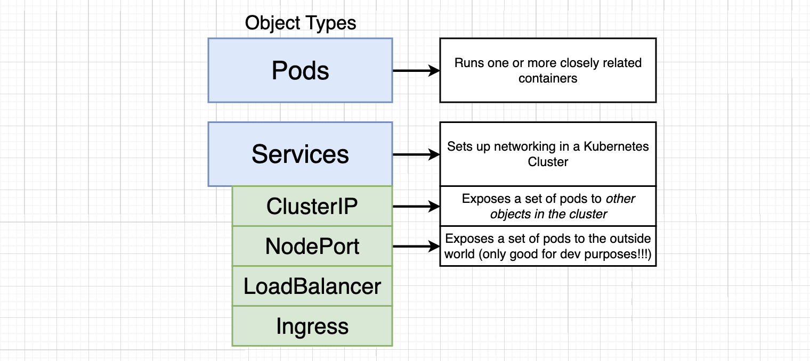

- ClusterIP
  - ClusterIP Services attached to Deployment can allow other Deployment object types in the Kubernetes Cluster to connect to.
  - If connected to Cluster IP service, we are exposing the Pods in Deployment to other services inside the Kubernetes Cluster.
  - Need the ClusterIP Service to provide objects (Pods) to everything inside the cluster.
  - From outside Kubernetes Cluster (outside world), we cannot access the Pod even if the Deployment object has a ClusterIP Service.
- Use a `selector` so our service knows what set of Pods it is providing access to.
- Traffic will enter through the Ingress Service instead.

```yaml
apiVersion: v1
kind: Service
metadata:
  name: client-cluster-ip-service
spec:
  type: ClusterIP
  selector:
    component: web # to connect to Pod
  ports:
    - port: 3000
      targetPort: 3000
```

- `port: 3000`: This is specifying a port on the service. It means that the service will listen on port 3000. Incoming traffic to this port on the service will be directed to the corresponding targetPort on the pods that the service is routing traffic to.
- `targetPort: 3000`: This specifies the target port on the Pods. When the service receives traffic on the port defined by `port`, it forwards that traffic to the Pods on the port defined by `targetPort`. In this case, both `port` and `targetPort` are set to 3000, so incoming traffic on port 3000 will be routed to port 3000 on the Pods.

```
# command to run a group of config files (specified directory instead)
➜  project-multi-container-k8s git:(main) kubectl apply -f ./k8s
service/client-cluster-ip-service created
deployment.apps/client-deployment created
```

### Express API Deployment Config

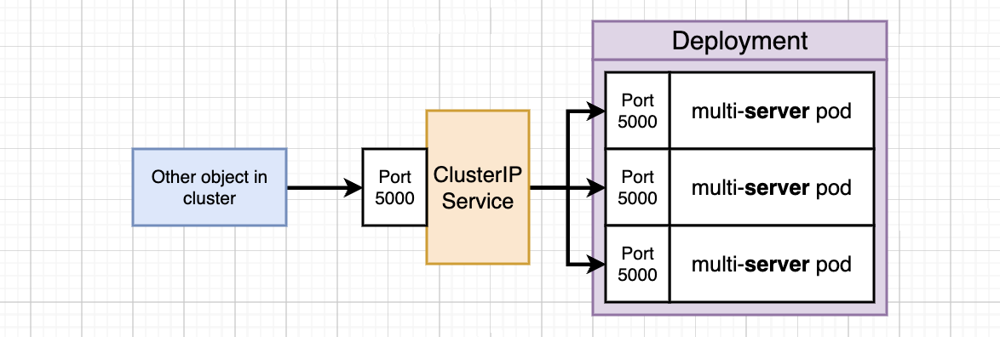

- Need to provide environment variables to out Deployment Config for API.

### Combining Config into Single Files

- Can create a single file to component the `ClusterIP` Service and `Deployment` object.
- Use `---` 3 dashes to separate

```yaml
apiVersion: apps/v1
kind: Deployment
metadata:
  name: server-deployment
spec:
  replicas: 3
  selector:
    matchLabels:
      component: server
  template:
    metadata:
      labels:
        component: server
    spec:
      containers: # 1 container in each Pod
        - name: server
          image: stephengrider/multi-server
          ports:
            - containerPort: 5000
---
apiVersion: v1
kind: Service
metadata:
  name: server-cluster-ip-service
spec:
  type: ClusterIP
  selector:
    component: server # specified in Pod as this selector
  ports:
    - port: 5000
      targetPort: 5000
```

### `selectors` in Deployment

```yaml
selector:
matchLabels:
  component: worker
template:
metadata:
  labels:
  component: worker
```

- **Selector Labels**
  - The `selector` section is used to specify the criteria for selecting which Pods should be managed by the Deployment.
  - The `template` section defines the template for the Pods that the Deployment will create.
- The reason for specifying the `component: worker` label in both places is that it ensures that the Pods created by the Deployment have the label that the Deployment uses to select and manage them.
- When you create or update the Deployment, the selector ensures that it matches Pods with the specified label, and the template ensures that the Pods it creates have the same label.

### The Worker Deployment

- Not setting up a ClusterIP Service.
- We only set up the ClusterIP Service when we want to redirect traffic to the Pods in the Deployment.
- In this case, we are not routing any requests to the multi-worker pods.

### Reapplying a Batch of Config Files

```
➜  project-multi-container-k8s git:(main) kubectl apply -f ./k8s
service/client-cluster-ip-service unchanged
deployment.apps/client-deployment unchanged
service/server-cluster-ip-service created
deployment.apps/server-deployment created
deployment.apps/worker-deployment created
```

- Kubernetes realised that we did not change the deployment YAML config file.
- Thus, kubernetes did not recreate the Deployment object and ClusterIP Service for client.

```
➜  project-multi-container-k8s git:(main) ✗ kubectl logs server-deployment-5949848f7-27kqw

> @ start /app
> node index.js

Listening
{ Error: connect ECONNREFUSED 127.0.0.1:5432
    at TCPConnectWrap.afterConnect [as oncomplete] (net.js:1161:14)
  errno: 'ECONNREFUSED',
  code: 'ECONNREFUSED',
  syscall: 'connect',
  address: '127.0.0.1',
  port: 5432 }
```

- `kubectl logs <pod_name>`
  - `pod_name` retrieved from `kubectl get pods`
  - Error because we haven't connect to postgres

### Postgres PVC (Persistent Volume Claim)

- Volumes with Databases
- Volume here is similar to Docker Volumes
- Data is being stored in the file system of the Postgres Container. If Pod gets delete by Deployment, we will lose everything if that Container crashes. Deployment then created a new Pod but no data is being carried over from the old Pod that crashed. (BAD)
- Thus, we create volumes. Postgres container writes data to volumes e instead. New Pod created has access to the volume that was used by the old Pod that crashed.

```yaml
metadata:
  name: postgres-deployment
spec:
  replicas: 1
```

- From the above configuration, try to avoid setting `replicas: 2` because we will have 2 postgres server Pods writing to the same file system at the same time. BAD. Issue with data integrity.

### Kubernetes Volumes

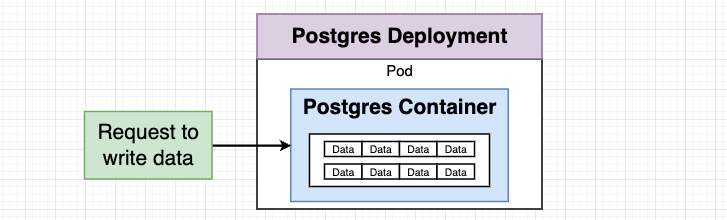
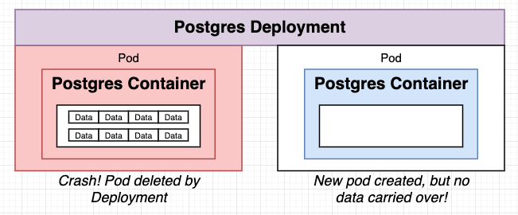
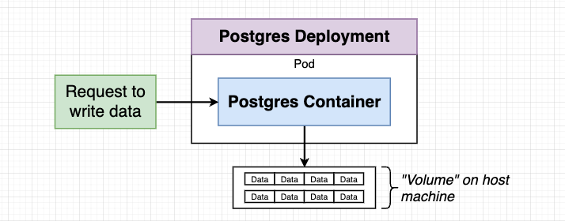
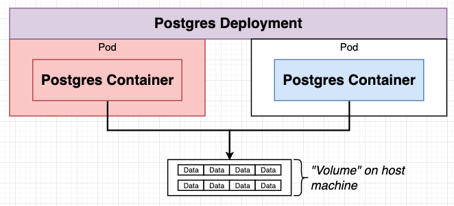
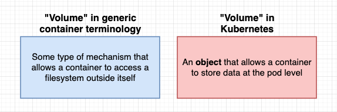
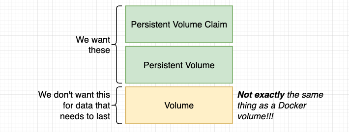
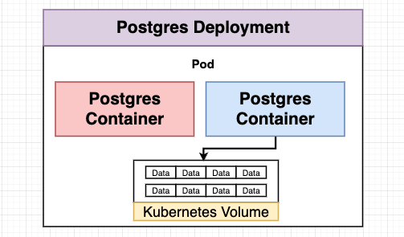
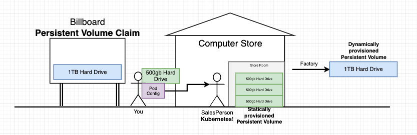

- Kubernetes Volume is tied to the Pod.
  - If the Pod dies, the Kubernetes Volume disappears.
  - Thus, Kubernetes Volume is not the ideal storage for postgres data. (Not Good)
- Persistent Volume
  - Not tied to any specific Pod or Container.
  - If Container dies or Pod deleted, the Persistent Volume will survive. When new Pod is created, the Postgres container in the Pod can connect to the Persistent Volume.
- Persistent Volume Claim
  - Different storage options inside the Kubernetes Cluster, specify different volume claims in the config file.
  - Pod Config request from Kubernetes. Kubernetes that looks into its store with Statically Provisioned Persistent Volumes (already present) or Dynamically provisioned Persistent Volume (created on the fly when needed).
  - It is not an actual instance of storage, it is attached to Pod Config. Kubernetes looks at that claim and check statically / dynamically provisioned Persistent Volume and meet that claim.

```yaml
apiVersion: v1
kind: PersistentVolumeClaim
metadata:
  name: database-persistent-volume-claim
spec:
  accessModes:
    - ReadWriteOnce
  resources:
    requests:
      storage: 2Gi # 2 GB of space
```

### Where Does Kubernetes Allocate Persistent Volumes?

- On local, Kubernetes stores Persistent Volumes in a slice of our hard drive.
- On Production, Kubernetes stores Persistent Volumes on a Cloud Provider, e.g., Google Cloud Persistent Disk, Azure File, Azure Disk, AWS Block Store.
  - Depending on the Cloud Provider, Kubernetes has a default storage class on the selected Cloud Provider. You can specifically mention which storage to use after that.
  - [Storage Classes Options](https://kubernetes.io/docs/concepts/storage/storage-classes/)

```
# where kubernetes stores persistent volume
➜  project-multi-container-k8s git:(main) kubectl get storageclass
NAME                 PROVISIONER                RECLAIMPOLICY   VOLUMEBINDINGMODE   ALLOWVOLUMEEXPANSION   AGE
standard (default)   k8s.io/minikube-hostpath   Delete          Immediate           false                  3d

➜  project-multi-container-k8s git:(main) ✗ kubectl describe storageclass
...
Provisioner:           k8s.io/minikube-hostpath
```

### Applying a PVC

```
➜  project-multi-container-k8s git:(main) ✗ kubectl get pvc
NAME                               STATUS   VOLUME                                     CAPACITY   ACCESS MODES   STORAGECLASS   AGE
database-persistent-volume-claim   Bound    pvc-e95c8522-2c2b-44c8-8338-3f3a30e1bd19   2Gi        RWO            standard       2m3s
```

### Defining Environment Variables

- Need to connect multi-worker to Redis and multi-server to Redis and Postgres through ClusterIP Service
  - REDIS_HOST and PG_HOST environment variables
  ```yaml
  metadata:
  name: redis-cluster-ip-service
  ```
  - `REDIS_HOST: redis-cluster-ip-service`

```yaml
spec:
  containers:
    - name: worker
      image: stephengrider/multi-worker
      env:
        - name: REDIS_HOST
          value: redis-cluster-ip-service
```

### Creating an Encoded Secret

- `Secrets` Object Type
  - Securely stores a piece of information in the cluster, such as a database password
  - Use this in environment variable of YAML config file
- Creating a secret (Imperative Command)
  - `kubectl create secret generic pgpassword --from-literal PGPASSWORD=password123`

```
➜  project-multi-container-k8s git:(main) ✗ kubectl create secret generic pgpassword --from-literal PGPASSWORD=password123
secret/pgpassword created
➜  project-multi-container-k8s git:(main) ✗ kubectl get secrets
NAME         TYPE     DATA   AGE
pgpassword   Opaque   1      7s
```