## Kubernetes (K8s)

### What is Kubernetes?

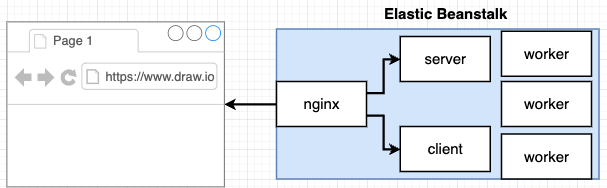
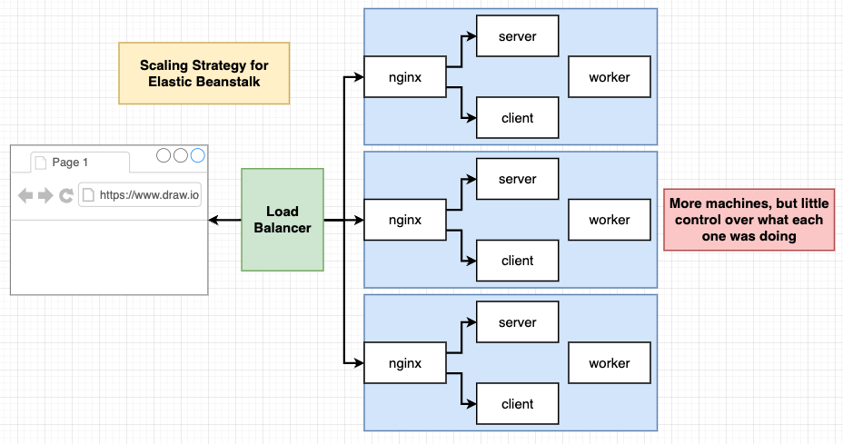
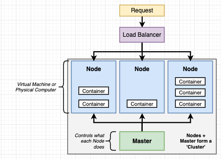

- Kubernetes is a system for running many different containers over multiple different machines / virtual machines.
- Use kubernetes when we need to scale up our application and run many different containers with different images.
- Previously, to scale up using Elastic Beanstalk, EB creates multiple sets of containers instead of the single container that is needed to scale up due to increase traffic. More machines, but little control over what each one was doing.
- `worker` service in our project is doing the hard computational work that takes time.
  - Kubernetes can scale the number of containers (or pods) for a specific service or workload across multiple nodes (virtual machines) in a cluster.
  - Can use kubernetes to scale the `worker` service horizontally by running multiple containers of the `worker` service on a single virtual machine (node) or across multiple nodes in your cluster.
- Kubernetes typically runs on a cluster of multiple nodes (physical or virtual machines), allowing you to distribute workloads and enhance redundancy.

### kubectl and minikube

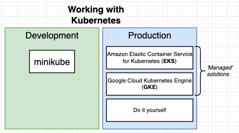
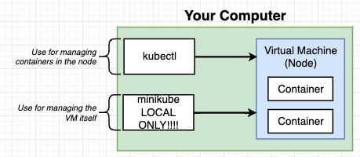

- kubectl
  - kubernetes cluster
  - tell a virtual machine or node what set of containers it should be running and manage what the node is doing.
  - used locally and production
- minikube
  - development kubernetes cluster
  - to create and run a kubernetes cluster on local machine

### Install kubectl

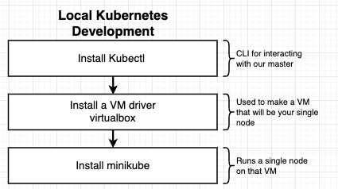

```
brew install kubectl
brew install minikube

which minikube
minikube start
```

- If everything installed correctly, should see the following

```
➜  ~ minikube status
minikube
type: Control Plane
host: Running
kubelet: Running
apiserver: Running
kubeconfig: Configured

➜  ~ kubectl cluster-info
Kubernetes control plane is running at https://127.0.0.1:50292
CoreDNS is running at https://127.0.0.1:50292/api/v1/namespaces/kube-system/services/kube-dns:dns/proxy
```

### Pushing an Image to Docker Hub

- [StackOverflow Link](https://stackoverflow.com/questions/41984399/denied-requested-access-to-the-resource-is-denied-docker)

```
docker login -u <username>

# Create a repository on Docker Hub
docker tag localimage:latest <name>/<repository_name>:<name>
docker push <name>/repository_name>:<name>
```

### `docker-compose` vs Kubernetes

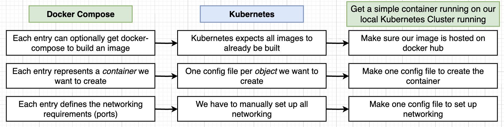
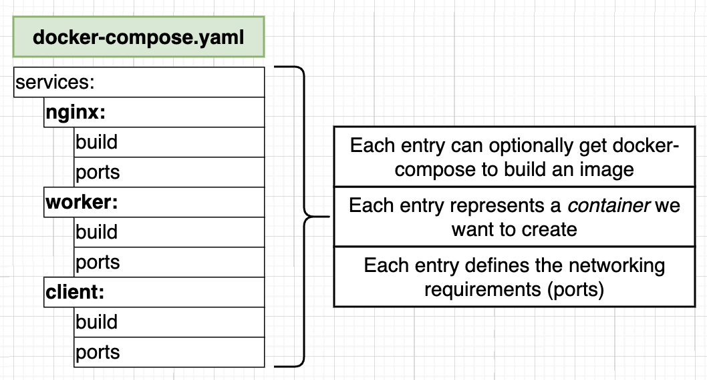

- Goal: Get the `multi-client` image (from Docker project) running on our local Kubernetes Cluster running as a container.

### Defining Properties in `yaml` file for k8s

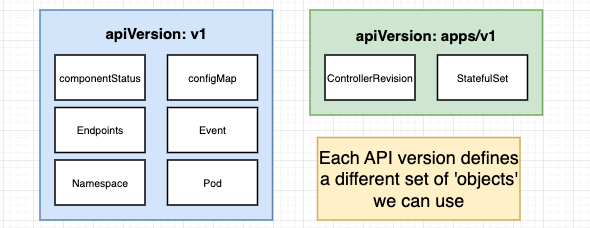

- `apiVersion`: each API version defines a different set of 'objects' we can use
- `Kind`: represents the type of object to be made, e.g., Pod, Service
  - Objects serve different purposes - running a container (pod), monitoring a container, setting up networking (service), etc.

## Kubernetes Object Types

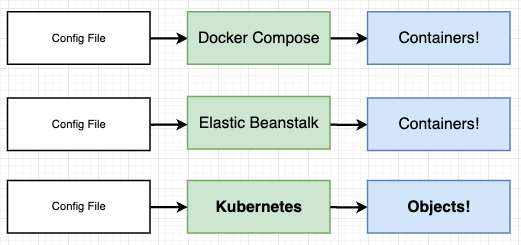
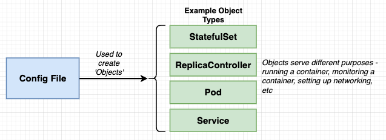

### Pods

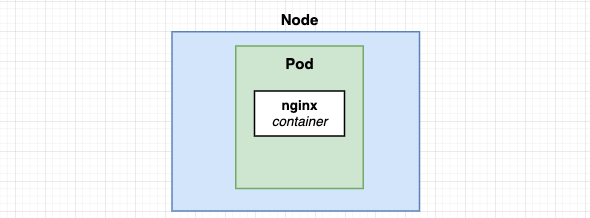
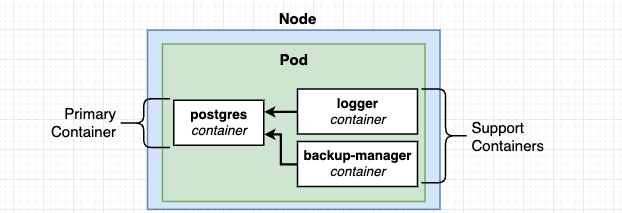
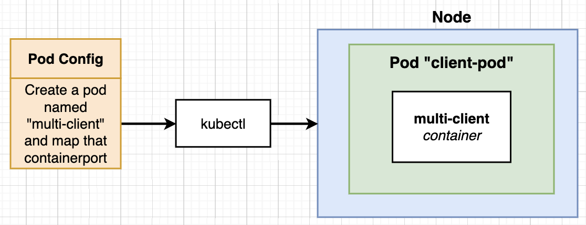
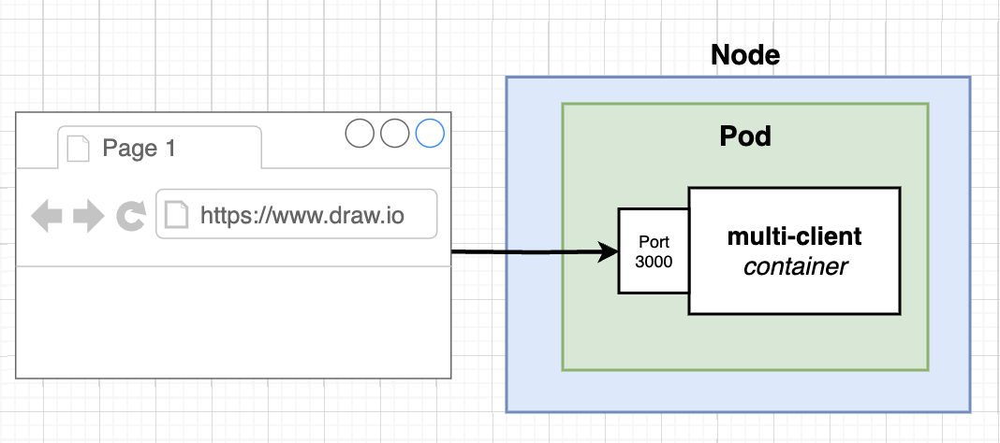

- `minikube start` creates a virtual machine on our computer and that VM is a 'node'. The node is used by Kubernetes to run some number of objects.
- Create a Pod inside the Node.
- A Pod is a grouping of containers with a **common purpose**.
  - A Pod is the **smallest deployable unit in Kubernetes** and represents a single instance of a running process in a cluster.
  - A Pod can contain 1 or more containers, and these containers share the same network namespace and storage volumes.
  - Pods are scheduled to run on the same node and can communicate with each other via `localhost`
  - Containers in a Pod are tightly coupled and are used for closely related tasks that often share resources and data.
  - A common use case is to have a main application container and a sidecar container within the same Pod. Sidecar container might handle logging, monitoring, or other auxiliary tasks for the main application.
    - E.g., A pod can contain 3 containers: postgres container, logger container, backup-manager container. If postgres container stops running, the logger container is useless as it cannot pull logs from the postgres database and the backup-manager is unable to backup sql tables and data from postgres db.

```
# to get the entire list of kubernetes objects
kubectl api-resources
```

### Services

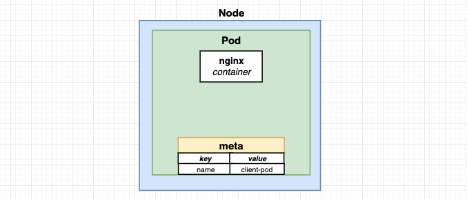
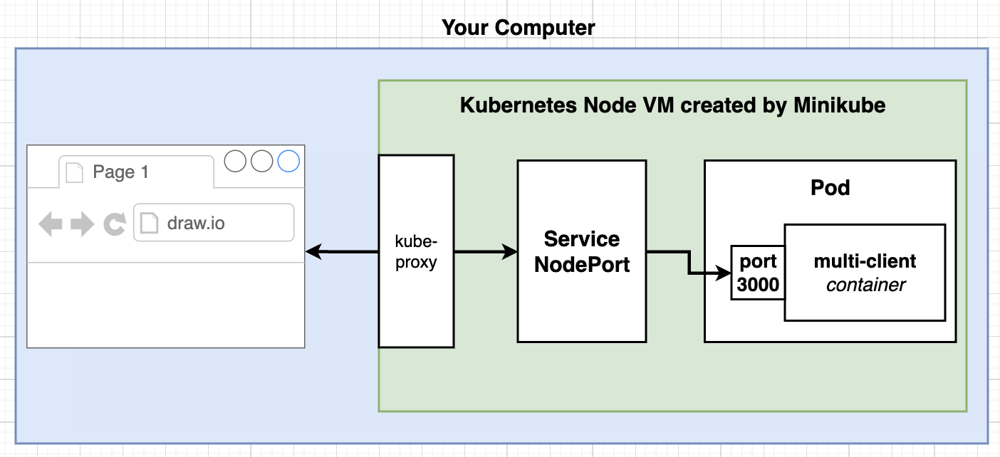
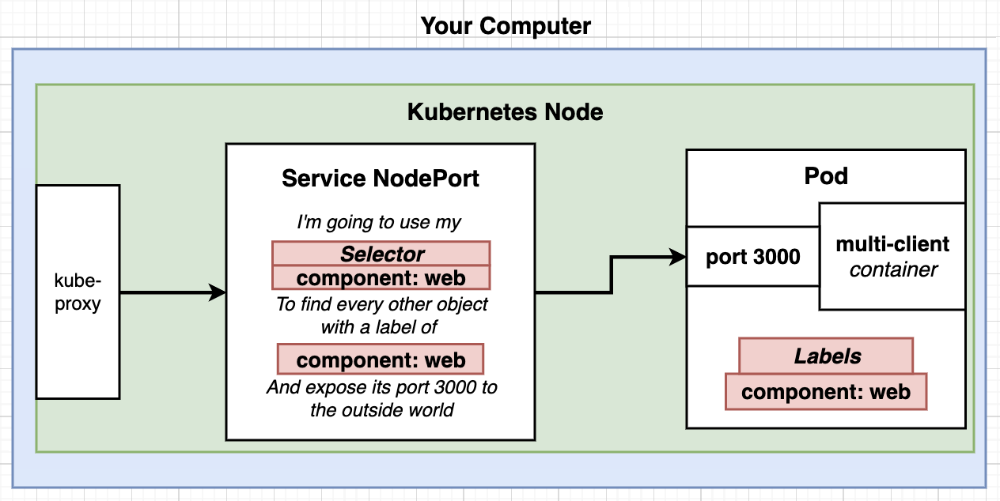
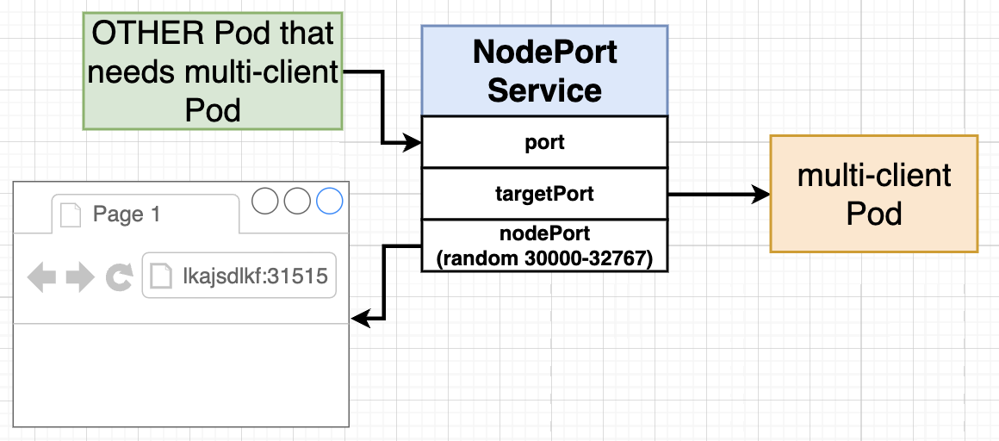

- Set up networking in a Kubernetes cluster
- 4 subtypes under 'Services'
  - ClusterIP
  - NodePort
    - Exposes a container to the outside world (only good for DEV purposes!!)
    - Sets up the communication between the outside world (browser) and the container inside the Pod.
  - LoadBalancer
  - Ingress
- If we have multiple services inside a single Kubernetes node, it is up to the kube proxy to send off requests to the appropriate services.

```yaml
# Service selector
  selector:
    component: web

# Pod selector
  labels:
    component: web

# Both has to be the same then the Service will forward requests to the Pod
# We can also mix and match the key-value pairs
  selector:
    tier: frontend

  labels:
    tier: frontend
```

- `ports` collection of ports to be opened on the Service.
- `port` is the port through which other Pods within the cluster can access the Service. Used for Pod-to-Pod communication within the cluster.
- `targetPort` port inside the Pod that the Service should route traffic to.
- `nodePort`
  - used to expose a Service to the outside world. (browser to test out connection to the Pod)
  - NodePort ports are in the range of 3000-32767, if not specified, it will be randomly assigned within the range.
  - Useful for exposing services for testing, development and small-scale deployments.
  - In Production environments, nodePort is not used but a LoadBalancer or an Ingress controller are used for more advanced and controlled external access.

```yaml
# NodePort Service
ports:
  - port: 3050
    targetPort: 3000
    nodePort: 31515

# Pod
ports:
  - containerPort: 3000
```

### Feed a config file to Kubectl

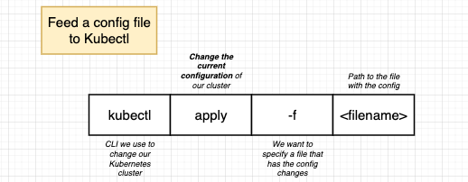
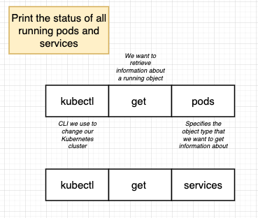
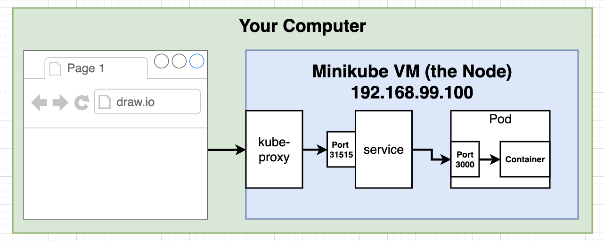

- To access container in Pod from the outside world
  - Get the IP address of the Kubernetes Node VM Created by minikube
  - Run `minikube ip` to retrieve the IP address, don't use localhost if using minikube to create VM
  - Since we are using Docker Desktop to run Kubernetes VM, we will use localhost.

```
➜  project-simple-k8s git:(main) ✗ kubectl apply -f client-pod.yaml
pod/client-pod created

➜  project-simple-k8s git:(main) ✗ kubectl apply -f client-node-port.yaml
service/client-node-port created

➜  project-simple-k8s git:(main) ✗ kubectl get pods
NAME         READY   STATUS    RESTARTS   AGE
client-pod   1/1     Running   0          51s

➜  project-simple-k8s git:(main) ✗ kubectl get services
NAME               TYPE        CLUSTER-IP      EXTERNAL-IP   PORT(S)          AGE
client-node-port   NodePort    10.100.150.18   <none>        3050:31515/TCP   101s
kubernetes         ClusterIP   10.96.0.1       <none>        443/TCP          12h
```

## Kubernetes Entire Deployment Flow


### Example

1. Feeding deployment (config) file with the `kubectl apply` command.
2. The file is then passed to the Master.
3. `kube-apiserver` program is responsible to monitor all the nodes inside the Kubernetes Cluster.
4. kube-apiserver ensures that the containers are started and distributed across the nodes (virtual machines). Each node has a docker running and docker reaches out to Docker Hub and downloads the `multi-worker` image.
5. The node then uses the `multi-worker` image to create the number of containers that we require.
6. The Master does a status update by looking at all the nodes and ensure that all the copies of `multi-worker` containers are running.

- If one container fails to run, the Master will be updated and finds a node to place a new running `multi-worker` container to ensure the correct number of running containers are always up.
- We always use `kubectl` command line tool to connect with Master and not to the Node directly. The Master connects to the Node.

### Imperative vs Declarative Deployments

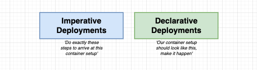
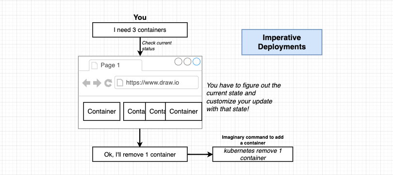

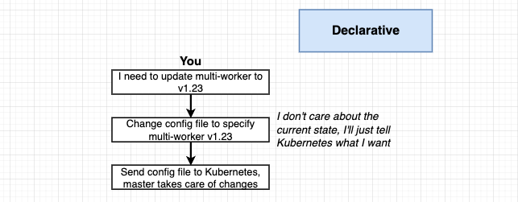
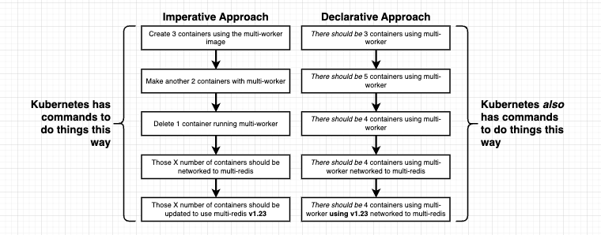

- **Imperative Deployments**:
  - Involves giving explicit step-by-step instructions to Kubernetes on how to create and manage resources.
  - Uses imperative commands like `kubectl create`, `kubectl apply` or `kubectl run` to crete and manage objects in the Kubernetes Cluster.
  - Specify the exact state you want your resources to be in, and Kubernetes performs the necessary actions to achieve that state.
  - Often used for initial setup and resource creation, but they may not be ideal for maintaining complex, long-term applications and managing updates.
- **Declarative Deployments**:
  - Focuses on describing the desired end state of your resources using YAML configuration files. E.g., You define the configuration, including the desired number of replicas, image versions, resource limits, etc., in a declarative manner.
  - Apply these configuration files to the Kubernetes cluster using `kubectl apply -f` and Kubernetes will make the necessary changes to ensure the current state matches the desired state.
  - Recommended approach to manage **production-grade** applications in Kubernetes. They make it easier to track and version changes, maintain consistency and collaborate with others.
  - Useful in CI/CD pipelines, as you can version control your configurations and automate updates.

### Updating Existing Objects (Declarative Deployment)

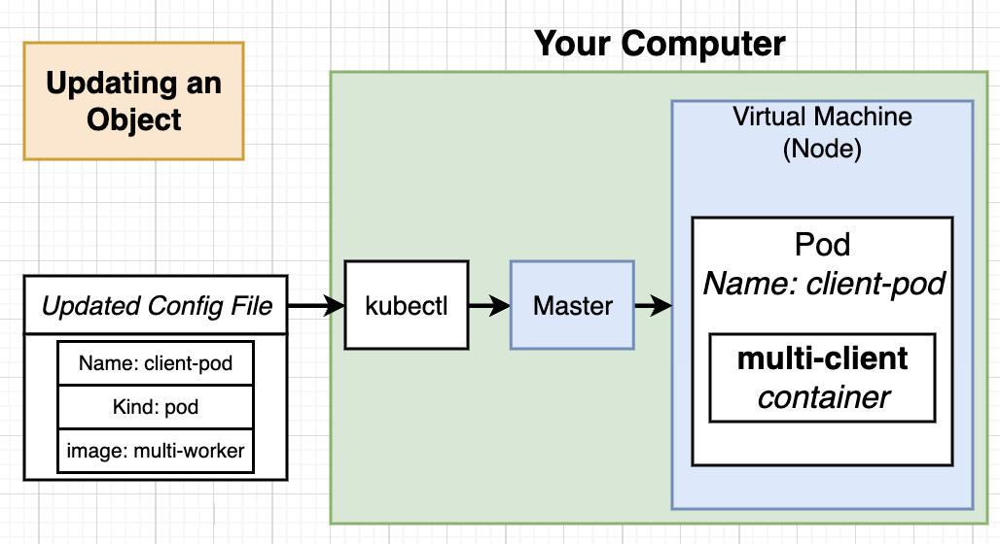
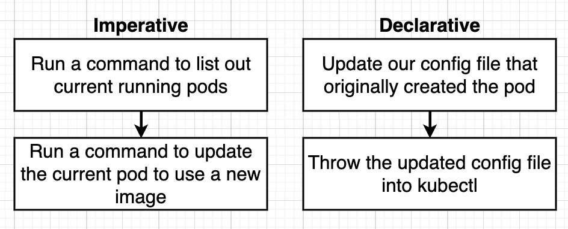

---

- Old Goal: Get the `multi-client` image running on our local Kubernetes Cluster running as a container.
- New Goal: Update our existing Pod to use the `multi-worker` image.

---

- For Pod, `name` and `kind` should be the same, then we make changes in the config file, e.g., image.
- Run `kubectl apply` to apply the new configuration
  ```
  ➜  project-simple-k8s git:(main) ✗ kubectl apply -f client-pod.yaml
  pod/client-pod configured
  ```
- Master will then update the Pod configuration for declarative deployment.


- Run `kubectl describe pod client-pod` to inspect the Pod and check the new configuration.

  ```
  ➜  project-simple-k8s git:(main) ✗ kubectl get pods
  NAME         READY   STATUS    RESTARTS       AGE
  client-pod   1/1     Running   2 (5m4s ago)   23h

  ➜  project-simple-k8s git:(main) ✗ kubectl describe pod client-pod
  Name:             client-pod
  Namespace:        default
  ```

### Deleting a Pod

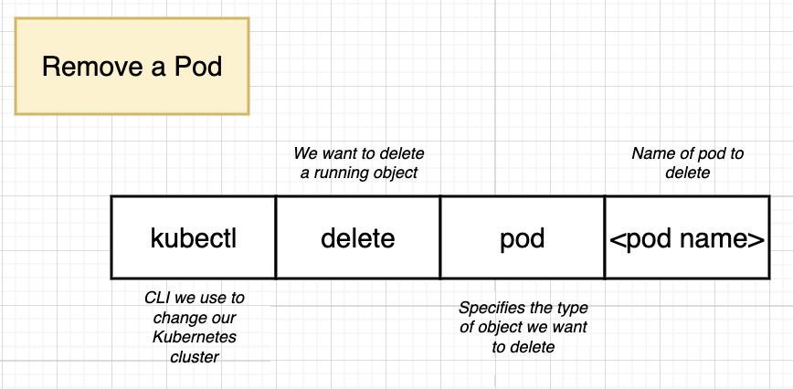
