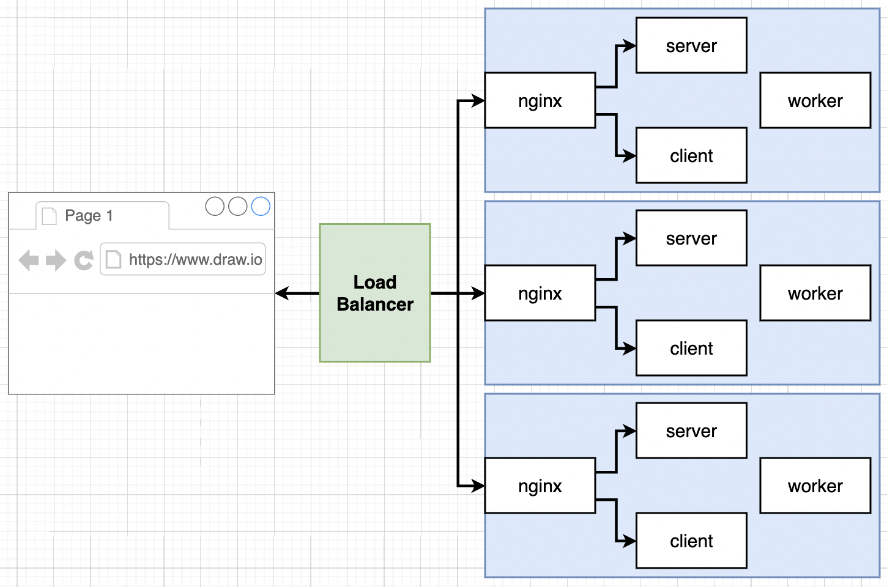
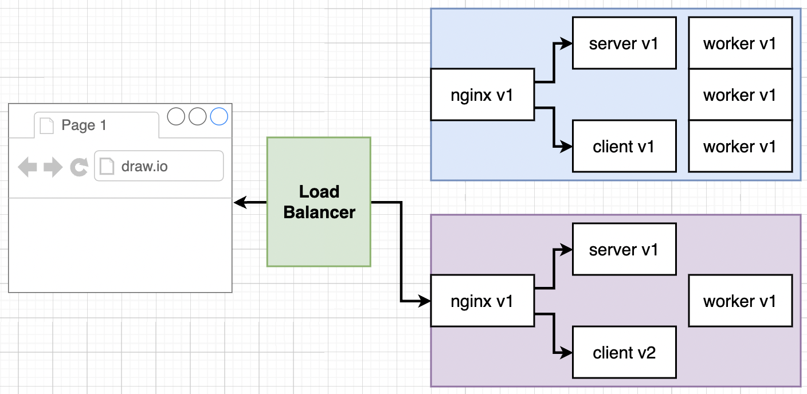
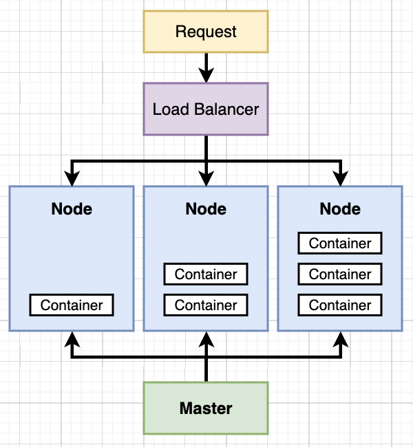

## Kubernetes (K8s)

### What is Kubernetes?




- Kubernetes is a system for running many different containers over multiple different machines / virtual machines.
- Use kubernetes when we need to scale up our application and run many different containers with different images.
- Previously, to scale up using Elastic Beanstalk, EB creates multiple sets of containers instead of the single container that is needed to scale up due to increase traffic. More machines, but little control over what each one was doing.
- `worker` service in our project is doing the hard computational work that takes time.
  - Kubernetes can scale the number of containers (or pods) for a specific service or workload across multiple nodes (virtual machines) in a cluster.
  - Can use kubernetes to scale the `worker` service horizontally by running multiple containers of the `worker` service on a single virtual machine (node) or across multiple nodes in your cluster.
- Kubernetes typically runs on a cluster of multiple nodes (physical or virtual machines), allowing you to distribute workloads and enhance redundancy.

### kubectl and minikube



- kubectl
  - kubernetes cluster
  - tell a virtual machine or node what set of containers it should be running and manage what the node is doing.
  - used locally and production
- minikube
  - development kubernetes cluster
  - to create and run a kubernetes cluster on local machine

### Install kubectl

```
brew install kubectl
brew install minikube

which minikube
minikube start
```

- If everything installed correctly, should see the following

```
➜  ~ minikube status
minikube
type: Control Plane
host: Running
kubelet: Running
apiserver: Running
kubeconfig: Configured

➜  ~ kubectl cluster-info
Kubernetes control plane is running at https://127.0.0.1:50292
CoreDNS is running at https://127.0.0.1:50292/api/v1/namespaces/kube-system/services/kube-dns:dns/proxy
```

### Pushing an Image to Docker Hub

- [StackOverflow Link](https://stackoverflow.com/questions/41984399/denied-requested-access-to-the-resource-is-denied-docker)

```
docker login -u <username>

# Create a repository on Docker Hub
docker tag localimage:latest <name>/<repository_name>:<name>
docker push <name>/repository_name>:<name>
```

### `docker-compose` vs Kubernetes

- Goal: Get the `multi-client` image (from Docker project) running on our local Kubernetes Cluster running as a container.

### Defining Properties in `yaml` file for k8s

- `apiVersion`: each API version defines a different set of 'objects' we can use
- `Kind`: represents the type of object to be made, e.g., Pod, Service
  - Objects serve different purposes - running a container (pod), monitoring a container, setting up networking (service), etc.

### Running Containers in Pods

- `minikube start` creates a virtual machine on our computer and that VM is a 'node'. The node is used by Kubernetes to run some number of objects.
- Create a Pod inside the Node.
- A Pod is a grouping of containers with a **common purpose**.
  - A Pod is the **smallest deployable unit in Kubernetes** and represents a single instance of a running process in a cluster.
  - A Pod can contain 1 or more containers, and these containers share the same network namespace and storage volumes.
  - Pods are scheduled to run on the same node and can communicate with each other via `localhost`
  - Containers in a Pod are tightly coupled and are used for closely related tasks that often share resources and data.
  - A common use case is to have a main application container and a sidecar container within the same Pod. Sidecar container might handle logging, monitoring, or other auxiliary tasks for the main application.
    - E.g., A pod can contain 3 containers: postgres container, logger container, backup-manager container. If postgres container stops running, the logger container is useless as it cannot pull logs from the postgres database and the backup-manager is unable to backup sql tables and data from postgres db.

```
# to get the entire list of kubernetes objects
kubectl api-resources
```
