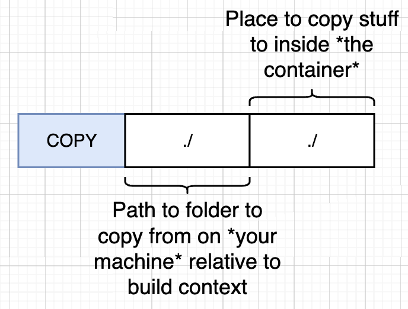

## Docker Projects with Node

- Objective: Learn Dockerfile

### Project Outline (`project-node`)

1. Create NodeJS web application
2. Create a Dockerfile
3. Build image from dockerfile
4. Run image as container
5. Connect to web application from a browser

### Base Image Issues

 


- Base image `alpine` is a small image and has a limited set of programs.
  - limited linux/unix executable programs
- Solution:
  - Find another base image that has npm preinstalled inside it. (we will be using this for the project)
  - Or use a `node` image that is lightweight and has `npm` preinstalled
  - `FROM node:14-alpine`
    - It is using the alpine version of node. This is a lightweight version of node that does not have the usual full set of dependencies that comes with NodeJS.

```
Step 1/3 : FROM alpine
 ---> 3cc203321400
Step 2/3 : RUN npm install
 ---> Running in 87a0f7b3da6a
/bin/sh: npm: not found
```

### `COPY ./ ./` in Dockerfile



- Copying from current working directory in local machine into the docker container working directory.

### Commands

```
docker build -t leonlow/projectnode .
docker run leonlow/projectnode  # no port mapping
```

### Container Port Mapping


- Incoming Request
  - Container has its own isolated set of ports that can receive traffic but by default, no incoming traffic from your computer is going to be directed to the container.
  - For incoming request to your computer to be directed to the container, we have to set up explicit **port mapping**
  - The 2 ports in port mapping do not have to be identical.

```
docker run -p 8080:8080 leonlow/projectnode
```

### Specify a Working Directory

- When we did `COPY ./ ./`, we copied the files into the root directory of the container.
- `WORKDIR /usr/app`
  - `/usr/app` any following command will be executed relative to this path in the container.

```
# look into the file system of docker container
docker run -it leonlow/projectnode sh
```

```
# another way to look into file system of container
docker run -p 8080:8080 leonlow/nodeproject
docker ps  # get container_id
docker exec -it <container_id> sh  # will be directly in /usr/app
```

### Unnecessary Rebuilds

- Changing something in `index.js` is not going to reflect the change inside the container as it is a file system snapshot.
- To reflect the change, have to run `docker build .` command again.
  - Since we have made a change inside `index.js`, the `COPY ./ ./` will be ran again as well as the other instructions below it in the dockerfile.
  - Thus, `npm install` was ran again even though we did not change our dependencies. We don't want to reinstall all the dependencies just because we made a change inside the source code.
- Solution:
